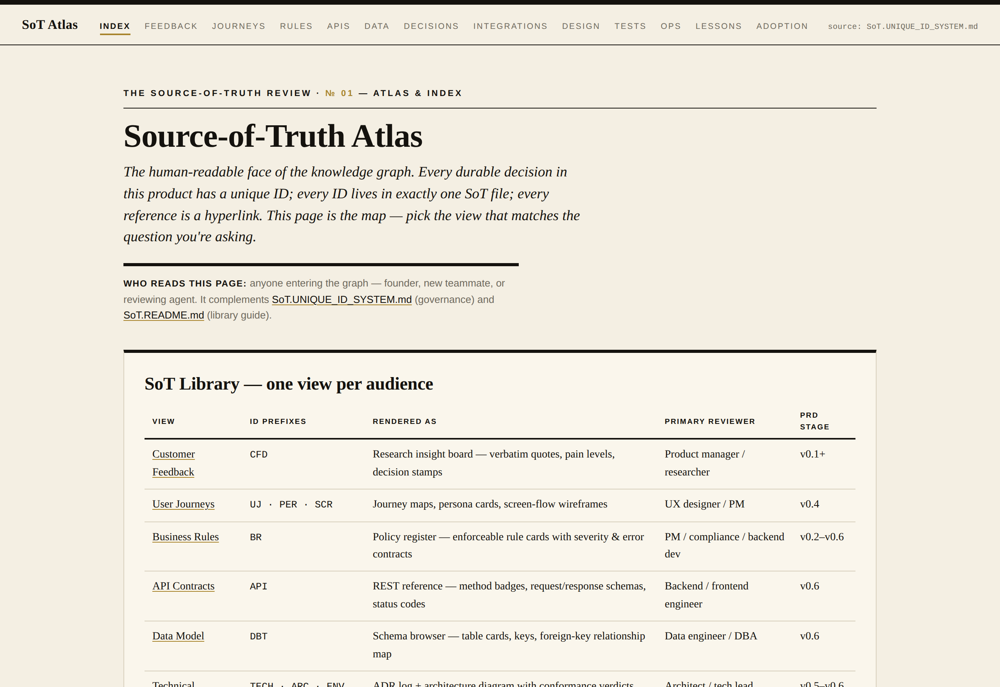
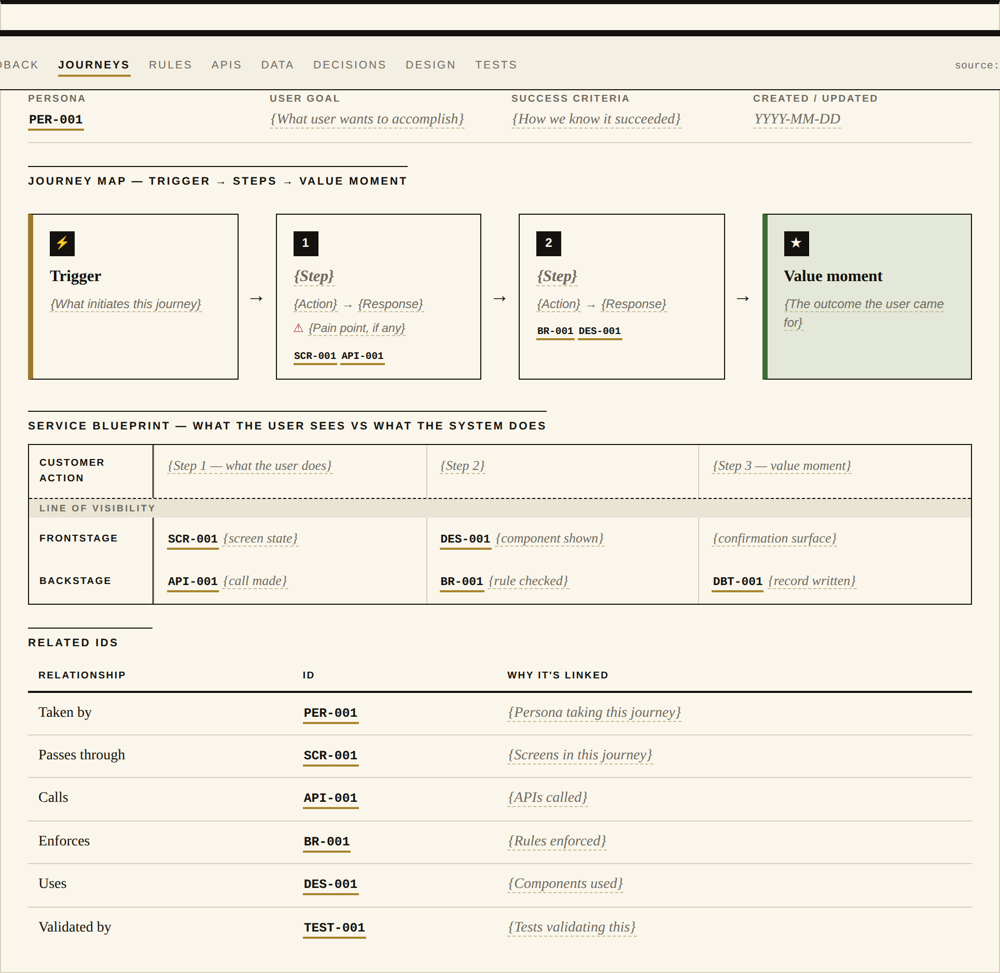
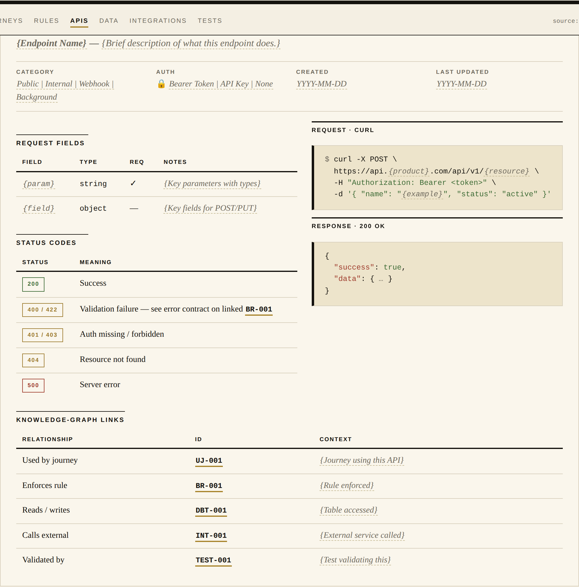
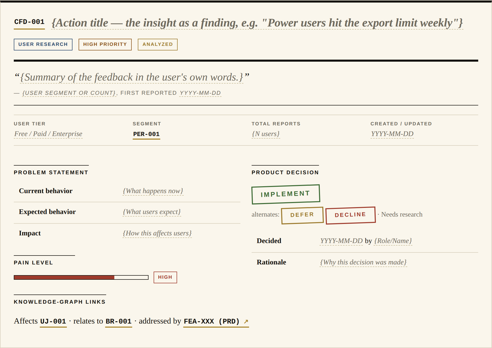
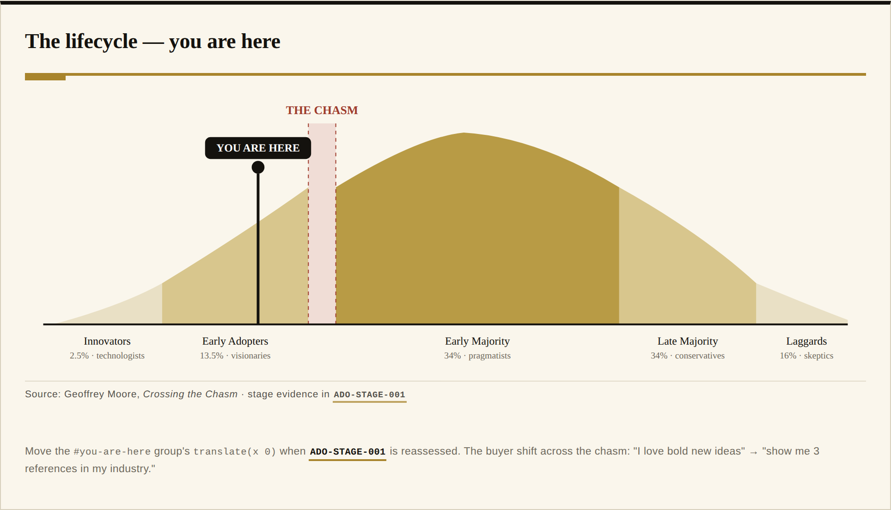

<div align="center">

# PRD-Led Context Engineering

### Memory as Infrastructure

**An ontology layer for product teams building products that solve real problems — with AI agents that remember.**

[](https://github.com/mattgierhart/PRD-driven-context-engineering/stargazers)
[](LICENSE)
[](https://github.com/mattgierhart/PRD-driven-context-engineering/actions/workflows/readiness.yml)
[](https://github.com/mattgierhart/PRD-driven-context-engineering/actions/workflows/plugin-sync.yml)
[](.claude/)
[](CONTRIBUTING.md)

*Your AI partner is brilliant in one session and amnesiac by the next. This repository is the fix:
a fork-ready methodology that turns documentation into a knowledge graph humans and AI navigate
together — so the 50th session is smarter than the 1st.*

[**Use this template**](https://github.com/mattgierhart/PRD-driven-context-engineering/generate) ·
[**Quick Start**](#-quick-start) · [**Docs**](docs/index.md) · [**The Idea**](#the-idea-memory-as-infrastructure) ·
[**Live demo views**](#-feature-the-human-review-layer)



</div>

> **V2 branch status.** `prd-ce-v2` is the V2 maturation branch (PRD at **v0.1 Spark** for the
> Product Management lifecycle; no V2 runtime exists). V2 matures here before any owner-approved merge
> to `main`; the methodology on `main` is the stable baseline. Where v2 is going — the build plan, the
> ontology, the eight Key Moments, the go-live tracker — lives in [`docs/v2/`](docs/v2/README.md).

---

<!-- SECTION: quick-start -->
## 🚀 Quick Start

```bash
# 1. Create your product repo from the template (or click "Use this template" on GitHub):
gh repo create my-product --template mattgierhart/PRD-driven-context-engineering --clone && cd my-product

# 2. Make it yours — the generic seeds replace this repo's own dashboard, PRD, and memory:
cp README_template.md README.md && cp PRD_template.md PRD.md && rm -rf SoT && cp -R SoT_template SoT

# 3. Open the repo in Claude Code and say "Let's frame the problem"
#    → prd-v01-problem-framing produces CFD- evidence IDs and fills PRD.md v0.1.

# 4. Advance only through gates — the repo scores itself:
python3 -m pip install -r scripts/requirements.txt && python3 scripts/readiness.py run
```

**What you get in five minutes**: a product repo whose PRD advances through ten gates, a Source-of-Truth
graph of typed IDs your agents cite instead of guess, and a readiness score that tells you what to fix
first. Prerequisites: Claude Code, Python 3.10+, git. **Already have a repo?** The source-run install
and the plugin path are in [`docs/INSTALL.md`](docs/INSTALL.md). No subscriptions, no servers, no
lock-in — fork and go.
<!-- /SECTION: quick-start -->

---

<!-- SECTION: evolution -->
## The Problem: AI forgets. Teams drift.

Every era of software solved memory its own way — and broke it its own way. **Waterfall** had static
memory: everything written up front, certainty at the cost of change. **Agile** moved fast and created
fragmented memory: knowledge scattered across tickets, wikis, and chats. **AI-assisted building** adds a
third failure, amnesiac memory: the model that architected your system yesterday has never heard of it
today. The common mistake is treating these as tooling problems. They are *memory* problems.

**PRD-Led Context Engineering** builds **shared memory**: it treats AI as a team member, not a tool, and
keeps documentation synchronized with code so humans and AI navigate the same truth.
<!-- /SECTION: evolution -->

<!-- SECTION: manifesto -->
## The Idea: Memory as Infrastructure

This methodology comes from two converging experiences. **Leading human teams** — alignment always
followed the same pattern: rally around a single Source-of-Truth artifact and the team moves as one;
without it, even great talent drifts. **Partnering with AI** — sometimes the model performs at a senior
level, sometimes it hallucinates; the variable was never the model's intelligence, it was the **context
density** provided. The convergence: **documentation is not an afterthought. Documentation is the
infrastructure of shared memory.**

> **The Golden Rule**: If it isn't part of the memory infrastructure, it isn't true.

So every durable decision gets a **unique ID** (`UJ-XXX`, `BR-XXX`, `API-XXX`) in a Source-of-Truth
file. That ID is a memory node with weight: when the AI references `BR-XXX`, it isn't guessing — it's
retrieving the validated decision you encoded. The linked network of IDs across files *is* the
**knowledge graph**, and it lives in plain markdown, in your repo, under version control.

**The four pillars** — *Just-in-time context* (IDs let you load only what a task needs) · *The
documentation ecosystem* (PRD ↔ EPICs ↔ SoT connected by links, skills, and hooks) · *Context validation*
(context is measured like code; the repo scores itself) · *Progressive documentation* (update in place,
never copy — no `PRD_v2.md`, ever).
<!-- /SECTION: manifesto -->

<!-- SECTION: cognitive-shift -->
### The Cognitive Shift

| Traditional Agile      | PRD-Led Context Engineering | The Shift                                                                                        |
| :--------------------- | :-------------------------- | :----------------------------------------------------------------------------------------------- |
| **Sprints**            | **Context Windows**         | We don't time-box based on dates; we _scope-box_ based on cognitive capacity.                    |
| **User Stories**       | **Prompts**                 | We don't write descriptions; we engineer _prompts_ that deterministically load context.          |
| **Tribal Knowledge**   | **Source of Truth**         | If it isn't in the Knowledge Graph (`SoT/`), it doesn't exist.                                   |
| **Standups**           | **Documentation Hooks**     | No status meetings. Event-driven hooks handle context loading, gate checks, and memory handoffs. |
| **Project Management** | **Context Governance**      | We don't task-manage people. The system gates execution until context is verified valid.         |
<!-- /SECTION: cognitive-shift -->

---

## What's in the box

Everything below ships in this repo, works offline, and forks in one click:

| Feature | What it gives you |
|---|---|
| 🧠 [The Knowledge Graph](#-feature-a-knowledge-graph-in-plain-markdown) | 14 SoT files, 24 ID types, zero databases — durable memory in markdown |
| 📈 [The Progressive PRD](#-feature-the-progressive-prd) | A gated v0.1 → v1.0 lifecycle that stops AI from one-shotting your architecture |
| 🛠 [The Skills](#-feature-a-skill-for-every-decision) | 41 stage playbooks from problem framing to crossing the chasm — Dunford, Hormozi, Moore, Torres built in — plus the methodology operators |
| 📊 [Readiness Scoring](#-feature-a-repo-that-scores-its-own-readiness) | The repo computes whether evidence is ready for owner gate review — and what to fix first |
| 🫀 [The Development Graph](#-feature-code-that-traces-back-to-specs) | `@implements` tags bridge code to specs; drift surfaces as a verdict, not a surprise |
| 📰 [The Human Review Layer](#-feature-the-human-review-layer) | Every SoT file rendered as a styled, hyperlinked page its reviewer actually wants to read |
| 🤖 [The Agent Squad](#-feature-an-agent-squad-with-persistent-memory) | Four role agents with persistent memory, coordinated through files instead of meetings |

---

<!-- SECTION: doc-ecosystem -->
## 🧠 Feature: A Knowledge Graph in plain markdown

**The pitch**: long-term product memory with no database, no SaaS, no lock-in — just files with discipline.

The architecture is **3 + 1 + SoT + Temp**: **executive functions** orient attention in the documented
read order (`CLAUDE.md` the physics, `README.md` the dashboard, `PRD.md` the strategy); **focus memory**
is the current PRD gate before v0.7 and one EPIC = one context window from v0.7 on; **long-term memory**
is `SoT/SoT.*.md` — Business Rules (`BR-`), User Journeys (`UJ-`), API Contracts (`API-`) and 21 more ID
types, nothing duplicated, everything referenced by ID; **short-term memory** is `temp/`, harvested into
SoT before an EPIC closes. Instead of dumping documentation into the context window, reference specific
IDs — fewer input tokens, deeper understanding.
<!-- /SECTION: doc-ecosystem -->

<!-- SECTION: lifecycle -->
## 📈 Feature: The Progressive PRD

**The pitch**: the "one-shot" — asking AI to build the whole app at once — produces generic code and rapid
drift. The Progressive PRD makes that impossible by design. `PRD.md` is a **gated workflow**, not a
document: the AI focuses on one stage at a time, and no stage advances until its Definition of Done is met.

| Version  | Name                     | Focus                 | Definition of Done (DoD)                                           |
| :------- | :----------------------- | :-------------------- | :----------------------------------------------------------------- |
| **v0.1** | **Spark**                | Problem & Outcomes    | Problem defined, Outcomes measurable, Open Questions list.         |
| **v0.2** | **Market Definition**    | Segments & ICP        | Segments sized, "Not For" defined, Business Rules (`BR-`) created. |
| **v0.3** | **Commercial Model**     | Value & Pricing       | Competitors profiled, Pricing model, Monetization rules.           |
| **v0.4** | **User Journeys**        | Personas & Flows      | Core journeys mapped (`UJ-`), Dependencies (`API-`) noted.         |
| **v0.5** | **Red Team Review**      | Risks & Feasibility   | Risks (Market/Tech) identified, Mitigations linked to tests.       |
| **v0.6** | **Architecture**         | Technical Strategy    | Stack selected, API contracts (`API-`) drafted, `ARC-` conformance rules, Cost guardrails. |
| **v0.7** | **Build Execution**      | Implementation Loop   | Code tested (`TEST-`), SoT updated, code traced to specs (Development Graph), Epic loop execution. |
| **v0.8** | **Release & Deployment** | Operational Readiness | Runbooks (`RUN-`), Monitoring (`MON-`, `MON-DRIFT-`), Rollback plan, Changelog system, MOPS handoff. |
| **v0.9** | **Launch**               | Go-to-Market          | Positioning (Dunford), Offer (Hormozi), Channels (ORB), Launch metrics (`KPI-`), Feedback channels (`CFD-`), Tactical playbooks (AEO, alternatives, outreach, HN/Reddit). |
| **v1.0** | **Market Adoption**      | Growth & Learning     | Adoption stage (`ADO-STAGE-`), Beachhead (`ADO-BEACHHEAD-`), Whole product (`ADO-WHOLE-`), References (`ADO-REF-`), Continuous discovery, Case studies, Testimonials. |

**Why gates work**: constrained focus prevents the AI from guessing the architecture before it
understands the users. **The paradox that makes it practical**: gates provide focus; the ecosystem
provides agility — customer feedback during Build doesn't restart the plan, it updates the `BR-` rules
and lets hooks propagate the change.
<!-- /SECTION: lifecycle -->

## 🛠 Feature: A skill for every decision

**The pitch**: the lifecycle isn't advice — it's executable. Every stage ships with skills that know what
to consume, what IDs to produce, and which gate they feed: **41 stage skills** (`prd-v01-*` → `prd-v10-*`)
from problem framing, competitive landscape, pricing, personas, and journey mapping through risk
discovery, architecture, epic scoping, test planning, release planning, and GTM — with **named
frameworks encoded** (April Dunford positioning, Alex Hormozi offer construction, Owned/Rented/Borrowed
channels, Geoffrey Moore chasm crossing, Teresa Torres continuous discovery, Rob Fitzpatrick Mom Test) —
plus the **methodology operators** (`ghm-*`: gate checks, SoT building, ID registration, insight
harvesting, status sync). **Three depth modes** — `quick` (founder gut-check, <15 min), `standard`,
`deep` (investor-ready) — so the method scales from solo founder to team. Every skill emits `Consumes` /
`Produces` sections in SoT IDs, which is what keeps the knowledge graph connected across stages.

<!-- SECTION: readiness-scoring -->
## 📊 Feature: A repo that scores its own readiness

**The pitch**: before advancing a stage or starting an EPIC, the repo already knows whether you're ready —
and *why not*. Readiness is a **three-layer graph** over the artifacts you already author: **SoT files**
(entry count, depth, cross-reference density, orphan rate), **EPICs** (they inherit the readiness of every
SoT file they reference; dangling refs surface as unmet criteria citing the file that caused them), and
the **PRD stage** (can we advance v0.X → v0.Y?). All three write to `status/readiness.json` with causal
links intact — **the highest-leverage fix is rarely the lowest-scoring file; it's the lowest-scoring file
blocking the most EPICs**, and the system tells you which.

```bash
python3 -m pip install -r scripts/requirements.txt
python3 scripts/readiness.py run        # compute all layers + print report
python3 scripts/readiness.py status     # print last-computed report
python3 scripts/readiness.py run --json # machine-readable output for hooks/CI
```

Exit codes `0/1/2` map to PASS / WARN / BLOCK (thresholds: warn=70, block=50, overridable per item).
The `ghm-gate-check` skill delegates here to prepare evidence for owner gate review; only an
owner-approved PRD transition authorizes advancement.

### 🫀 Feature: Code that traces back to specs

Once building starts (v0.7), the code itself joins the knowledge graph. An AST pass extracts code nodes
into `status/devgraph.json`; the `@implements` / `@verifies` tags you write under
[rule 04](.claude/rules/04-coding-standards.md) become **bridge edges** linking each code unit to the spec
it realizes. Readiness then measures *reality*, not just spec health: `implementation_coverage` (which
scoped specs actually have implementing code) and `architecture_conformance` (do the `ARC-` rules still
hold — drift is a `violate` verdict, not a surprise in review). Untagged code shows up as an **orphan
node** — a context leak you can see. See [`docs/DEVELOPMENT_GRAPH.md`](docs/DEVELOPMENT_GRAPH.md) and
[`docs/READINESS_PROTOCOL.md`](docs/READINESS_PROTOCOL.md).
<!-- /SECTION: readiness-scoring -->

<!-- SECTION: sot-html-companion -->
## 📰 Feature: The Human Review Layer

**The pitch**: markdown SoT files are optimized for agents and diffs. Humans reviewing a gate deserve a
better reading surface — so every SoT file ships with a styled, hyperlinked HTML view in the format its
natural reviewer already expects. Start at [`SoT/html/index.html`](SoT/html/index.html) (opens from
`file://`, no build step, no JS). Markdown stays authoritative; the HTML is a *render*: entry anchors
equal unique IDs (`SoT.BUSINESS_RULES.html#BR-001`) and every cross-reference is a hyperlink — a reviewer
walks the knowledge graph by clicking, the same way an agent walks it by ID.

| | |
|---|---|
|  |  |
| **The Atlas** (`index.html`) — registry of every view, ID anatomy, graph patterns | **User Journeys** — trigger → steps → value moment, the way design reviews read flows |
|  |  |
| **API Contracts** — Swagger-style reference with method plates and status codes | **Data Model** — ER-style entity cards with keys and a relationship map |
|  |  |
| **Customer Feedback** — quote-first insight cards with decision stamps | **Adoption** — Moore lifecycle curve with the chasm and a "you are here" marker |

Each of the 13 pages serves a different reviewer — policy register for `BR-`, ADRs + topology diagram for
`TECH-`/`ARC-`, Storybook-style specimens for `DES-`, Given/When/Then cards for `TEST-`, an ops console
for `DEP-`/`RUN-`/`MON-`, a retro playbook for `LL-`. The schema-per-ID-type and persona-per-view
rationale lives in [`SoT/html/README.md`](SoT/html/README.md); screenshots are regenerated with
`python3 SoT/html/screenshot.py`. A proposed third artifact class — **deliverables**, an *input* mode
where a human contributes judgment and the page emits SoT markdown — is the
[`docs/v2/DELIVERABLES_CONCEPT.md`](docs/v2/DELIVERABLES_CONCEPT.md) concept.
<!-- /SECTION: sot-html-companion -->

<!-- SECTION: repo-structure -->
## 🤖 Feature: An agent squad with persistent memory

**The pitch**: four role agents that remember, coordinate through files, and get smarter every EPIC — no
standups required. **horizon** (Strategy, v0.1–v0.5) · **studio** (Design, v0.3–v0.6) · **devlab** (Build,
v0.6–v0.8) · **metro** (Ops, v0.9–v1.0). Each accumulates Feedback, Patterns, Decisions, and Handoff Notes
in its `MEMORY.md`; a `SubagentStop` hook extracts memories from the conversation, and EPIC harvest
promotes cross-EPIC insights to `SoT/SoT.LESSONS_LEARNED.md` as durable `LL-` entries. **Event-driven
hooks instead of meetings**: `SessionStart` injects the read order, `UserPromptSubmit` checks context
density, `PreToolUse` verifies an active EPIC before code writes, `PostToolUse` reminds on SoT cascade
updates — standardized by [`HOOK_CONTRACT.md`](.claude/hooks/HOOK_CONTRACT.md). Multi-agent EPICs avoid
the telephone game: a Synthesis Checkpoint forces the coordinator to produce self-contained worker
prompts before implementation begins.

The repository layout — which files are this repo's own truth, which are downstream seeds, which are the
runtime, which are generated — is in [`docs/ARCHITECTURE.md`](docs/ARCHITECTURE.md). This root `README`,
`PRD`, and `SoT` describe the methodology repository; a product starts from `README_template.md`,
`PRD_template.md`, and `SoT_template/`.
<!-- /SECTION: repo-structure -->

---

## Docs, releases, contributing

- **Docs front door**: [`docs/index.md`](docs/index.md) — install paths, architecture, readiness protocol, development graph, the v2 direction.
- **Releases**: [`CHANGELOG.md`](CHANGELOG.md) (template version in `.claude/VERSION`) · [`MIGRATION.md`](MIGRATION.md) for upgrading a product repo.
- **Contributing**: [`CONTRIBUTING.md`](CONTRIBUTING.md) — refine templates and skills, report friction or a *context leak*, follow the lifecycle even for meta-changes. Questions → [Discussions](https://github.com/mattgierhart/PRD-driven-context-engineering/discussions).
- **The thinking**: [gearheartai.org](https://www.gearheartai.org) — the essays behind Memory as Infrastructure.

**⭐ If this changes how you build with AI, [star the repo](https://github.com/mattgierhart/PRD-driven-context-engineering/stargazers) — stars put this method in front of the next team drowning in context drift.**
