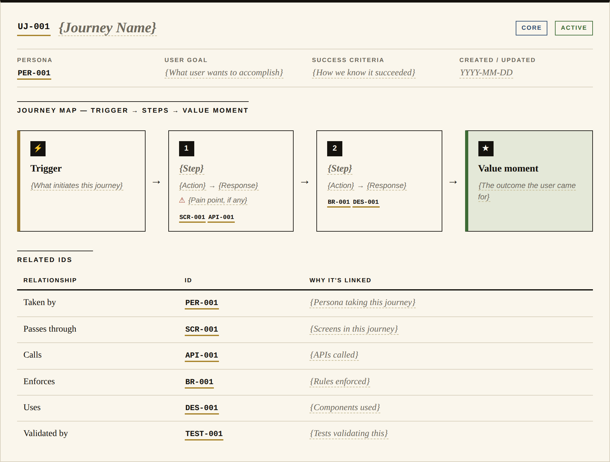
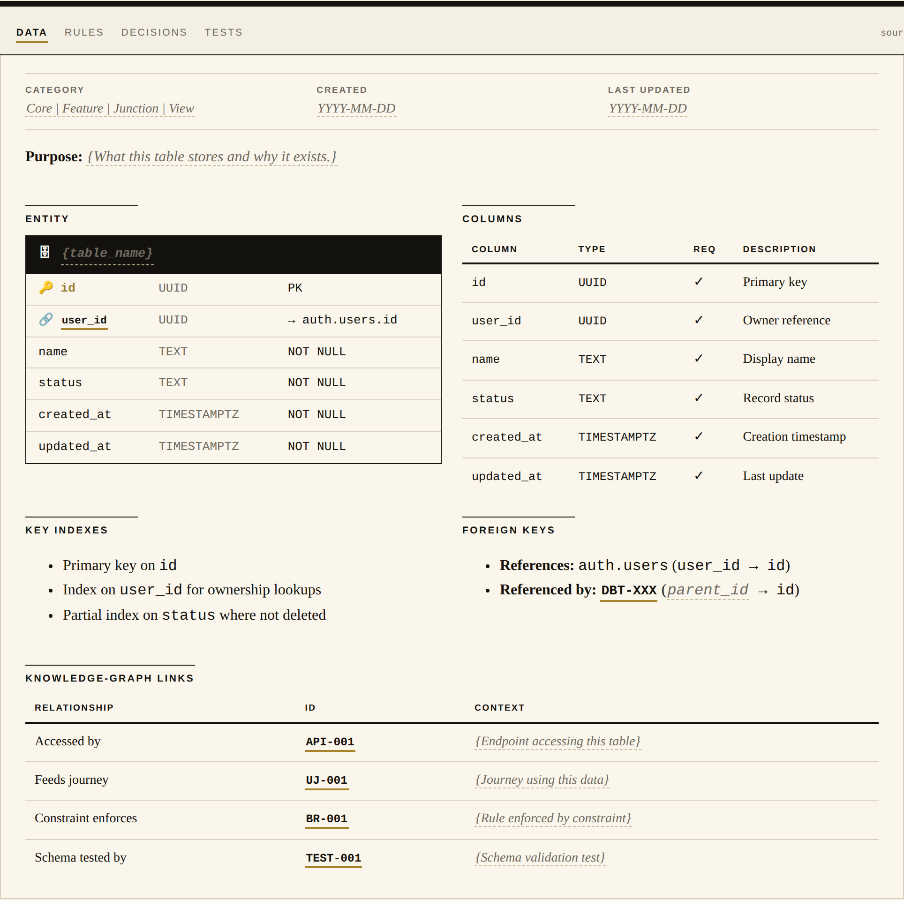
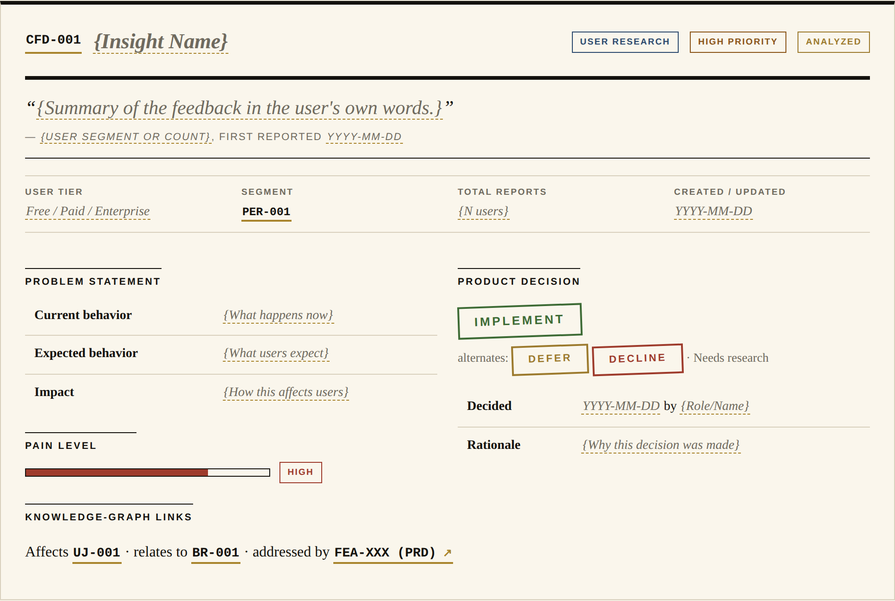

<div align="center">

# PRD-Led Context Engineering

### Memory as Infrastructure — an operating system for building products with AI agents

[](https://github.com/mattgierhart/PRD-driven-context-engineering/stargazers)
[](LICENSE)
[](#contributing)
[](.claude/)

*Your AI partner is brilliant in one session and amnesiac by the next. This repository is the fix:
a fork-ready methodology that turns documentation into a knowledge graph humans and AI navigate
together — so the 50th session is smarter than the 1st.*

[**Quick Start**](#-quick-start) · [**The Idea**](#the-idea-memory-as-infrastructure) ·
[**The Lifecycle**](#-feature-the-progressive-prd) · [**The Skills**](#-feature-47-skills-one-for-every-decision) ·
[**Live Demo Views**](#-feature-the-human-review-layer)


**⭐ If this changes how you build with AI, [star the repo](https://github.com/mattgierhart/PRD-driven-context-engineering/stargazers) — we're driving to 1,000 stars by December, and every star puts this method in front of another team drowning in context drift.**

</div>

---

<!-- SECTION: evolution -->
## The Problem: AI forgets. Teams drift.

Every era of software solved memory its own way — and broke it its own way:

- **Waterfall** had **Static Memory**. Write everything down upfront: certainty, at the cost of change.
- **Agile** moved fast and created **Fragmented Memory**. Knowledge scattered across tickets, wikis, and chats; shared understanding evaporated.
- **AI-assisted building** adds a third failure: **Amnesiac Memory**. The model that architected your system yesterday has never heard of it today.

The common mistake is treating these as tooling problems. They are *memory* problems.

**PRD-Led Context Engineering** builds **Shared Memory**: it treats AI as a team member, not a tool, and keeps documentation synchronized with code so humans and AI navigate the same truth.
<!-- /SECTION: evolution -->

---

<!-- SECTION: manifesto -->
## The Idea: Memory as Infrastructure

This methodology comes from two converging experiences.

**Leading human teams** — alignment always followed the same pattern: rally around a single Source-of-Truth artifact and the team moves as one. Without it, even great talent drifts.

**Partnering with AI** — sometimes the model performs at a senior level, sometimes it hallucinates. The variable was never the model's intelligence. It was the **Context Density** provided: rich, structured context in; senior-level output out.

The convergence: **documentation is not an afterthought. Documentation is the infrastructure of shared memory.**

> **The Golden Rule**: If it isn't part of the memory infrastructure, it isn't true.

So every durable decision gets a **Unique ID** (`UJ-101`, `BR-004`, `API-045`) in a **Source-of-Truth file**. That ID is a memory node with weight: when the AI references `BR-004`, it isn't guessing — it's retrieving a specific, validated decision you encoded. The linked network of IDs across files *is* the **Knowledge Graph**, and it lives in plain markdown, in your repo, under version control.

### The 4 Pillars

1. **Just-in-Time Context** — IDs let you load *only* what a task needs. No repo-dumps, no noise, fewer hallucinations.
2. **The Documentation Ecosystem** — PRD ↔ EPICs ↔ SoT connected by links, skills, and hooks. When logic changes, both human and AI know.
3. **Context Validation** — context is measured like code. Too sparse, the AI drifts; too dense, it chokes. The repo scores itself (see [Readiness Scoring](#-feature-a-repo-that-scores-its-own-readiness)).
4. **Progressive Documentation** — update in place, never copy. No `PRD_v2.md`, ever. One document, many versions, single current reality.
<!-- /SECTION: manifesto -->

<!-- SECTION: cognitive-shift -->
### The Cognitive Shift

This changes how work is *measured*, not just how it's tooled:

| Traditional Agile      | PRD-Led Context Engineering        | The Shift                                                                                              |
| :--------------------- | :--------------------------------- | :----------------------------------------------------------------------------------------------------- |
| **Sprints**            | **Context Windows**                | We don't time-box based on dates; we _scope-box_ based on cognitive capacity.                          |
| **User Stories**       | **Prompts**                        | We don't write descriptions; we engineer _prompts_ that deterministically load context.                |
| **Tribal Knowledge**   | **Source of Truth**                | If it isn't in the Knowledge Graph (`SoT/`), it doesn't exist.                                         |
| **Standups**           | **Documentation Hooks**            | No status meetings. Event-driven hooks handle context loading, gate checks, and memory handoffs.       |
| **Project Management** | **Context Governance**             | We don't task-manage people. The system gates execution until context is verified valid.               |
<!-- /SECTION: cognitive-shift -->

---

## What's in the box

Everything below ships in this repo, works offline, and forks in one click:

| Feature | What it gives you |
|---|---|
| 🧠 [The Knowledge Graph](#-feature-a-knowledge-graph-in-plain-markdown) | 14 SoT files, 21 ID types, zero databases — durable memory in markdown |
| 📈 [The Progressive PRD](#-feature-the-progressive-prd) | A gated v0.1 → v1.0 lifecycle that stops AI from one-shotting your architecture |
| 🛠 [47 Skills](#-feature-47-skills-one-for-every-decision) | Stage playbooks from problem framing to crossing the chasm — Dunford, Hormozi, Moore, Torres built in |
| 📊 [Readiness Scoring](#-feature-a-repo-that-scores-its-own-readiness) | The repo computes whether you're ready to advance — and what to fix first |
| 🫀 [The Development Graph](#-feature-code-that-traces-back-to-specs) | `@implements` tags bridge code to specs; drift surfaces as a verdict, not a surprise |
| 📰 [The Human Review Layer](#-feature-the-human-review-layer) | Every SoT file rendered as a styled, hyperlinked page its reviewer actually wants to read |
| 🤖 [The Agent Squad](#-feature-an-agent-squad-with-persistent-memory) | Four role agents with persistent memory, coordinated through files instead of meetings |

---

<!-- SECTION: doc-ecosystem -->
## 🧠 Feature: A Knowledge Graph in plain markdown

**The pitch**: long-term product memory with no database, no SaaS, no lock-in — just files with discipline.

The architecture is **3 + 1 + SoT + Temp**, designed to manage Context Density for both human cognitive load and AI context windows:

1. **Executive Functions** — orient attention. Files load stable→volatile to maximize prompt-cache hits:
   - `README.md` — the Dashboard (where am I? what is active?)
   - `PRD.md` — the Strategy (why and what)
   - `CLAUDE.md` — the Physics (how the AI must behave)
2. **Focus Memory** — `epics/`: the only variable state. An EPIC frames one problem as one context window.
3. **Long-Term Memory** — `SoT/SoT.*.md`: the immutable facts. Business Rules (`BR-`), User Journeys (`UJ-`), API Contracts (`API-`), and 18 more ID types. Nothing duplicated; everything referenced by ID.
4. **Short-Term Memory** — `temp/`: the scratch pad. Files attach to the active EPIC and get harvested to SoT before the EPIC closes.

> **Just-in-Time Context**: instead of dumping documentation into the context window, reference specific IDs (`UJ-101`, `API-002`). Fewer input tokens, deeper understanding.
<!-- /SECTION: doc-ecosystem -->

---

<!-- SECTION: lifecycle -->
## 📈 Feature: The Progressive PRD

**The pitch**: the "One-Shot" — asking AI to build the whole app at once — produces generic code and rapid drift. The Progressive PRD makes that impossible by design.

`PRD.md` is a **gated workflow**, not a document. The AI focuses on one stage at a time, and no stage advances until its **Definition of Done** is met:

| Version  | Name                     | Focus                 | Definition of Done (DoD)                                           |
| :------- | :----------------------- | :-------------------- | :----------------------------------------------------------------- |
| **v0.1** | **Spark**                | Problem & Outcomes    | Problem defined, Outcomes measurable, Open Questions list.         |
| **v0.2** | **Market Definition**    | Segments & ICP        | Segments sized, "Not For" defined, Business Rules (`BR-`) created. |
| **v0.3** | **Commercial Model**     | Value & Pricing       | Competitors profiled, Pricing model, Monetization rules.           |
| **v0.4** | **User Journeys**        | Personas & Flows      | Core journeys mapped (`UJ-`), Dependencies (`API-`) noted.         |
| **v0.5** | **Red Team Review**      | Risks & Feasibility   | Risks (Market/Tech) identified, Mitigations linked to tests.       |
| **v0.6** | **Architecture**         | Technical Strategy    | Stack selected, API contracts (`API-`) drafted, `ARC-` conformance rules, Cost guardrails. |
| **v0.7** | **Build Execution**      | Implementation Loop   | Code tested (`TEST-`), SoT updated, code traced to specs (Development Graph), Epic loop execution. |
| **v0.8** | **Release & Deployment** | Operational Readiness | Runbooks (`RUN-`), Monitoring (`MON-`, `MON-DRIFT-`), Rollback plan, Changelog system, MOPS handoff. |
| **v0.9** | **Launch**               | Go-to-Market          | Positioning (Dunford), Offer (Hormozi), Channels (ORB), Launch metrics (`KPI-`), Feedback channels (`CFD-`), Tactical playbooks (AEO, alternatives, outreach, HN/Reddit). |
| **v1.0** | **Growth**               | Market Adoption       | Adoption stage (`ADO-STAGE-`), Beachhead (`ADO-BEACHHEAD-`), Whole product (`ADO-WHOLE-`), References (`ADO-REF-`), Continuous discovery, Case studies, Testimonials. |

**Why gates work**: constrained focus prevents the AI from guessing the architecture before it understands the users; deep focus produces meaningful IDs; the result is not just a working product but a *desirable* one.

**The paradox that makes it practical**: gates provide focus; the ecosystem provides agility. Because documentation is modular and interlocked, you can revisit any stage just-in-time — customer feedback during Build doesn't restart the plan, it updates the `BR-` rules and lets hooks propagate the change.
<!-- /SECTION: lifecycle -->

---

## 🛠 Feature: 47 skills, one for every decision

**The pitch**: the lifecycle isn't advice — it's executable. Every stage ships with skills that know what to consume, what IDs to produce, and which gate they feed.

- **41 stage skills** (`prd-v01-*` → `prd-v10-*`): problem framing, competitive landscape, pricing, persona definition, journey mapping, risk discovery, architecture design, epic scoping, test planning, release planning, GTM strategy, case studies…
- **6 methodology operators** (`ghm-*`): gate checks, SoT building, ID registration, insight harvesting, status sync.
- **Named frameworks, encoded**: April Dunford positioning, Alex Hormozi offer construction, Owned/Rented/Borrowed channel allocation, Geoffrey Moore chasm crossing, Teresa Torres continuous discovery, Rob Fitzpatrick Mom Test interviews.
- **Three depth modes** — `quick` (founder gut-check, <15 min), `standard` (default), `deep` (investor-ready, with assumption logs) — so the method scales from solo founder to team.

Every skill emits `Consumes` / `Produces` sections in SoT IDs, which is what keeps the knowledge graph connected as you move through stages.

---

<!-- SECTION: readiness-scoring -->
## 📊 Feature: A repo that scores its own readiness

**The pitch**: before advancing a stage or starting an EPIC, the repo already knows whether you're ready — and *why not*.

Readiness is a **three-layer graph** over the artifacts you already author:

1. **SoT files** — scored on entry count, depth, cross-reference density, and orphan rate. A placeholder file scores 0.
2. **EPICs** — inherit the readiness of every SoT file they reference. Dangling refs and unresolved assumptions surface as unmet criteria, each citing the file that caused it.
3. **PRD stage** — answers "can we advance v0.X → v0.Y?" from gate criteria plus the layers below.

All three write to one file — `status/readiness.json` — with causal links intact: an EPIC's unmet criterion points at its `caused_by` SoT file; the top blockers are ranked by downstream impact. **The highest-leverage fix is rarely the lowest-scoring file — it's the lowest-scoring file blocking the most EPICs.** The system tells you which.

```bash
python scripts/readiness.py run        # compute all layers + print report
python scripts/readiness.py status     # print last-computed report
python scripts/readiness.py run --json # machine-readable output for hooks/CI
```

Exit codes `0/1/2` map to PASS / WARN / BLOCK (thresholds: warn=70, block=50, overridable per item). The `ghm-gate-check` skill delegates here for stage-advancement decisions.

### 🫀 Feature: Code that traces back to specs

Once building starts (v0.7), the code itself joins the knowledge graph. An AST pass extracts code nodes into `status/devgraph.json`; the `@implements` / `@verifies` tags you write under [rule 04](.claude/rules/04-coding-standards.md) become **bridge edges** linking each code unit to the spec it realizes. Readiness then measures *reality*, not just spec health:

- `implementation_coverage` — which scoped specs actually have implementing code
- `architecture_conformance` — do the `ARC-` rules still hold in the as-built system (drift = a `violate` verdict, not a surprise in review)

Untagged code shows up as an **orphan node** — a context leak you can see. The same `devgraph.json` powers the **HeartBeat** visualizer: a live pulse of built / unbuilt / drifted. See [`docs/DEVELOPMENT_GRAPH.md`](docs/DEVELOPMENT_GRAPH.md).

**Deeper reading**: [`.claude/rules/07-readiness-protocol.md`](.claude/rules/07-readiness-protocol.md) · [`docs/READINESS_PROTOCOL.md`](docs/READINESS_PROTOCOL.md)
<!-- /SECTION: readiness-scoring -->

---

<!-- SECTION: sot-html-companion -->
## 📰 Feature: The Human Review Layer

**The pitch**: markdown SoT files are optimized for agents and diffs. Humans reviewing a gate deserve a better reading surface — so every SoT file ships with a styled, hyperlinked HTML view in the format its natural reviewer already expects. Start at [`SoT/html/index.html`](SoT/html/index.html) (opens from `file://`, no build step, no JS).

**The contract**: markdown stays authoritative; the HTML is a *render*. Entry anchors equal unique IDs (`SoT.BUSINESS_RULES.html#BR-001`), and every cross-reference is a hyperlink — a reviewer walks the knowledge graph by clicking, the same way an agent walks it by ID.

| | |
|---|---|
|  |  |
| **The Atlas** (`index.html`) — registry of every view, ID anatomy, graph patterns | **User Journeys** — trigger → steps → value moment, the way design reviews read flows |
|  |  |
| **API Contracts** — Swagger-style reference with method plates and status codes | **Data Model** — ER-style entity cards with keys and a relationship map |
|  |  |
| **Customer Feedback** — quote-first insight cards with decision stamps | **Adoption** — Moore lifecycle curve with the chasm and a "you are here" marker |

Each of the 13 pages serves a different reviewer: policy register for `BR-`, ADRs + topology diagram for `TECH-`/`ARC-`, Storybook-style specimens for `DES-`, Given/When/Then cards for `TEST-`, an ops console for `DEP-`/`RUN-`/`MON-`/`SEC-`, a retro playbook for `LL-`, a vendor context map for `INT-`. The full schema-per-ID-type and persona-per-view rationale lives in [`SoT/html/README.md`](SoT/html/README.md).

> **Screenshots are generated** — when the pages change, refresh them with
> `python3 SoT/html/screenshot.py` (Playwright + Chromium; see
> [`SoT/html/README.md`](SoT/html/README.md#refreshing-the-screenshots) for setup) and commit the
> regenerated PNGs with the change.
<!-- /SECTION: sot-html-companion -->

---

<!-- SECTION: repo-structure -->
## 🤖 Feature: An agent squad with persistent memory

**The pitch**: four role agents that remember, coordinate through files, and get smarter every EPIC — no standups required.

- **horizon** (Strategy, v0.1–v0.5) · **studio** (Design, v0.3–v0.6) · **devlab** (Build, v0.6–v0.8) · **metro** (Ops, v0.9–v1.0)
- **Memory that persists**: each agent accumulates Feedback, Patterns, Decisions, and Handoff Notes in its `MEMORY.md`. A `SubagentStop` hook actively extracts memories from the conversation. During EPIC harvest, cross-EPIC insights are promoted to `SoT/SoT.LESSONS_LEARNED.md` as durable `LL-` entries.
- **Event-driven hooks instead of meetings**: `SessionStart` injects read order, `UserPromptSubmit` checks context density, `PreToolUse` verifies an active EPIC before code writes, `Stop` reminds on SoT cascade updates. Behavior is standardized by [`HOOK_CONTRACT.md`](.claude/hooks/HOOK_CONTRACT.md).
- **Multi-agent EPICs without the telephone game**: a Synthesis Checkpoint forces the coordinator to produce self-contained worker prompts before implementation begins — workers never see degraded second-hand context.
- **File-based standups**: the [Squad Status](#squad-status) section below shows agent activity and EPIC state at a glance, updated by `ghm-status-sync`.

### Repository structure

```text
/
├── README.md               # Dashboard, structure, and status
├── PRD.md                  # Product definition (Progressive PRD)
├── CLAUDE.md               # The agent's operating instructions
├── epics/                  # Active Context Windows (Tasks)
├── SoT/                     # Shared Memory Store (SoT.* files + html/ review layer)
├── temp/                    # Scratch Pad for explorations and audits
└── .claude/                 # Methodology runtime (skills, hooks, agents)
    ├── skills/              # 41 stage skills (prd-v*) + 6 operators (ghm-*)
    ├── hooks/               # Session/user/stop hooks + subagent memory hooks
    ├── agents/              # Role agents with persistent MEMORY.md
    ├── domain-profile.yaml  # ID registry + skill taxonomy
    └── settings.json        # Hook wiring and execution config
```

> **Agent Note**: `.claude/` can be replaced with `.gemini/`, `.codex/`, or any other agent structure, but the skills, hooks, and agent model here were built with Anthropic's documentation model in mind.

> **Fork Note**: this `README.md` explains the methodology. When you fork for a product, copy `README_template.md` to `README.md` and customize it.
<!-- /SECTION: repo-structure -->

---

<!-- SECTION: quick-start -->
## 🚀 Quick Start

```bash
# 1. Fork this repo for your product, then:
cp README_template.md README.md     # your product dashboard replaces this page

# 2. Open the repo in Claude Code — hooks load the read order automatically.

# 3. Start the lifecycle at the beginning:
#    "Let's frame the problem"  →  triggers prd-v01-problem-framing
#    The skill produces CFD- evidence IDs and fills PRD.md v0.1.

# 4. Advance only through gates:
python scripts/readiness.py run      # are we ready for v0.2?
```

From there, the method drives itself: each stage's skills consume the previous stage's IDs, the readiness score tells you when to advance, and the knowledge graph grows with every decision. **No subscriptions, no servers, no lock-in — fork and go.**
<!-- /SECTION: quick-start -->

---

<!-- SECTION: star-goal -->
## ⭐ The Road to 1,000 Stars

This methodology gets better the more teams stress-test it. The goal: **1,000 GitHub stars by December.**

- **If it resonates** — [star the repo](https://github.com/mattgierhart/PRD-driven-context-engineering/stargazers). Stars are how solo methodologies become shared standards.
- **If it worked for you** — open an issue with your story. Real-world runs become Lessons Learned (`LL-`) entries.
- **If it fought you** — report the friction. A gate that slows you down without adding value is a bug in the method.
<!-- /SECTION: star-goal -->

---

<!-- SECTION: squad-status -->
## Squad Status

<!-- Updated by ghm-status-sync skill -->

### Agent Activity

| Agent | Role | Last Active | Current EPIC | Status |
|-------|------|-------------|--------------|--------|
| horizon | Strategy (v0.1-v0.5) | — | — | idle |
| studio | Design (v0.3-v0.6) | — | — | idle |
| devlab | Build (v0.6-v0.8) | — | — | idle |
| metro | Ops (v0.9-v1.0) | — | — | idle |

### EPIC Status

| EPIC | State | Lead | Last Updated |
|------|-------|------|--------------|
| _(no active EPICs)_ | — | — | — |
<!-- /SECTION: squad-status -->

---

<!-- SECTION: contributing -->
## Contributing

Thank you for helping refine **PRD-Led Context Engineering**. This repository is not just a codebase; it is a living system of **Memory as Infrastructure**.

### Core Philosophy

Before contributing, read:

1. **[`README.md`](README.md)** — this page: the methodology and dashboard.
2. **[`CLAUDE.md`](CLAUDE.md)** — the Agent Operating Instructions.

The goal is always **Context Density**: exactly the right information, at exactly the right time, for humans and AI alike.

### Ways to Contribute

**Refine the methodology**
- **Templates**: improve `SoT/` templates, the [HTML review layer](SoT/html/README.md), or `epics/EPIC_TEMPLATE.md`.
- **Skills & workflows**: sharpen a stage skill, suggest automation hooks, or improve Source-of-Truth management.
- **Documentation**: clarify the rules of the road in this README.

**Report friction**
- A [lifecycle gate](#-feature-the-progressive-prd) that slows you down without adding value? Tell us.
- The AI struggling to find context? Report it as a **Context Leak**.

### Getting Started

1. **Fork & branch** for your feature or fix.
2. **Follow the lifecycle** — even meta-changes respect the spirit of the gated workflow.
3. **Traceability** — durable new concepts get an ID (`BR-XXX`, `UJ-XXX`).

### Contribution Standards

- **Terminology**: "PRD-Led Context Engineering", "Source of Truth", and "EPICs", consistent with this README.
- **Links**: relative links to files (e.g., `[Link](README.md)`), never absolute paths.
- **Tone**: professional, prescriptive, rigorous.

### Questions?

Open a GitHub Issue — and if the method earned it, [leave a star](https://github.com/mattgierhart/PRD-driven-context-engineering/stargazers) on the way out. ⭐
<!-- /SECTION: contributing -->
