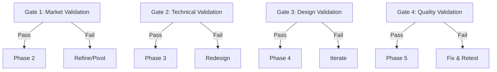

# 🚦 APOLLO WORKFLOW GATES - Validation Criteria

> **Authority**: WORKFLOW_MASTER.md defines the workflow  
> **Purpose**: This document details gate validation criteria  
> **Philosophy**: Fail fast, learn quickly, prevent downstream issues

---

## 🎯 Gate Overview



---

## 🔍 Gate 1: Market Validation
**After**: Phase 1 (Market Research)  
**Before**: Phase 2 (Technical Feasibility)  
**Decision Maker**: Gemini (Strategic Review)  

### Pass Criteria

#### Required Documents
- [x] **PRD v0.5+** with:
  - Clear problem statement
  - Quantified market opportunity (TAM/SAM/SOM)
  - Defined success metrics
  - User personas (minimum 2)
  - Revenue model

#### Market Validation
- [x] **Market Size**: >$10M addressable market
- [x] **Competition Analysis**: Clear differentiation identified
- [x] **User Validation**: Evidence of user pain point
- [x] **Revenue Path**: Clear monetization within 30 days
- [x] **Risk Assessment**: No showstoppers identified

#### Quality Thresholds
| Metric | Minimum | Target | Actual |
|--------|---------|--------|--------|
| Market Research Depth | 5 sources | 10+ sources | {value} |
| Competitor Analysis | 3 competitors | 5+ competitors | {value} |
| User Interviews/Surveys | 10 responses | 50+ responses | {value} |
| Revenue Projection Confidence | 60% | 80% | {value} |

### Fail Conditions
- ❌ Market too small (<$1M)
- ❌ No clear differentiation
- ❌ Regulatory blockers discovered
- ❌ Revenue model unclear
- ❌ User need not validated

### Gate Review Checklist
```markdown
## Gate 1 Review - {Date}
**Reviewer**: Gemini

Market Opportunity:
- [ ] TAM > $10M validated
- [ ] Growth trend positive
- [ ] Entry barriers manageable

Product-Market Fit:
- [ ] User pain point severe
- [ ] Solution uniquely valuable
- [ ] Willingness to pay validated

Strategic Alignment:
- [ ] Fits company vision
- [ ] Resource requirements reasonable
- [ ] Timeline achievable

**Decision**: ⬜ Pass | ⬜ Pass with conditions | ⬜ Fail
**Conditions**: {if applicable}
```

---

## ⚙️ Gate 2: Technical Validation
**After**: Phase 2 (Technical Feasibility)  
**Before**: Phase 3 (Design & UX)  
**Decision Maker**: Claude + Gemini  

### Pass Criteria

#### Required Deliverables
- [x] **Architecture Design** reviewed and approved
- [x] **Tech Stack** selected and justified
- [x] **EPIC-00** completed (foundation setup)
- [x] **Database Schema** defined
- [x] **API Contracts** documented
- [x] **Security Model** validated
- [x] **"Hello World"** deployed

#### Technical Validation
- [x] **Scalability**: Can handle 10x growth
- [x] **Performance**: <200ms response time achievable
- [x] **Security**: No critical vulnerabilities
- [x] **Cost**: <$0.10/user infrastructure
- [x] **Complexity**: Manageable with team size

#### Risk Assessment
| Risk Category | Acceptable Level | Current Level | Status |
|--------------|-----------------|---------------|---------|
| Technical Debt | Low-Medium | {level} | 🟢🟡🔴 |
| Dependency Risk | Low | {level} | 🟢🟡🔴 |
| Scalability Risk | Low | {level} | 🟢🟡🔴 |
| Security Risk | Very Low | {level} | 🟢🟡🔴 |
| Cost Risk | Low | {level} | 🟢🟡🔴 |

### Fail Conditions
- ❌ Architecture fundamentally flawed
- ❌ Performance targets unachievable
- ❌ Security vulnerabilities critical
- ❌ Cost projections >$1/user
- ❌ Technical complexity too high

### Gate Review Checklist
```markdown
## Gate 2 Review - {Date}
**Reviewers**: Claude (Technical), Gemini (Strategic)

Technical Readiness:
- [ ] All services provisioned
- [ ] Development environment stable
- [ ] CI/CD pipeline working
- [ ] Database migrations tested
- [ ] Auth system functional

Architecture Quality:
- [ ] Scalability validated
- [ ] Security review passed
- [ ] Performance benchmarks met
- [ ] Cost model confirmed
- [ ] Technical debt acceptable

**Decision**: ⬜ Pass | ⬜ Pass with conditions | ⬜ Fail
**Technical Debt Accepted**: {list any}
```

---

## 🎨 Gate 3: Design Validation
**After**: Phase 3 (Design & UX)  
**Before**: Phase 4 (Development)  
**Decision Maker**: Product Owner Agent  

### Pass Criteria

#### Required Deliverables
- [x] **User Journey Maps** for all personas
- [x] **Information Architecture** defined
- [x] **Design System** configured
- [x] **Component Library** ready
- [x] **Key Screens** designed (min 5)
- [x] **Mobile Designs** completed
- [x] **Assets** exported and optimized

#### Design Validation
- [x] **Usability**: Intuitive navigation
- [x] **Accessibility**: WCAG 2.1 AA compliant
- [x] **Responsiveness**: Mobile-first design
- [x] **Consistency**: Design system applied
- [x] **Performance**: Asset optimization done

#### User Testing Results
| Metric | Target | Actual | Status |
|--------|--------|--------|--------|
| Task Completion Rate | >80% | {value}% | 🟢🟡🔴 |
| Error Rate | <10% | {value}% | 🟢🟡🔴 |
| Time on Task | <2min | {value} | 🟢🟡🔴 |
| User Satisfaction | >4/5 | {value}/5 | 🟢🟡🔴 |

### Fail Conditions
- ❌ Poor usability test results
- ❌ Accessibility failures
- ❌ Mobile experience broken
- ❌ Design system incomplete
- ❌ Asset performance issues

### Gate Review Checklist
```markdown
## Gate 3 Review - {Date}
**Reviewer**: Product Owner

Design Completeness:
- [ ] All screens designed
- [ ] Interaction patterns defined
- [ ] Error states designed
- [ ] Empty states designed
- [ ] Loading states designed

Quality Validation:
- [ ] Usability testing complete
- [ ] Accessibility audit passed
- [ ] Performance budget met
- [ ] Brand alignment confirmed
- [ ] Stakeholder approval received

**Decision**: ⬜ Pass | ⬜ Pass with conditions | ⬜ Fail
**Design Debt**: {list any}
```

---

## ✅ Gate 4: Quality Validation
**After**: Phase 4 (Development)  
**Before**: Phase 5 (Launch)  
**Decision Maker**: CODEX + Gemini  

### Pass Criteria

#### Required Metrics
- [x] **Test Coverage**: >80% (overall)
- [x] **Test Coverage**: >90% (critical paths)
- [x] **All Tests**: Passing
- [x] **Performance**: All targets met
- [x] **Security**: No high/critical issues
- [x] **Accessibility**: No serious violations
- [x] **Mobile**: iOS/Android validated

#### Quality Metrics
| Category | Requirement | Actual | Status |
|----------|------------|--------|--------|
| Unit Test Coverage | >80% | {value}% | 🟢🟡🔴 |
| Integration Tests | All passing | {X}/{Y} | 🟢🟡🔴 |
| E2E Tests | Critical paths | {X}/{Y} | 🟢🟡🔴 |
| Performance Score | >90 | {value} | 🟢🟡🔴 |
| Security Issues | 0 critical | {count} | 🟢🟡🔴 |
| Accessibility | 0 serious | {count} | 🟢🟡🔴 |
| Code Quality | A rating | {rating} | 🟢🟡🔴 |

#### Platform Validation
- [x] **Web**: Chrome, Firefox, Safari tested
- [x] **Mobile Web**: Responsive design verified
- [x] **iOS**: Simulator testing passed
- [x] **Android**: Emulator testing passed
- [x] **API**: All endpoints tested
- [x] **Database**: Migration rollback tested

### Fail Conditions
- ❌ Test coverage <70%
- ❌ Critical bugs unfixed
- ❌ Performance targets missed
- ❌ Security vulnerabilities
- ❌ Platform compatibility issues
- ❌ Data loss scenarios

### Gate Review Checklist
```markdown
## Gate 4 Review - {Date}
**Reviewers**: CODEX (Quality), Gemini (Strategic)

Code Quality:
- [ ] Test coverage target met
- [ ] No critical bugs
- [ ] Performance validated
- [ ] Security scan clean
- [ ] Code review complete

Production Readiness:
- [ ] Deployment playbook ready
- [ ] Rollback plan tested
- [ ] Monitoring configured
- [ ] Documentation complete
- [ ] Support plan ready

**Decision**: ⬜ Pass | ⬜ Pass with conditions | ⬜ Fail
**Known Issues**: {list any accepted}
```

---

## 🚀 Pre-Launch Gate (Gate 4.5)
**Optional**: Additional validation before production  
**Decision Maker**: Product Owner + Gemini  

### Go/No-Go Criteria
- [x] **Legal**: Terms of Service, Privacy Policy ready
- [x] **Compliance**: GDPR/CCPA/COPPA as needed
- [x] **Payment**: Processing tested end-to-end
- [x] **Support**: Documentation and channels ready
- [x] **Marketing**: Landing page and materials ready
- [x] **Analytics**: Tracking implemented and tested
- [x] **Backup**: Disaster recovery plan tested

### Launch Readiness Score
```
Technical Readiness:  [████████░░] 80%
Business Readiness:   [██████████] 100%
Legal/Compliance:     [██████████] 100%
Support Readiness:    [████████░░] 80%
Marketing Readiness:  [██████░░░░] 60%

Overall: 84% - Ready with conditions
```

---

## 📊 Gate Metrics & Tracking

### Gate Performance History
| Product | Gate 1 | Gate 2 | Gate 3 | Gate 4 | Time to Revenue |
|---------|--------|--------|--------|--------|-----------------|
| Example-1 | Pass | Pass | Retry | Pass | 18 days |
| Example-2 | Pass | Retry | Pass | Pass | 21 days |

### Common Gate Failures
| Gate | Failure Reason | Frequency | Prevention |
|------|---------------|-----------|------------|
| Gate 1 | Insufficient market research | 30% | Use AURA agent |
| Gate 2 | Over-engineered architecture | 25% | Start simple |
| Gate 3 | Poor mobile experience | 20% | Mobile-first design |
| Gate 4 | Low test coverage | 35% | Test-first development |

### Gate Optimization Tips
1. **Front-load validation**: Catch issues early
2. **Use checklists**: Prevent oversight
3. **Automate checks**: Reduce manual validation
4. **Document decisions**: Explain conditional passes
5. **Learn from failures**: Update criteria based on experience

---

## 🔄 Gate Evolution

### Criteria Updates
Gates evolve based on learnings:
- After 5 products: Review and adjust thresholds
- After failures: Add missing criteria
- After successes: Streamline unnecessary checks

### Current Experiments
| Experiment | Hypothesis | Status | Results |
|------------|-----------|--------|---------|
| Lower coverage for MVPs | 70% sufficient for launch | Testing | TBD |
| Skip Gate 3 for B2B | Design less critical | Planned | - |

---

## 🔗 Related Documents

- **[WORKFLOW_MASTER.md](WORKFLOW_MASTER.md)** - Workflow overview
- **[WORKFLOW_PHASES.md](WORKFLOW_PHASES.md)** - Phase execution
- **[CODEX.md](../../CODEX.md)** - Gate enforcement configuration
- **[STANDARDS.md](../../STANDARDS.md)** - Quality standards
- **[testing_playbook-template.md](../templates/testing_playbook-template.md)** - Testing criteria

---

*Gate criteria are enforced by CODEX for CI/CD integration. Manual gate reviews use Gemini for strategic validation. Update criteria based on product learnings.*