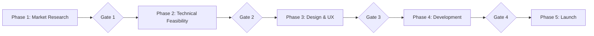

# 📋 APOLLO WORKFLOW PHASES - Detailed Execution Guide

> **Authority**: WORKFLOW_MASTER.md defines the workflow  
> **Purpose**: This document provides detailed phase execution  
> **Timeline**: 14-21 days from idea to revenue

---

## 🎯 Phase Overview



For gate criteria, see [WORKFLOW-GATES.md](WORKFLOW-GATES.md)

---

## 📊 Phase 1: Market Research & Problem Definition
**Duration**: 1-2 days  
**Models**: Perplexity → Gemini → Claude  
**Output**: PRD v0.1 → v0.3 → v0.5  

### Execution Steps

#### Step 1.1: Market Discovery (Perplexity)
```markdown
Prompt for Perplexity:
"Research the market for [product category]. Find:
- Current solutions and their limitations
- Market size and growth trends  
- User pain points and complaints
- Pricing models and monetization
- Recent innovations or changes"
```

**Deliverables**:
- Market research summary
- Competitor analysis matrix
- User pain points list
- Opportunity identification

#### Step 1.2: Synthesis & Strategy (Gemini)
```markdown
Handoff to Gemini:
"Based on this market research: [Perplexity output]
Create:
- Strategic positioning recommendation
- Unique value proposition
- Target user personas
- Revenue model options
- Risk assessment"
```

**Deliverables**:
- Strategic brief
- UVP statement
- Persona definitions
- Business model canvas

#### Step 1.3: PRD Creation (AURA/Claude)
```markdown
Task for AURA agent:
"Synthesize market research into PRD:
- Problem statement from research
- Solution approach
- Success metrics
- User stories
- Acceptance criteria"
```

**Deliverables**:
- PRD v0.1 (initial)
- PRD v0.3 (refined)
- PRD v0.5 (gate-ready)

### Quality Checklist
- [ ] Market opportunity validated with data
- [ ] Competitive differentiation clear
- [ ] Revenue model defined
- [ ] User personas detailed
- [ ] Success metrics quantified

---

## ⚙️ Phase 2: Technical Feasibility & Planning
**Duration**: 1-2 days  
**Models**: Claude (Opus) + tech-stack-advisor  
**Output**: Technical architecture, EPIC-00 setup  

### Execution Steps

#### Step 2.1: Architecture Design
```markdown
Task for tech-stack-advisor:
"Design architecture for: [PRD summary]
Consider:
- Scalability requirements
- Performance targets
- Security needs
- Integration points
- Cost constraints (<$0.10/user)"
```

**Deliverables**:
- Architecture diagram
- Tech stack selection
- Database schema
- API design
- Security model

#### Step 2.2: Foundation Setup (EPIC-00)
```markdown
EPIC-00 Checklist:
- [ ] Repository initialization
- [ ] Environment configuration (.env)
- [ ] CI/CD pipeline setup
- [ ] Database provisioning
- [ ] Auth system setup
- [ ] Monitoring configuration
- [ ] Secret management
```

**Deliverables**:
- Working development environment
- Deployed "Hello World"
- Service connections verified
- Golden datasets (if AI product)

#### Step 2.3: EPIC Planning
```markdown
Break down into EPICs:
- EPIC-01: Core data model
- EPIC-02: Authentication
- EPIC-03: Primary feature
- EPIC-04: Secondary features
- EPIC-05: Polish & optimization
```

**Deliverables**:
- EPIC files created
- Story point estimates
- Dependency mapping
- Sprint plan

### Quality Checklist
- [ ] Architecture reviewed by Gemini
- [ ] All services provisioned
- [ ] Development environment working
- [ ] COMMAND_CENTER Technical Truth updated
- [ ] Risk score calculated

---

## 🎨 Phase 3: Design & User Experience
**Duration**: 2-3 days  
**Models**: Claude + UX agents  
**Output**: Complete designs, component library  

### Execution Steps

#### Step 3.1: UX Journey Mapping
```markdown
Task for ux-journey-architect:
"Create user journeys for: [PRD]
Include:
- Entry points
- Key workflows
- Decision points
- Success states
- Error handling"
```

**Deliverables**:
- User journey maps
- Information architecture
- Navigation structure
- Interaction patterns

#### Step 3.2: Design System Selection
```markdown
Task for design-system-selector:
"Choose design system:
- Evaluate shadcn/ui, Tailwind UI, etc.
- Consider customization needs
- Ensure mobile compatibility
- Define component strategy"
```

**Deliverables**:
- Design system choice
- Component inventory
- Theme configuration
- Style guide

#### Step 3.3: Design Generation
```markdown
Task for design-tool-orchestrator:
"Generate designs using: [UXPilot/Lovable]
- Create responsive layouts
- Design key screens
- Define micro-interactions
- Export assets"
```

**Deliverables**:
- Figma/design files
- Exported assets
- Component specifications
- Implementation guide

### Quality Checklist
- [ ] All user journeys mapped
- [ ] Design system configured
- [ ] Mobile responsiveness verified
- [ ] Accessibility review complete
- [ ] Assets exported and optimized

---

## 💻 Phase 4: Development & Testing
**Duration**: 7-10 days  
**Models**: Claude (Sonnet) + specialized agents  
**Output**: Working product with 80%+ test coverage  

### Execution Steps

#### Step 4.1: Sprint Execution
```markdown
Daily Sprint Rhythm:
Morning:
- Review yesterday's progress
- Update COMMAND_CENTER metrics
- Plan today's tasks

Development:
- Work through EPIC tasks
- Delegate to subagents
- Integration testing

Evening:
- Update test coverage
- Document challenges
- Commit changes
```

**Key Patterns**:
- Test-first development
- Progressive enhancement
- Continuous integration
- Daily deployments

#### Step 4.2: Subagent Orchestration
```markdown
Delegation Strategy:
- Boilerplate → swift-codegen
- Tests → test-generator
- Complex logic → Claude directly
- Review → architecture-validator
```

**Context Management**:
- Orchestrator pattern
- Fresh context windows
- Kill switch validation
- Result integration

#### Step 4.3: Progressive Testing
```markdown
Testing Phases:
1. Unit tests (>80% coverage)
2. Integration tests
3. E2E critical paths
4. Performance testing
5. Security scan
6. Accessibility audit
```

**Deliverables**:
- Test reports
- Coverage metrics
- Performance benchmarks
- Security assessment

### Quality Checklist
- [ ] All EPICs completed
- [ ] Test coverage >80%
- [ ] No critical bugs
- [ ] Performance targets met
- [ ] Security review passed
- [ ] Mobile app approved (if applicable)

---

## 🚀 Phase 5: Launch & Revenue
**Duration**: 2-3 days  
**Models**: Claude + deployment agents  
**Output**: Live product generating revenue  

### Execution Steps

#### Step 5.1: Pre-Launch Preparation
```markdown
Task for deployment_playbook-creator:
"Create deployment playbook:
- Environment setup
- Database migrations
- Secret rotation
- Monitoring setup
- Rollback plan"
```

**Checklist**:
- [ ] Production environment ready
- [ ] DNS configured
- [ ] SSL certificates
- [ ] Backup strategy
- [ ] Monitoring alerts

#### Step 5.2: Staged Rollout
```markdown
Deployment Stages:
1. Deploy to staging
2. Smoke tests
3. Deploy to production (canary)
4. Monitor metrics
5. Full rollout
6. Enable monetization
```

**Monitoring**:
- Error rates
- Performance metrics
- User behavior
- Revenue events

#### Step 5.3: Post-Launch Optimization
```markdown
First 48 Hours:
- Monitor error logs
- Track user feedback
- Optimize slow queries
- Fix critical bugs
- A/B test pricing
```

**Success Metrics**:
- Uptime >99.9%
- Response time <200ms
- Conversion rate
- Revenue per user

### Quality Checklist
- [ ] Zero-downtime deployment
- [ ] All features working
- [ ] Payment processing active
- [ ] Analytics tracking
- [ ] Support channel ready
- [ ] First revenue achieved

---

## 📈 Phase Optimization Tips

### Speed Optimizations
| Phase | Optimization | Time Saved |
|-------|-------------|------------|
| Phase 1 | Use AURA agent for PRD | 4-6 hours |
| Phase 2 | Template reuse | 2-3 hours |
| Phase 3 | Design system presets | 1 day |
| Phase 4 | Parallel subagent work | 2-3 days |
| Phase 5 | Automated deployment | 4-6 hours |

### Common Bottlenecks
| Bottleneck | Solution | Prevention |
|------------|----------|------------|
| PRD churn | Clear success metrics | Gate 1 validation |
| Tech debt | Refactor continuously | Code review discipline |
| Design revision | User testing early | Prototype validation |
| Bug accumulation | Test-first development | >80% coverage |
| Deployment issues | Staging environment | Deployment playbook |

---

## 🔄 Continuous Improvement

### Phase Retrospective Questions
After each phase:
1. What went better than expected?
2. What took longer than planned?
3. What patterns emerged?
4. What would we do differently?
5. What should be templated?

### Metrics to Track
- **Velocity**: Story points per day
- **Quality**: Bugs per feature
- **Efficiency**: Context windows per EPIC
- **Revenue**: Time to first dollar
- **Stability**: Uptime percentage

---

## 🔗 Related Documents

- **[WORKFLOW_MASTER.md](WORKFLOW_MASTER.md)** - Workflow overview
- **[WORKFLOW-GATES.md](WORKFLOW-GATES.md)** - Gate criteria
- **[SUBAGENT-NAVIGATION.md](SUBAGENT-NAVIGATION.md)** - Agent selection
- **[EPIC-template.md](../templates/EPIC-template.md)** - EPIC structure
- **[COMMAND-CENTER-template.md](../templates/COMMAND-CENTER-template.md)** - Metrics tracking

---

*This detailed phase guide expands on WORKFLOW_MASTER.md. For gate criteria and validation requirements, see WORKFLOW-GATES.md.*