> **Repository status notice (2026-08-08):** This document preserves the original V2 research
> proposal. Its use of terms such as “constitutional” and “implementation-ready” describes the
> source proposal, not the repository's current authority or runtime status. PRD-CE V2 has no
> implemented runtime on this branch. [`PRD_CE_V2_BUILD_PLAN.md`](PRD_CE_V2_BUILD_PLAN.md) governs
> the proposed build sequence and holds migration and accepted-state mutation until their evidence
> and safety gates pass. Registry, marketplace, cloud, enterprise, connector, multi-provider, and
> cross-domain examples below are unaccepted research hypotheses and are outside the current V2
> Product Management build scope.

# The Product Model

## Master AI-Native Product Engineering Blueprint

**A SoT-first, truth-tracked Product Knowledge Graph for humans and AI agents**

**Research date:** August 7, 2026  
**Blueprint version:** 2.1  
**Primary subjects:** Impeccable and PRD-Led Context Engineering  
**Primary implementation decision:** Markdown SoT is canonical; generated databases and graph views are read models.  
**Design goal:** Define the smallest, clearest system that continuously compounds product knowledge without discarding the relational strengths already proven in PRD-CE.

> **Revision 2.1:** This version explicitly retains SoT Markdown, typed unique IDs, and relational properties as the core architecture. It defines SQLite and graph databases as generated read models rather than replacements for Markdown, and adds a direct coding-agent implementation contract.

---

## Research Method

This study combines:

1. Direct inspection of the Impeccable and PRD-Led Context Engineering repositories and their documentation.
2. The Claude research output supplied as an input hypothesis set.
3. Current primary-source research on OpenSpec, GitHub Spec Kit, BMAD, Graphiti, MCP, React, Git, Terraform, Docker, Tailwind, Next.js, Astro, shadcn/ui, Cursor, the OpenAI Agents SDK, Diátaxis, and Architecture Decision Records.
4. First-principles product and systems design.

Three evidence labels are used throughout:

- **Observed** — directly supported by repository code or official documentation.
- **Inferred** — a reasoned interpretation of observed design choices.
- **Recommended** — an original design proposal resulting from the synthesis.

The scoring models in this report are analytical judgments, not empirical user-study results. They should be validated with prototypes and usability testing.

---

# 0. Proposed Constitutional Decisions for Implementation

The original source proposed that this section override conflicting directions. In this repository,
these remain proposed constraints only: they become binding solely when accepted through `PRD.md`
and durable SoT decisions. Nothing in this research input overrides the current authority chain.

## 0.1 The canonical model

1. **The Source of Truth remains a first-class concept.** The accepted Product Model is authored in structured Markdown under `product/SoT/`.
2. **Markdown is the canonical write model and recovery source.** The system must be fully reconstructable from committed files and Git history.
3. **Typed unique IDs remain the primary human-facing addresses.** IDs such as `BR-104`, `UJ-101`, `ARC-004`, `API-045`, `TEST-301`, and `CFD-089` stay visible in Markdown, code, tests, prompts, and conversation.
4. **Relational properties are first-class data.** The links between SoT records are not decorative references; they are the edges of the Product Knowledge Graph and must be parsed, validated, indexed, traversed, and preserved through migration.
5. **A hidden immutable UID is optional infrastructure, not the user experience.** It may be generated for cross-repository synchronization or hosted graph identity, but it must never replace typed IDs in normal use.
6. **SQLite and graph JSON are generated read models.** They exist for fast traversal, full-text search, reverse references, temporal queries, drift analysis, context compilation, and visualization. They are disposable and must never contain irreplaceable knowledge.
7. **A hosted graph is an optional projection of the same logical model.** It adds synchronization, governance, and organization-wide queries; it does not become a competing source of truth.
8. **Accepted knowledge and proposed changes remain separate.** New semantic changes begin in a Change Set or are detected from direct SoT edits and wrapped into one before adjudication.
9. **Generated or inferred knowledge never silently becomes authoritative.** It enters as proposed, inferred, or ambiguous until accepted under an explicit authority policy.
10. **Views are derived.** `PRODUCT.md`, graph visualizations, readiness/fitness reports, HTML pages, context packs, and dashboards must reference or compile from canonical SoT records rather than introduce independent facts.

## 0.2 The governing invariant

> **The SoT is the human- and agent-editable Product Knowledge Graph. Typed IDs are its addresses. Relational properties are its edges. Markdown is its canonical representation. SQLite and hosted graph services are derived query layers.**

## 0.3 The implementation priority

> **Wave 0B reconciliation:** The active first-executable contract is
> [ARC-003](../SoT/SoT.TECHNICAL_DECISIONS.md#arc-003-first-executable-value-is-read-only-in-place-inspection):
> read-only, in-place inspection with exact source citations. The sequence below is preserved
> research direction, not one release. Its proposal, adjudication, and materialization steps are
> deferred until the read-only foundation and separate mutation gates pass.

The research sequence proposed proving the kernel before rebuilding the entire methodology:

```text
structured SoT Markdown
    → parse IDs and relational properties
    → validate integrity
    → build disposable SQLite and graph indexes
    → query, trace, and compile context
    → propose and adjudicate changes
    → materialize accepted updates back into SoT Markdown
```

---

# 1. Executive Summary

## The decisive conclusion

Impeccable is more cohesive because it productizes one outcome through one entry point, one context hierarchy, one shared vocabulary, one feedback loop, and one authored source compiled into many interfaces.

PRD-Led Context Engineering is more ambitious. It already contains the beginnings of a genuinely differentiated product: a Markdown Source of Truth, typed unique IDs, relational properties, provenance, supersession, valid-time queries, stale-knowledge detection, conflict relationships, code-to-spec traceability, and durable memory. Those are not legacy details to abstract away. They are the kernel of the next product.

Its weakness is that it exposes too much methodology and runtime machinery before the user experiences the value of that kernel.

The next generation should not be “PRD-CE with fewer folders,” nor “Impeccable for product managers.” It should preserve the SoT graph while radically simplifying the interface around it.

It should define a new category:

> **An AI-native Product Model Runtime: a local-first, Markdown-authoritative system that turns evidence, decisions, specifications, implementation, tests, telemetry, and feedback into an adjudicated temporal Product Knowledge Graph, then compiles the exact context humans and agents need for the work in front of them.**

## The master thesis

The Product Knowledge Graph is the durable asset, and the accepted SoT Markdown is its canonical projection.

But a graph that merely accumulates information is not enough. The differentiating behavior is **adjudication**:

- What does the product currently treat as authoritative?
- What is only proposed?
- What was rejected, and why?
- What has been superseded?
- What is contradicted by newer evidence?
- What is stale?
- What was believed at a prior point in time?
- Which decisions are implemented, verified, and observed in production?

The framework therefore has seven irreducible ideas:

1. **Product is the public noun.**
2. **SoT Markdown is the canonical accepted write model.**
3. **Typed unique IDs are the durable human-facing addresses.**
4. **Relational properties are the graph edges.**
5. **Change Set is the reviewable unit of work.**
6. **Claim or SoT record is the unit of durable knowledge.**
7. **Adjudication is the moat; context compilation is the agent interface.**

Everything else is a generated read model, view, adapter, policy, or extension.

## The five most important refinements to Claude’s output

| Claude insight | Master synthesis |
|---|---|
| “One noun, many verbs” | Correct, but the public noun should be **Product**, not “Truth” or “Graph.” The graph is the computational substrate. |
| “Adjudication, not accumulation” | Correct and central. Adjudication must be represented as reviewed semantic change sets, not scattered status edits. |
| “Markdown OSS, graph database cloud” | Markdown is not merely an OSS packaging choice. It is the canonical write model. SQLite, graph JSON, and a hosted graph are disposable or synchronized read models of the same SoT records and relationships. |
| “Stable prefixed IDs are the graph” | Confirmed. Retain typed IDs as the primary addresses. Add an optional hidden immutable UID only for cross-repo identity and hosted synchronization. |
| “Stale is a decision state” | Freshness is orthogonal to lifecycle. A decision may be accepted and stale at the same time. Status, authority, confidence, freshness, and temporal validity must remain separate. |

## The actual ancestry

“The React of AI-native product engineering” is useful as an ambition, but no single existing framework is the correct ancestor.

The design should combine:

- **Impeccable** for productization, progressive disclosure, opinionated defaults, compiled interfaces, and behavioral evals.
- **React** for minimal canonical state and derived views.
- **Git** for immutable history, branching, merge, and durable identity.
- **Architecture Decision Records** for context, status, rationale, and supersession.
- **Terraform** for declarative intended state, observed state, plan/apply, drift, and protected state transitions.
- **OpenSpec** for separating current state from proposed changes.
- **Graphiti** for temporal facts, provenance episodes, incremental graph updates, and historical queries.
- **MCP** for universal agent access, not as a storage model.
- **shadcn/ui** for an open, inspectable extension registry.
- **Astro** for opt-in complexity.

Architecturally, this is closer to **Git + ADRs + Terraform + a temporal graph**. Experientially, it should feel like **Impeccable + React**.

## The recommended product loop

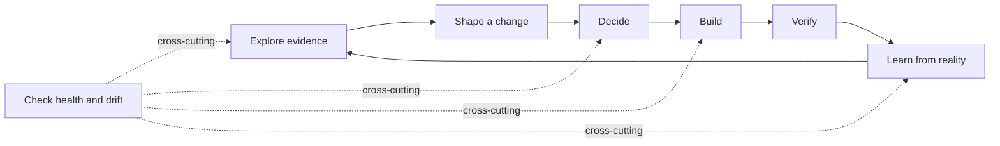

The user does not “manage a graph.” The user explores, shapes, decides, builds, learns, and checks. The graph compounds beneath those verbs.

## Recommended command surface

One skill, one root command, seven verbs:

```text
/product
/product init
/product explore
/product shape
/product decide
/product build
/product learn
/product check
```

`/product` by itself answers questions, recommends the next action, and routes plain-language requests. Advanced mechanics such as graph traversal, migration, sync, export, and schema inspection remain CLI or API reference surfaces.

## The core architecture

The product model has five planes:

1. **Evidence** — interviews, research, experiments, feedback, sources.
2. **Intent** — outcomes, constraints, accepted decisions, requirements.
3. **Delivery** — UX, architecture, contracts, code, tests, releases.
4. **Reality** — deployed behavior, telemetry, incidents, customer experience.
5. **Change** — proposed mutations and adjudication events connecting the other four.

These planes are represented through one storage contract:

- `product/SoT/` contains accepted, durable, structured Markdown records.
- `product/changes/` contains proposed semantic mutations and their impact.
- `product/evidence/` contains sources or source manifests.
- `.product/index.sqlite` and `.product/graph.json` are generated from Markdown for fast query and traversal.
- A hosted graph may synchronize the same records and edges at team or enterprise scale.

This avoids the dangerous fiction that one document contains every kind of “truth,” while preserving a single canonical authority for accepted knowledge. The system can show discrepancies between intended, implemented, and experienced product behavior without making a database the place users must author product meaning.

## The open/commercial boundary

The open-source boundary should not be “one writer versus many writers.” Git already supports teams.

**Open source, permanently:**

- Repo-scoped Markdown SoT and Product Model
- Typed ID and relationship registries
- Semantic Change Sets
- Generated SQLite and graph indexes
- CLI and one-skill agent interface
- MCP server
- GitHub Action
- Basic visualization
- Open schema and full export
- Playbook and adapter registry

**Commercial cloud:**

- Continuous multi-repo and external-system ingestion
- Cross-product and organization-wide graph
- Semantic reconciliation and conflict inboxes
- Role-based authority and approval policy
- SSO, audit, retention, data residency
- Scheduled freshness and drift monitoring
- Portfolio analytics and governance
- Managed connectors and enterprise support

The paid product adds synchronization, scope, governance, and service quality. It does not hold the user’s local product memory hostage.

## The strategic wedge

The fastest path to adoption is not asking users to adopt a methodology.

It is:

> **Run one command on an existing repository and immediately reveal decisions that have no evidence, requirements that have no implementation, code that has no known intent, tests that verify nothing explicit, stale critical assumptions, and contradictions between documentation and reality.**

The first useful experience must happen before the user learns the ontology.

---

# 2. Product Philosophy Comparison

## 2.1 What Impeccable actually productizes

### Observed

Impeccable currently presents itself as one skill with 23 commands and deterministic detector rules. Its main command routes plain-language intent, recommends next steps, and reads `PRODUCT.md` and `DESIGN.md`. Its documentation gives users a short start path and a broader Plan → Build → Review → Refine journey. Its v3.0 release explicitly consolidated 18 skills into one skill with 23 commands. [S4][S7][S8]

Its repository also separates authored source from generated provider outputs. One source is transformed into provider-specific installations; detector rules feed multiple surfaces; generated counts and metadata are validated; and behavioral tests exercise the actual skill against contemporary models. [S5][S6]

### Inferred

Impeccable’s cohesion is not merely a smaller folder count or a literal “one noun.”

It has a clear hierarchy:

1. **Outcome:** better, less generic product design.
2. **Context:** product intent and design system.
3. **Interface:** one command namespace.
4. **Loop:** shape, build, evaluate, refine, maintain.
5. **Opinion:** deterministic and model-facing design rules.
6. **Distribution:** compiled into every supported harness.
7. **Verification:** deterministic checks plus model-behavior evals.

The crucial property is that the machinery is subordinate to a recognizable user outcome.

### Product principle

> **A framework feels simple when every concept has an obvious parent. Complexity becomes overwhelming when internal mechanisms appear as peers.**

## 2.2 What PRD-Led Context Engineering actually contains

### Observed

PRD-CE defines a layered memory architecture, a set of Source-of-Truth files, stable IDs, relationship semantics, staleness rules, temporal validity, a ten-stage lifecycle, dozens of skills, four named agents, hooks, readiness scoring, development graph outputs, and human review views. [S1][S2][S3]

The unique-ID system already states that durable concepts keep stable IDs, records typed relationships, defines staleness windows, and describes a supersession protocol with `Valid From`, `Valid To`, and `Invalidated By`. The `asof.py` utility reconstructs authoritative decisions for a prior lifecycle version. [S2][S3]

### Inferred

PRD-CE’s complexity comes from five layers being presented simultaneously:

- **Ontology** — IDs, types, relations.
- **Methodology** — lifecycle stages and named product methods.
- **Runtime** — agents, hooks, memory loading.
- **Governance** — readiness, validation, gates.
- **Views** — HTML, dashboards, generated graph files.

Each layer is legitimate. The mistake is making the user learn all five before receiving value.

PRD-CE is not “too ambitious.” It lacks a product hierarchy that makes its ambition progressively discoverable.

## 2.3 Necessary versus accidental complexity

| Capability | Keep? | Correct product form |
|---|---:|---|
| Stable identity | Yes | Typed ID as primary address; optional hidden UID; aliases preserve history |
| Provenance | Yes | Required on claims and changes; mostly captured automatically |
| Supersession | Yes | First-class semantic change operation |
| Valid-time history | Yes | Core temporal query capability |
| Transaction history | Yes | Explicit change receipt plus Git history |
| Conflict representation | Yes | First-class conflict object/edge with severity and disposition |
| Freshness | Yes | Orthogonal metadata and policy, not lifecycle status |
| Code/spec/test linkage | Yes | Scoped traceability and derived coverage views |
| Context-window-sized work | Yes | Change set and generated context pack |
| Lifecycle guidance | Yes | Documentation narrative and optional policy profile |
| Ten hardcoded gates | No | Goal-scoped fitness checks and configurable policies |
| Forty-plus first-class skills | No | Seven verbs plus optional playbooks |
| Named agent squad | No | Hidden task-specialist workers with explicit contracts |
| Hand-authored HTML mirror | No | Generated views only |
| Readiness as a pillar | No | Derived “fitness for this change” view |
| Type prefix encoded in identity | No | Kind metadata plus aliases |
| Numeric confidence by default | No | Evidence basis and confidence band; scores only when calibrated |

## 2.4 The product seam

Impeccable and PRD-CE embody different instincts:

- Impeccable hides machinery and exposes taste.
- PRD-CE exposes machinery to enforce rigor.

The next-generation framework should resolve the seam this way:

> **Hide the machinery, preserve the rigor, and make the rigor inspectable on demand.**

The user should never need to understand the graph to get value. But advanced users must be able to inspect every claim, source, status transition, derivation, and policy decision.

## 2.5 Adjacent product philosophies

| Framework | Public mental model | Durable unit | Strength | Unclaimed territory |
|---|---|---|---|---|
| Impeccable | One design skill, many commands | Product/design context | Cohesive, opinionated product loop | Whole-product memory and temporal adjudication |
| OpenSpec | Explore/propose/apply/archive | Spec change folder | Current specs separated from proposed updates; brownfield-friendly | Semantic product graph across evidence, decisions, delivery, and reality |
| GitHub Spec Kit | Constitution → Spec → Plan → Tasks → Implement | Generated artifact set | Clear intent-driven SDD and extensibility | Long-lived temporal memory and post-release learning |
| BMAD | Expert agents and workflows | Methodology artifacts | Broad lifecycle, adaptive depth, rich guidance | Minimal concepts and a single canonical product model |
| PRD-CE | Lifecycle skills over an ID-linked SoT | ID-addressed records | Strong latent graph, temporal validity, traceability | Productized surface and generic change semantics |
| Graphiti | Temporal context graph | Entity, fact, episode | Provenance, temporal validity, incremental graph updates | Product lifecycle semantics and human decision authority |
| Git + ADRs | Commits and decision records | Snapshot/change and decision | History, merge, rationale, supersession | Unified product ontology and agent context compiler |

OpenSpec is the most important current adjacent competitor because it already separates current specifications from proposed changes and archives accepted updates. The next-generation product must therefore move beyond document change tracking into **semantic change tracking across the entire product model**. [S9]

---

# 3. Repository Teardown

## 3.1 Comparative structure

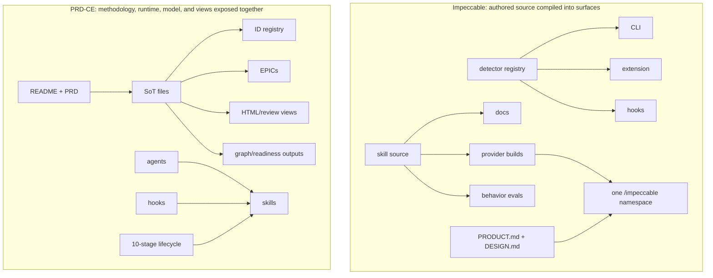

## 3.2 Impeccable design decisions

### Single skill and command router

**Observed:** Impeccable consolidated 18 skills into one namespace and retained pinning for favorite shortcuts. [S7][S8]

**Why it works:** It reduces namespace pollution without removing capability. The default root command also solves the “I do not know which command I need” problem.

**Lesson:** The next framework should have one root skill that can answer, recommend, or route. Specialist commands are verbs, not separate products.

### Root context files

**Observed:** `PRODUCT.md` captures audience, purpose, voice, anti-references, and product/brand register; `DESIGN.md` captures visual decisions. Every command reads both. [S4][S8]

**Why it works:** Context is stored once, remains editable, and is reused without forcing users to understand a database.

**Lesson:** Keep `PRODUCT.md` as the human-readable front door, but treat it as a generated or curated view over the Product Model rather than the entire model.

### Source-first compilation

**Observed:** The repository treats `skill/` as source of truth and generates provider-specific artifacts. Builds validate provider manifests, counts, versions, prose, and rule drift. [S5][S6]

**Why it works:** Cross-harness complexity is absorbed by the build system rather than exported to users or contributors.

**Lesson:** Author the product methodology and command schema once, compile it into Claude Code, Cursor, Codex, Gemini, Copilot, MCP, CLI, and docs.

### One rule registry, many enforcement surfaces

**Observed:** The same anti-pattern registry feeds multiple interfaces. [S5][S6]

**Why it works:** Opinion remains consistent in chat, CI, and browser review.

**Lesson:** Product-model policies, schema rules, drift checks, and relationship validators must originate from one machine-readable policy registry.

### Behavioral evaluation

**Observed:** Impeccable tests skill behavior against real models and maintains deterministic fixtures for detector rules. [S5][S7]

**Why it works:** Prompts are treated as executable product behavior, not static prose.

**Lesson:** The next framework needs scenario evals such as “resolve a superseded decision,” “compile context for a feature,” “detect a contradiction,” and “refuse to promote generated content without authority.”

## 3.3 PRD-CE design decisions

### Layered memory

**Observed:** The repo separates durable SoT, active work/EPIC context, temporary scratch, and agent memory. [S1]

**Why it was chosen:** It maps information longevity to context loading and reduces full-repository prompt dumps.

**Keep:** The principle.

**Change:** Make the layers implementation details of a context compiler. Users should see Current Product, Active Change, and Evidence—not a memory taxonomy.

### Stable-to-volatile loading

**Observed:** Stable product context is loaded before volatile work context. [S1]

**Why it was chosen:** It improves consistency and prompt-cache reuse.

**Keep:** This should become a deterministic context-pack compiler that chooses the smallest relevant subgraph.

### Stable IDs and typed relationships

**Observed:** The repo defines stable IDs, many prefixes, relationship vocabulary, staleness, and validation. [S2]

**Why it was chosen:** It makes Markdown addressable and graph-like.

**Keep:** Durable identity, references, and relationship validation.

**Change:** Separate identity from ontology. A business rule should not require a new identity if it later becomes a decision, policy, or contract.

### Temporal validity and supersession

**Observed:** PRD-CE records valid-from, valid-to, and invalidating decisions and supports prior-state queries. [S2][S3]

**Why it matters:** This is the strongest genuinely differentiated primitive in the repository.

**Elevate:** Make supersession, historical queries, and retained rejected alternatives central to the product story.

### Lifecycle skills

**Observed:** The repository offers many stage-specific skills with methods and output contracts. [S1]

**Why they were chosen:** They encode high-quality product practice and provide structured work paths.

**Keep:** As optional playbooks and domain methods.

**Change:** Remove stage numbers and named methodologies from the core command surface.

### Hooks, readiness, graph outputs, and HTML

**Observed:** These provide deterministic governance and human review. [S1]

**Why they were chosen:** They close the gap between methodology and execution.

**Keep:** As runtime checks and generated views.

**Change:** They should be derived from the Product Model and policy registry. None should become a second authored source.

## 3.4 The deeper repository lesson

Impeccable’s repository is not actually simple internally. It has a CLI, browser extension, website, provider transformers, generated outputs, tests, and release infrastructure.

It feels simple because internal complexity is **compiled away**.

The next repository should follow the same rule:

> **Complexity may exist in the implementation, but it must not leak into the user’s mental model.**

---

# 4. Information Architecture Evaluation

## 4.1 Evaluation criteria

Scores range from 1 to 5.

- Learnability
- Scalability
- AI usability
- Human usability
- Discoverability
- Extensibility
- Contributor friendliness
- Documentation simplicity

| Model | Learn | Scale | AI | Human | Discover | Extend | Contribute | Docs | Total /40 |
|---|---:|---:|---:|---:|---:|---:|---:|---:|---:|
| One skill → many commands | 5 | 4 | 5 | 5 | 5 | 4 | 4 | 5 | **37** |
| Many skills | 2 | 4 | 3 | 2 | 2 | 5 | 3 | 2 | **23** |
| Lifecycle-first | 4 | 3 | 3 | 4 | 4 | 3 | 3 | 4 | **28** |
| Artifact-first | 3 | 3 | 3 | 3 | 3 | 4 | 3 | 3 | **25** |
| Role-first | 3 | 2 | 2 | 3 | 3 | 3 | 3 | 3 | **22** |
| Graph-first as public UX | 2 | 5 | 5 | 2 | 3 | 5 | 3 | 2 | **27** |
| **Commands over graph, lifecycle as narrative** | **5** | **5** | **5** | **5** | **5** | **5** | **4** | **5** | **39** |

## 4.2 Recommended information architecture

Use three layers:

### Layer 1: Task-first surface

The user thinks:

- Help me understand.
- Help me choose.
- Help me build.
- Tell me what changed.
- Tell me what is wrong.

This becomes `/product` plus seven verbs.

### Layer 2: Lifecycle narrative

Documentation teaches:

**Explore → Shape → Decide → Build → Learn**

This is a journey, not a hard gate system. Users may enter anywhere.

### Layer 3: Graph-native substrate

Agents and advanced tools operate on claims, evidence, changes, decisions, relationships, policies, and temporal history.

Humans do not need to think “create a node.” Agents should never need to guess which document is authoritative.

## 4.3 The Product Model mental model

The public explanation should be one paragraph:

> Your product has a memory. It stores what you observed, what you decided, what you built, what happened in reality, and how each changed over time. You work through small reviewed changes. The framework gives every human and agent the current product context without erasing the reasoning that came before it.

That is simpler than “knowledge graph,” while still making the graph the underlying product.

---

# 5. Radical Simplification Recommendations

## 5.1 The constitutional test

Every core concept must perform at least one of these operations:

1. **Observe** — capture evidence or reality.
2. **Propose** — express a candidate change.
3. **Adjudicate** — accept, reject, withdraw, deprecate, or supersede.
4. **Materialize** — update the current Product Model.
5. **Validate** — check evidence, consistency, implementation, or policy.
6. **Compile** — produce context, views, or integrations.

If a feature does none of these, it does not belong in the core.

## 5.2 Keep, demote, remove

| Current concept | Decision | V2 form |
|---|---|---|
| SoT | **Keep and elevate** | `product/SoT/` is the canonical accepted Markdown projection of the Product Model |
| Unique IDs | **Keep and extend** | Typed IDs remain primary; optional generated UID supports cross-repo/cloud identity |
| Relationship vocabulary | **Keep and elevate** | Relational properties become schema-validated graph edges and query primitives |
| Temporal validity | Keep and elevate | Standard metadata plus current and as-of queries |
| `asof.py` | Keep capability | `product as-of` backed by the generated index |
| EPICs | Replace in core | Semantic Change Sets sized for coherent work; an EPIC may remain an optional view/playbook |
| `temp/` | Hide or simplify | Local scratch/workspace, harvested automatically into evidence, lessons, or a Change Set |
| Lessons learned | Keep | Durable `LL-` SoT records linked to changes, evidence, and outcomes |
| 47 skills | Collapse | Seven verbs plus optional registry playbooks |
| 10 lifecycle stages | Demote | Optional guided journey and policy profiles |
| Named methodologies | Move | Registry playbooks |
| Four named agents | Remove from UX | Hidden workers selected by capability and scoped context |
| Hooks | Keep | Runtime policy enforcement around SoT and Change Sets |
| Readiness score | Replace | Goal-scoped fitness, unresolved-risk, and graph-integrity views |
| Devgraph | Keep capability | Generated `.product/index.sqlite` and `.product/graph.json` |
| HTML review mirror | Remove as authored source | Generated human views linked back to SoT IDs |
| Quick/standard/deep everywhere | Collapse | One optional depth control or automatic sizing |
| Prefix registry | Keep and simplify | Machine-readable ID registry; prefixes are stable human affordances, not disposable UI |
| `PRODUCT.md` | Keep as a front door | Generated or reference-only summary; no un-IDed canonical facts |

## 5.3 The minimum public concepts

A new user should need only five ideas:

- **Product** — the thing being built and learned about.
- **SoT** — the accepted product memory in Markdown.
- **Change** — a proposed or accepted semantic mutation.
- **Decision** — an authorized disposition of a change or conflict.
- **Evidence** — what supports, contradicts, or contextualizes knowledge.

Users should not need to learn graph databases, node types, index tables, or agent personas to receive value.

The internal model may include Entity, Claim, Relationship, Event, Policy, Artifact, Signal, and View, but those are reference concepts rather than onboarding requirements.

## 5.4 What should remain opinionated

Radical simplification does not mean neutrality.

The core should insist that:

- Generated knowledge starts as proposed.
- Evidence and authority are explicit.
- Accepted meaning is never silently overwritten.
- Superseded and rejected records are retained.
- Changes are reviewable.
- Derived views are never hand-authored.
- Critical conflicts cannot be hidden by summary generation.
- Context is compiled just in time.
- Local data remains exportable.
- Extensions cannot mutate core semantics without namespacing and validation.

Opinion is the product. Configuration should tune policy, not erase the philosophy.

---

# 6. Product Knowledge Graph Architecture

## 6.1 The refined hypothesis

The original hypothesis says:

> The Product Knowledge Graph is the product. Everything else is an interface to it.

The refined version is:

> **The Product Model is the durable product asset. The SoT is its canonical accepted Markdown projection. Typed IDs and relational properties make that projection a graph. SQLite, graph JSON, MCP, and hosted graph services are computational read layers. Adjudication is the behavior that makes the asset trustworthy.**

This keeps the proven PRD-CE representation while preventing any database technology from becoming the product or a prerequisite for adoption.

## 6.2 Five-plane model

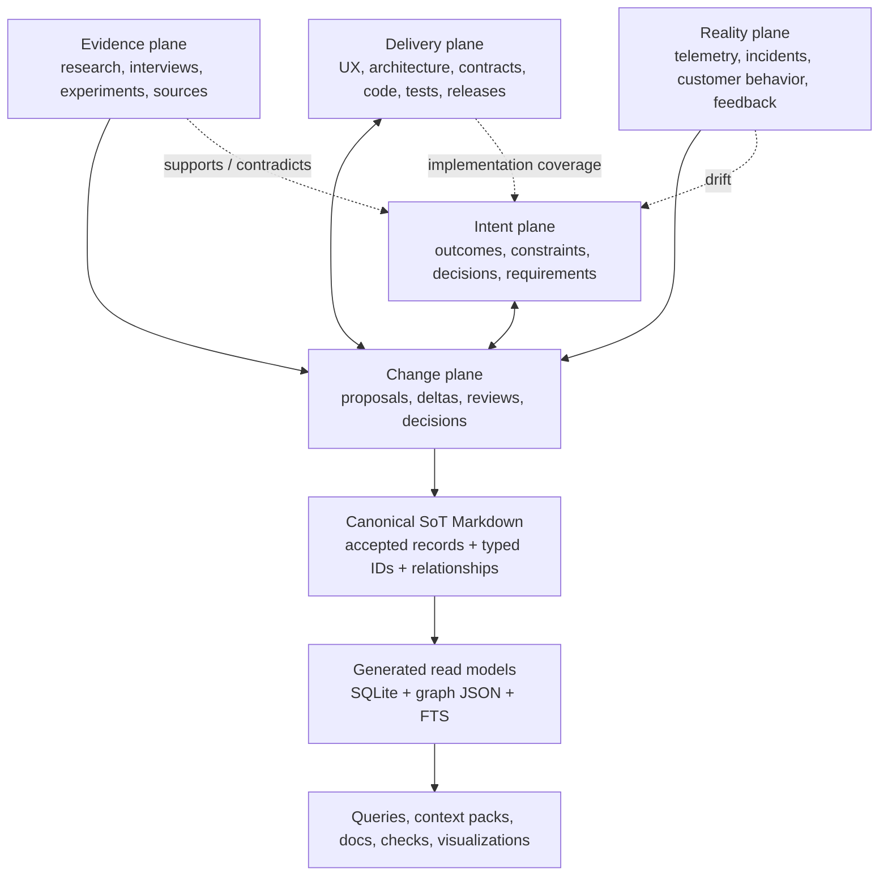

### Evidence plane

Stores what was observed and where it came from.

Examples:

- Interview transcript
- Customer feedback
- Competitive analysis
- Research source
- Experiment result
- Incident report

### Intent plane

Stores what the product currently intends or requires.

Examples:

- Outcome
- Product principle
- Decision
- Constraint
- Requirement
- Policy
- Non-goal

### Delivery plane

Stores how intent is designed, implemented, verified, and released.

Examples:

- User journey
- Screen or interaction contract
- Architecture
- API/data contract
- Code unit
- Test
- Release

### Reality plane

Stores what actually happens.

Examples:

- Telemetry
- Adoption signal
- Support pattern
- Incident
- Customer behavior
- Measured outcome

### Change plane

Stores proposed semantic mutations and their adjudication.

Examples:

- Add claim
- Modify scope
- Supersede decision
- Reject proposal
- Link implementation
- Reclassify confidence
- Resolve conflict

The graph’s highest-value queries compare planes:

- Intent versus implementation
- Implementation versus verification
- Intent versus observed reality
- Evidence versus accepted decisions
- Current state versus prior state

## 6.3 Core internal objects

### Entity

A stable subject in the product domain.

Examples: Checkout, Workspace, Free Plan, Onboarding Journey, Authentication Service.

### Claim

An atomic statement about an entity or relationship.

Example:

> Free Plan has a maximum team size of five members.

A claim has status, provenance, scope, temporal validity, authority, and freshness.

### Evidence

A source or episode that supports, contradicts, or contextualizes a claim.

### Decision

An authorized commitment that selects an option, establishes a rule, or resolves a conflict.

A Decision is not merely a high-confidence Claim. It has an owner and authority policy.

### Artifact

A designed or implemented expression of product intent: PRD section, UX flow, API contract, code unit, test, release.

### Signal

An observed result from the real product: telemetry, feedback, incident, measured outcome.

### Change Set

A reviewable collection of semantic mutations with rationale, evidence, impact, owner, and disposition.

### View

A derived projection: `PRODUCT.md`, readiness/fitness report, graph visualization, docs, context pack, release brief.

## 6.4 Logical schema

The logical schema is independent of its storage projection. In V2, accepted records are authored in Markdown and indexed into SQLite and graph JSON.

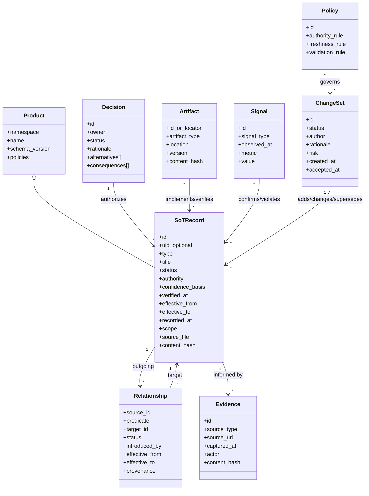

A SoT record is the MVP persistence unit. It may represent a decision, business rule, journey, requirement, architecture constraint, contract, test specification, lesson, signal, or evidence summary. The internal claim model may become more granular later, but V2 should not split every sentence into a node before the retrieval and adjudication value is proven.

## 6.5 Identity design

### Decision: retain typed IDs

Typed IDs are one of the strongest usability features in PRD-CE. They make the graph legible in Markdown, code, tests, pull requests, and agent conversation.

Examples:

```text
CFD-089   customer feedback
OUT-003   desired outcome
BR-104    business rule
UJ-101    user journey
ARC-004   architecture decision or rule
API-045   API contract
TEST-301  verification record
MON-018   monitoring or production signal
LL-027    lesson learned
CHG-0142  semantic Change Set
```

### Identity contract

Each durable object has a typed ID and may have a generated UID:

```yaml
id: BR-104
uid: pkn_01K2A7E4W0H3S9   # optional, generated, normally hidden
type: business-rule
title: Free plan member limit
aliases:
  - BR-072-FREE-LIMIT
```

Rules:

- `id` is the primary address humans and agents use.
- IDs are never reused.
- The prefix registry remains machine-readable and versioned.
- The prefix communicates the record’s original or dominant meaning, but it does not force destructive renaming if the record is later reclassified.
- `uid` is optional for local operation and required only when cross-repository synchronization, deduplication, or hosted graph identity needs it.
- `namespace + id` is globally resolvable within a synchronized organization.
- Aliases preserve historical references and migrations.
- Code comments, tests, prompts, and Markdown links should prefer the typed ID.
- Moving a record between SoT files must not change its ID.
- A title or type change must not break references.

This combines the clarity of PRD-CE with the identity durability needed by a future hosted service.

## 6.6 Relationship vocabulary

Relational properties are a constitutional feature. The framework should make them easier to author and much harder to corrupt.

### Core predicates

| Category | Predicate | Typical direction | Meaning |
|---|---|---|---|
| Evidence | `informed-by` | claim/decision → evidence | The target contributed to this record |
| Evidence | `supports` | evidence → claim | The source increases support for the target |
| Evidence | `contradicts` | evidence → claim | The source challenges the target |
| Evidence | `derived-from` | record → source record | The source was transformed into this record |
| Intent | `requires` | record → prerequisite | The source cannot hold without the target |
| Intent | `constrains` | rule/decision → target | The source limits the target |
| Intent | `depends-on` | record → dependency | The source relies on the target |
| Intent | `part-of` | record → parent | The source belongs to a larger concept |
| Experience | `designed-for` | design/journey → persona/outcome | The source serves the target |
| Delivery | `implements` | code/artifact → SoT record | The source realizes the target |
| Delivery | `enforces` | API/code/policy → rule | The source enforces the target |
| Delivery | `verifies` | test/evidence → SoT record | The source verifies the target |
| Reality | `monitors` | monitor/signal → SoT record | The source observes the target |
| Reality | `violates` | reality/artifact → SoT record | The source is inconsistent with the target |
| Change | `supersedes` | new record → old record | The source replaces the target while preserving history |
| Change | `conflicts-with` | record ↔ record | Both cannot be treated as simultaneously valid in the same scope |
| Change | `deprecates` | active record → old record | The target remains usable but should be retired |
| Change | `introduced-by` | record/edge → Change Set | The target explains the semantic introduction |

Human-friendly inverse forms such as `implemented-by`, `verified-by`, and `monitored-by` may be accepted in Markdown. The parser should normalize them into one canonical edge direction while preserving the authored form for rendering.

### Relationship contract

Every indexed relationship must have:

```yaml
source: BR-104
predicate: informed-by
target: CFD-089
status: accepted
introduced_by: CHG-0142
effective_from: v0.6
effective_to: null
```

The minimum authoring form may remain a readable Markdown list:

```markdown
### Relationships

- `informed-by → CFD-089`
- `constrains → UJ-101`
- `enforced-by → API-045`
- `implemented-by → CODE-membership-limit`
- `verified-by → TEST-301`
- `monitored-by → MON-018`
- `conflicts-with → CFD-140`
```

Validation rules:

- Every target ID in managed scope must resolve or be explicitly marked external.
- Duplicate edges collapse only when all semantic properties match.
- Unknown predicates fail validation unless they are namespaced extensions.
- Symmetric predicates such as `conflicts-with` are indexed in both traversal directions without duplicating the authored edge.
- Edge history is retained through Change Sets and temporal fields.
- Removing an edge is a semantic change and must be attributable to a Change Set or Git change receipt.

Extensions use namespaces:

```text
healthcare:governed-by
security:mitigates
design:uses-token
```

A relation enters the core only after it proves broadly reusable and cannot be expressed safely through existing predicates.

## 6.7 Canonical structured Markdown contract

The Markdown format must remain pleasant to read while deterministic enough to parse without an LLM.

### Record example

```markdown
## BR-104 | Free Plan Member Limit

- **Type:** Business Rule
- **Status:** Accepted
- **Authority:** Product
- **Confidence Basis:** Asserted and verified
- **Verified:** 2026-08-07
- **Valid From:** v0.6
- **Valid To:** —
- **Invalidated By:** —
- **UID:** `pkn_01K2A7E4W0H3S9`
- **Introduced By:** `CHG-0142`

### Statement

A free workspace may contain no more than five active members.

### Rationale

The limit creates a clear upgrade boundary while allowing a small team to evaluate collaboration.

### Relationships

- `informed-by → CFD-089`
- `constrains → UJ-101`
- `enforced-by → API-045`
- `verified-by → TEST-301`
- `monitored-by → MON-018`
- `conflicts-with → CFD-140`

### History

- Supersedes: `BR-072`
- Last adjudicated by: `CHG-0142`
```

### Parser rules for V2

- A durable record begins with an H2 heading whose first token is a registered typed ID.
- The title follows `|`, `:`, or `—`; the parser normalizes these variants.
- Structured fields use `- **Field:** value` syntax.
- `Status`, `Type`, and either `Statement` or a type-specific primary section are required for accepted records.
- Relationships appear under a `### Relationships` heading and use backticked `predicate → TARGET-ID` syntax.
- Existing PRD-CE relationship formats should be accepted through a compatibility parser.
- Free-form explanatory prose remains allowed beneath known sections.
- Unknown sections are preserved during read/write cycles.
- Reformatting must not destroy comments, custom prose, or unrelated sections.
- Duplicate IDs are blocking errors.
- A generated UID may be added without changing the typed ID.

### Authority of files

- `product/SoT/*.md` is authoritative for accepted product knowledge.
- `product/changes/**` is authoritative for pending semantic changes and adjudication context.
- `product/evidence/**` is authoritative for locally stored evidence or source manifests.
- Git history and `product/history/**` preserve accepted/rejected change receipts.
- `PRODUCT.md` is a generated or reference-only front door. It must not contain canonical facts that lack a SoT ID.

## 6.8 Markdown write model and generated database read model

Markdown and databases solve different problems. V2 should deliberately use both.

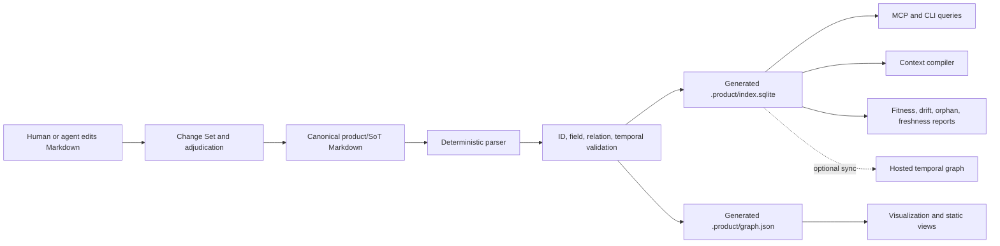

### Storage responsibilities

| Layer | Responsibility | Authority |
|---|---|---|
| Markdown SoT | Human/agent authoring, Git diff, review, portability, recovery | **Canonical** |
| Change Sets | Proposed semantic mutations, evidence, impact, adjudication | **Canonical for pending change** |
| SQLite | Fast local queries, FTS, reverse references, temporal filters, context compilation | Generated/disposable |
| Graph JSON | Portable visualization and interoperability projection | Generated/disposable |
| Hosted graph | Cross-repo synchronization, governance, organization queries | Synchronized projection; never sole authority |

### Recommended local SQLite tables

```text
records(
  namespace, id, uid, prefix, type, title, status, authority,
  confidence_basis, verified_at, effective_from, effective_to,
  invalidated_by, introduced_by, source_file, source_line,
  content_hash, body_markdown
)

relationships(
  source_id, predicate, target_id, authored_predicate,
  status, introduced_by, effective_from, effective_to,
  source_file, source_line
)

aliases(alias, canonical_id, introduced_by)
changes(change_id, status, title, author, created_at, decided_at, path)
evidence(evidence_id, source_type, source_uri, captured_at, content_hash, path)
artifacts(locator, artifact_type, content_hash, last_seen_at)
artifact_links(locator, predicate, target_id, confidence_basis)
validation_findings(finding_id, severity, code, record_id, message, generated_at)
```

A separate FTS virtual table may index titles, statements, rationale, and body text.

### Rebuild and integrity guarantees

- Deleting `.product/` and running `product index` must reconstruct the complete local query model.
- No accepted fact or edge may exist only in SQLite.
- Database writes are internal implementation details; agents do not directly mutate SQLite.
- The index records file paths, line numbers, and content hashes so every answer can cite the Markdown source.
- The indexer must be deterministic for the same repository state.
- Schema migrations must preserve the ability to rebuild from prior supported Markdown formats.
- Hosted synchronization must round-trip without changing typed IDs or losing relationship metadata.

A dedicated graph database should be deferred until cross-repository scale or query complexity proves SQLite insufficient. The local product should not require a server.

## 6.9 Orthogonal truth dimensions

The system must not collapse distinct dimensions into one status.

| Dimension | Example values | Question answered |
|---|---|---|
| Lifecycle | draft, proposed, accepted, rejected, withdrawn, deprecated, superseded | Where is this in its decision lifecycle? |
| Authority | unowned, agent-proposed, team-approved, policy-authorized | Who may treat this as canonical? |
| Confidence basis | observed, asserted, inferred, generated, derived | How was it obtained? |
| Confidence band | low, medium, high, verified | How strongly is it supported? |
| Freshness | current, review-due, stale | When was it last verified under its policy? |
| Valid time | effective from/to | When was it true in the product world? |
| Transaction time | recorded/retracted | When did the system know or record it? |
| Scope | product, version, environment, segment, market | Where does it apply? |

Numeric confidence should be optional and used only when calibrated. A false precision such as `0.83` is worse than an explicit evidence basis.

## 6.10 Decision state machine

Freshness is deliberately outside this state machine.

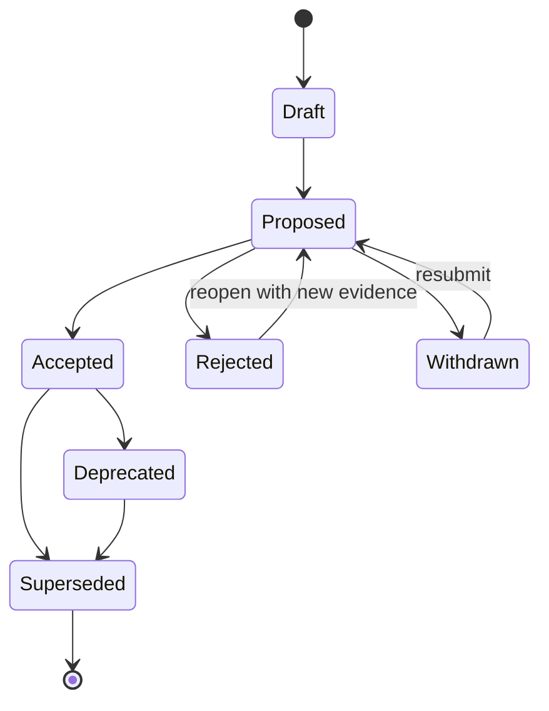

Accepted, rejected, and superseded records remain queryable. Rejected alternatives are especially valuable because they stop future agents and teammates from repeatedly rediscovering already-considered options.

## 6.11 Temporal model

Every durable claim should support:

```yaml
effective_from: 2026-05-01
effective_to: null
recorded_at: 2026-04-18T15:12:00Z
retracted_at: null
supersedes: pkn_...
```

This enables two distinct queries:

- **What was effective on June 1?**
- **What did the organization believe on April 20?**

Git history remains valuable, but semantic transaction time must be explicit. Rebases, imports, generated projections, and cross-repo synchronization make commit timestamps insufficient as the only temporal model.

## 6.12 Knowledge evolution

```mermaid
flowchart LR
    IDEA[Idea] --> EV[Evidence and hypotheses]
    EV --> OUT[Outcomes and product intent]
    OUT --> CH[Proposed Change Set]
    CH --> DEC[Accepted or rejected decision]
    DEC --> DES[UX, architecture, contracts]
    DES --> CODE[Implementation]
    CODE --> TEST[Verification]
    TEST --> REL[Release]
    REL --> SIG[Telemetry, incidents, feedback]
    SIG --> EV2[New evidence]
    EV2 --> CH2[New Change Set]
    CH2 --> DEC2[Superseding decision]
    DEC2 -.retains history.-> DEC
```

Knowledge compounds because new evidence creates a change against existing meaning. It does not overwrite the prior narrative.

## 6.13 Derived views

The following should always be generated:

- `PRODUCT.md`
- Current decision register
- Change summary
- Context pack for a task
- Implementation coverage
- Verification coverage
- Unresolved conflict list
- Freshness review queue
- Goal-scoped delivery fitness
- As-of product model
- Release notes
- Graph visualization
- Onboarding brief

A view is replaceable. The model and accepted change history are not.

---

# 7. Agent Architecture

## 7.1 Design principle

Agents should be primary users of the model, but not automatic owners of product truth.

The architecture separates initiative from authority:

- Agents may discover, infer, draft, relate, and propose.
- Deterministic systems may observe and derive.
- Policies determine which changes may be auto-accepted.
- Authorized humans or delegated roles accept material product decisions.

## 7.2 Agent flow

```mermaid
sequenceDiagram
    participant H as Human
    participant O as Product Orchestrator
    participant C as Context Compiler
    participant G as Product Model
    participant W as Specialist Worker
    participant P as Policy/Validation Engine

    H->>O: "Should the free plan still cap teams at five?"
    O->>C: Compile relevant context
    C->>G: Query current claim, evidence, history, implementation, signals
    G-->>C: Minimal subgraph + provenance
    C-->>O: Task context pack
    O-->>H: Current decision is accepted, but fresh evidence contradicts it
    H->>O: Explore a change
    O->>W: Self-contained task + context pack
    W->>G: Propose Change Set
    G->>P: Validate schema, evidence, conflicts, authority
    P-->>O: Material decision; human approval required
    O-->>H: Present semantic diff and consequences
    H->>O: Accept
    O->>G: Record adjudication and materialize SoT Markdown
    G-->>O: Reindexed SQLite/graph views and affected context packs
```

## 7.3 Read patterns

Agents should retrieve:

1. The target SoT ID, artifact locator, or product concept.
2. Current accepted claims in scope.
3. Direct evidence and decision rationale.
4. One-hop dependencies and affected artifacts.
5. Relevant rejected/superseded alternatives.
6. Current conflicts, freshness warnings, and policy constraints.

They should not load the entire repository unless explicitly required.

The output is a **task context pack**, not a raw graph dump.

## 7.4 Write patterns

All durable agent writes use one of four channels:

### Observe

Attach source-backed evidence or deterministic observations.

### Propose

Create a Change Set. Generated content remains proposed.

### Derive

Recompute coverage, health, summaries, or inferred relationships. Derived content names its inputs and algorithm/model version.

### Adjudicate

Accept, reject, withdraw, deprecate, or supersede through an authority-controlled action.

Direct silent edits to accepted meaning are prohibited. A file edit that changes semantics must be represented as a change, even if the CLI generates the change automatically from the diff.

## 7.5 Context flow


Context compression rules:

- Preserve accepted decisions and blocking constraints verbatim.
- Preserve source links and conflict summaries.
- Summarize low-risk background.
- Exclude superseded content unless relevant to the question.
- Include rejected alternatives when the task risks repeating them.
- Include actual code or contracts only for affected scope.
- Record which context pack a model received for reproducibility.

## 7.6 Multi-agent architecture

Remove named personas from the core.

Use capability-scoped workers:

- Research worker
- Product-shaping worker
- UX/architecture worker
- Implementation worker
- Verification worker
- Evidence reconciler
- Migration worker

Workers are spawned when useful and receive self-contained contracts. They do not carry implicit lifecycle ownership.

The orchestrator remains accountable for:

- Selecting workers
- Compiling context
- Merging outputs
- Detecting disagreement
- Creating one coherent Change Set
- Routing material decisions for approval

## 7.7 MCP design

MCP is the universal access layer, not the Product Model itself. MCP defines tools, resources, and prompts but does not prescribe how an application stores or reasons over context. [S13]

### Resources

```text
product://record/<id>
product://change/<id>
product://decision/<id>
product://context/<task-id>
product://as-of/<timestamp>
product://health
```

### Tools

```text
product.query
product.compile_context
product.attach_evidence
product.propose_change
product.adjudicate
product.check
product.trace
```

### Prompts

Optional playbooks and guided methods:

```text
product://playbook/problem-framing
product://playbook/positioning
product://playbook/red-team
```

## 7.8 Deterministic validation

Hooks and CI should enforce:

- Schema validity
- Broken references
- Duplicate identity
- Unauthorized accepted changes
- Accepted semantic edits without a Change Set
- Missing provenance on evidence-backed claims
- Invalid temporal windows
- Circular supersession
- Critical unresolved conflicts
- Generated views edited by hand
- Scoped implementation and verification gaps

LLMs can propose semantic conflicts. Deterministic systems must validate structural integrity.

## 7.9 Traceability without dogma

Code-to-product traceability is valuable, but “orphan code” is too absolute.

Use three categories:

- **Mapped** — explicitly implements or verifies product intent.
- **Infrastructure/exempt** — intentionally outside product traceability.
- **Unmapped in managed scope** — should be reviewed.

Annotations should use typed IDs so links remain compact and resolvable:

```ts
// @product implements BR-104
// @product verifies TEST-301
```

AST and repository adapters can infer additional mappings, but inferred links remain distinguishable from explicit ones.

---

# 8. Documentation & Website Information Architecture

## 8.1 Documentation principle

Documentation must teach a journey without confusing the journey with the reference model.

Diátaxis distinguishes tutorials, how-to guides, reference, and explanation because they serve different reader needs. [S22]

The docs should use two simultaneous axes:

- **Journey axis:** Explore → Shape → Decide → Build → Learn
- **Need axis:** Tutorial → How-to → Reference → Explanation

## 8.2 Documentation IA diagram

```mermaid
flowchart TB
    HOME[Docs home: your product should remember] --> START[Start: first value in 10 minutes]
    START --> TUT[Tutorial: resolve one real conflict]
    HOME --> JOURNEY[The product loop]
    JOURNEY --> EXPLORE[Explore]
    JOURNEY --> SHAPE[Shape]
    JOURNEY --> DECIDE[Decide]
    JOURNEY --> BUILD[Build]
    JOURNEY --> LEARN[Learn]
    HOME --> GUIDES[How-to guides]
    GUIDES --> BROWN[Adopt in an existing repo]
    GUIDES --> CONFLICT[Resolve a contradiction]
    GUIDES --> MIGRATE[Migrate from PRD-CE/OpenSpec/ADRs]
    GUIDES --> TEAM[Use across a team]
    HOME --> MODEL[Mental model]
    MODEL --> CLAIMS[Claims, evidence, decisions]
    MODEL --> TIME[Temporal history]
    MODEL --> AUTH[Authority and confidence]
    HOME --> REF[Reference]
    REF --> CLI[Commands and CLI]
    REF --> SCHEMA[Schema]
    REF --> MCP[MCP]
    REF --> POLICY[Policies]
    HOME --> PLAY[Playbooks and registry]
```

## 8.3 The first tutorial

The tutorial should not start with an idea-to-launch methodology.

It should use an existing repository and produce visible value:

1. Install.
2. Scan.
3. Review proposed baseline records.
4. See one contradiction.
5. Resolve it through a Change Set.
6. Ask “what is current and why?”
7. Inspect the generated `PRODUCT.md`.

This teaches the core loop through success rather than explanation.

## 8.4 “Thinking in Product Models”

React’s “Thinking in React” teaches a repeatable way to decompose a UI, identify minimal state, and derive everything else. [S14]

The framework needs an equivalent explanation page:

### Thinking in Product Models

1. Identify the stable product entities.
2. Capture atomic claims instead of duplicating prose.
3. Separate evidence from decisions.
4. Store the minimum accepted state.
5. Derive documents and views.
6. Make changes through explicit deltas.
7. Compare intent, delivery, and reality.
8. Retain superseded and rejected meaning.
9. Compile only the context required for the current task.

## 8.5 Documentation rules

- Show useful output before ontology.
- Never mix cloud-only assumptions into open-source tutorials.
- Generate command and schema reference from source.
- Test tutorials end to end on every release.
- Mark playbooks as optional methodology, not core truth.
- Include brownfield examples, not only greenfield demos.
- Use one canonical example product throughout the guided journey.
- Publish migration guides whenever schema or command semantics change.
- Maintain an “observed versus inferred versus accepted” vocabulary consistently.

---

# 9. Community Strategy

## 9.1 Community architecture

The community should have a guarded core and an open periphery.

### Guarded core

- Product Model schema
- Change semantics
- Temporal model
- Authority model
- CLI
- Context compiler
- MCP contract
- Policy engine
- Compatibility rules

### Open periphery

- Product playbooks
- Domain schemas
- Policy packs
- Data connectors
- Visualization views
- Agent adapters
- Migration adapters
- Example products

This follows the successful pattern of a small stable kernel surrounded by installable, inspectable extensions.

## 9.2 Registry model

shadcn/ui’s registry can distribute components, config, docs, rules, workflows, and other files, and GitHub repositories can act directly as registries. [S23]

Use a similar ownership model:

```text
product add @core/red-team
product add @healthcare/clinical-traceability
product add @linear/connector
product add @figma/experience-model
```

Registry items are copied or installed transparently into the project. Users can inspect and modify them.

Each item declares:

- Namespace and version
- Compatible schema versions
- Added node/relation types
- Added policies
- Commands or playbooks
- Required connectors
- Migrations
- Tests
- Provenance and maintainer
- Trust tier: official, verified, community

## 9.3 What attracts contributors

- One-page mental model
- One-command local development
- Visible extension points
- Small, well-scoped issues
- Examples with expected outputs
- Fast maintainer feedback
- Public roadmap and compatibility policy
- Credit in registry and release notes
- A product that uses its own change/adjudication workflow

## 9.4 What retains contributors

- Core stability
- Clear review standards
- A place for domain expertise outside the core
- Automated compatibility testing
- Predictable releases
- Maintainer recognition
- Real usage telemetry for registry items, with privacy safeguards
- No surprise relicensing or movement of previously open capabilities behind a paywall

## 9.5 Complexity control

A proposed core concept must pass all of these:

1. It serves at least three materially different domains.
2. Existing primitives cannot express it safely.
3. It does not require a new public noun.
4. It has deterministic validation.
5. It has migration semantics.
6. It can be documented without expanding the first-five-minute experience.
7. It strengthens observing, proposing, adjudicating, materializing, validating, or compiling the Product Model.

Otherwise, it remains an extension.

---

# 10. Contributor Experience

## 10.1 Contribution workflow

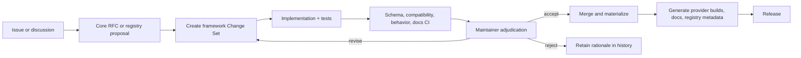

## 10.2 Two contribution lanes

### Core lane

High bar:

- Prior issue or RFC
- Explicit problem and alternatives
- Compatibility analysis
- Schema migration
- Deterministic tests
- Behavioral agent evals
- Documentation updates
- Maintainer approval

### Registry lane

Lower bar:

- Valid manifest
- Namespaced schema
- Example
- Automated tests
- Security disclosure
- License and ownership
- Compatibility range

## 10.3 Source-first development

The framework repository should mirror Impeccable’s source-first discipline:

- One authored command schema
- One policy registry
- One graph schema
- Provider outputs generated
- Reference docs generated
- Counts and compatibility claims generated
- Fixtures for deterministic behavior
- Live model evals for orchestration behavior
- Generated artifacts not edited directly

## 10.4 Required CI

- Unit tests
- Schema tests
- Migration replay tests
- Temporal query tests
- Semantic change reducer tests
- Context-pack snapshot tests
- Provider compilation tests
- MCP contract tests
- Tutorial end-to-end tests
- Real-model behavior evals
- Registry security and compatibility checks
- Generated-output drift check

## 10.5 Governance

Recommended initial model:

- Founder/BDFL for coherent product philosophy
- Small maintainer council for schema and compatibility
- Public RFC process for core semantics
- Published deprecation windows
- Open format and export guarantee
- Security response policy
- Annual review of open-source charter

A foundation is premature before the product establishes a stable category. Invisible or arbitrary governance is also unacceptable for infrastructure that stores organizational memory.

---

# 11. Recommended Repository Structure

Two structures matter: the end-user project and the framework’s own source repository.

## 11.1 End-user project structure

```text
your-product/
├── PRODUCT.md                     # generated/reference front door; all facts link to IDs
├── AGENTS.md                      # generated tool-agnostic operating instructions
│
├── product/
│   ├── manifest.yaml              # namespace, schema version, policies, adapters
│   ├── SoT/                       # CANONICAL accepted Product Knowledge Graph
│   │   ├── SoT.OUTCOMES.md
│   │   ├── SoT.CUSTOMER_FEEDBACK.md
│   │   ├── SoT.BUSINESS_RULES.md
│   │   ├── SoT.USER_JOURNEYS.md
│   │   ├── SoT.DESIGN_COMPONENTS.md
│   │   ├── SoT.TECHNICAL_DECISIONS.md
│   │   ├── SoT.API_CONTRACTS.md
│   │   ├── SoT.DATA_MODEL.md
│   │   ├── SoT.INTEGRATIONS.md
│   │   ├── SoT.TESTING.md
│   │   ├── SoT.DEPLOYMENT.md
│   │   ├── SoT.LESSONS_LEARNED.md
│   │   └── SoT.UNIQUE_ID_SYSTEM.md
│   ├── changes/                   # proposed semantic mutations
│   │   ├── active/
│   │   │   └── CHG-0142-free-plan-limit/
│   │   │       ├── proposal.md
│   │   │       ├── delta.yaml
│   │   │       ├── evidence.md
│   │   │       ├── impact.md
│   │   │       └── tasks.md
│   │   └── archive/               # accepted, rejected, withdrawn change packages
│   ├── evidence/                  # durable sources, transcripts, telemetry manifests
│   ├── history/                   # compact adjudication receipts and migration baselines
│   ├── schema/
│   │   ├── id-prefixes.yaml
│   │   ├── relationships.yaml
│   │   ├── record-types.yaml
│   │   └── policies.yaml
│   ├── policies/                  # authority, freshness, validation profiles
│   └── playbooks/                 # optional methods and domain guidance
│
├── work/                          # active scratch/context; partially gitignored
│
├── .product/                      # GENERATED and disposable
│   ├── index.sqlite
│   ├── graph.json
│   ├── state.json
│   ├── context/
│   ├── reports/
│   ├── cache/
│   └── views/
│
└── .agents/                       # generated provider-specific skills/hooks
```

### Authority rules

- `product/SoT/` is the canonical accepted representation.
- `product/changes/active/` is where proposed semantic edits normally begin.
- Accepted changes update the SoT records and move their complete package to `product/changes/archive/`.
- `product/history/` stores compact decision receipts, migration baselines, and optional event projections; it is not a second copy of current truth.
- `.product/` is always generated and may be deleted at any time.
- `PRODUCT.md` is a concise front-door view compiled from selected SoT IDs.
- Direct human edits to SoT are allowed for low-friction operation. `product check` compares content hashes and Git changes, synthesizes a pending Change Set, and requires adjudication before treating the semantic mutation as formally accepted.
- Agents should write proposed changes first and materialize accepted SoT updates only through the change application path.
- Legacy repositories with root-level `SoT/` are supported by the importer; V2 defaults to `product/SoT/`.

This keeps the successful file-native workflow while making the accepted graph, pending work, and generated query layer unambiguous.

## 11.2 Framework source repository

```text
product-model-runtime/
├── packages/
│   ├── schema/                    # record, ID, relationship, change and policy contracts
│   ├── markdown/                  # loss-preserving SoT parser and writer
│   ├── id-registry/               # typed IDs, aliases, namespace and optional UID
│   ├── relationship-engine/       # edge normalization, inverses, traversal, validation
│   ├── reducer/                   # accepted Change Set → SoT mutation
│   ├── temporal/                  # as-of, supersession, history
│   ├── index-sqlite/              # generated local query/read model
│   ├── graph/                     # graph JSON projection and query abstractions
│   ├── context-compiler/          # task-specific retrieval and compression
│   ├── policy/                    # authority, freshness, validation
│   ├── cli/
│   ├── mcp/
│   └── viewer/
│
├── skill/                         # one authored agent skill
│   ├── SKILL.src.md
│   ├── commands/
│   ├── references/
│   └── workers/
│
├── adapters/
│   ├── claude/
│   ├── codex/
│   ├── cursor/
│   ├── copilot/
│   ├── gemini/
│   ├── github/
│   └── external-systems/
│
├── registry/
│   ├── playbooks/
│   ├── domain-packs/
│   ├── policies/
│   └── migrations/
│
├── tests/
│   ├── fixtures/
│   ├── behavior/
│   ├── compatibility/
│   ├── migrations/
│   └── tutorials/
│
├── site/
├── scripts/
└── dist/                          # generated provider and release artifacts
```

## 11.3 Why this structure is better

- The accepted SoT graph is visibly central.
- Typed IDs and relational properties remain readable without a database UI.
- Current state and proposed changes are separate.
- History is retained without mixing it into current context.
- SQLite, graph JSON, context packs, and views are unmistakably generated.
- Provider complexity is compiled.
- Optional methodology lives in playbooks and extensions.
- The local Markdown format can project losslessly into a hosted temporal graph.

---

# 12. Command Taxonomy

## 12.1 One skill, seven verbs

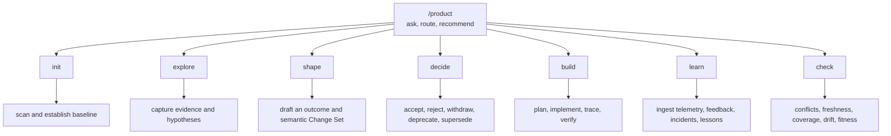

## 12.2 Command definitions

### `/product`

The default conversational interface.

- Answer questions from the Product Model.
- Explain current state and provenance.
- Recommend two or three next actions.
- Route plain-English requests.
- Never mutate accepted meaning without showing the change path.

### `/product init`

- Scan an existing repository.
- Detect product docs, ADRs, specs, code, tests, and existing traceability.
- Propose baseline entities, claims, decisions, and aliases.
- Create `PRODUCT.md`, `product/manifest.yaml`, and the initial model.
- Mark extracted and inferred content distinctly.
- Ask for approval only where authority is required.

### `/product explore`

- Research or inspect an area.
- Add evidence and hypotheses.
- Identify uncertainty and contradictions.
- Use optional playbooks.
- Produce no silent accepted decisions.

### `/product shape`

- Turn evidence into a coherent product change.
- Define outcome, scope, non-goals, requirements, UX/architecture implications, risks, and acceptance signals.
- Produce one semantic Change Set.
- Scale depth to the work.

### `/product decide`

- Review a change or conflict.
- Show semantic diff, evidence, alternatives, dependencies, consequences, and authority.
- Accept, reject, withdraw, deprecate, or supersede.
- Preserve rationale.

### `/product build`

- Compile the implementation context pack.
- Create or refine tasks.
- Implement against accepted intent.
- Link code and tests.
- Update the change as implementation reveals new facts.
- Require a new decision if meaning changes.

### `/product learn`

- Ingest telemetry, feedback, incidents, experiments, and support patterns.
- Compare experienced reality with intended behavior.
- Propose model changes.
- Harvest reusable lessons.

### `/product check`

- Validate schema and references.
- Detect conflicts and stale critical claims.
- Report implementation and verification coverage.
- Detect drift between intent, delivery, and reality.
- Compute goal-scoped fitness for an active change.
- Suggest the smallest next corrective action.

## 12.3 Advanced CLI

Keep operational mechanics out of the slash-command menu:

```text
product query
product trace
product graph
product diff
product as-of
product migrate
product sync
product schema
product export
product doctor
```

## 12.4 Playbooks

Methods become optional parameters or registry items:

```text
/product explore --playbook=mom-test
/product shape --playbook=opportunity-solution-tree
/product shape --playbook=dunford-positioning
/product check --policy=regulated-healthcare
```

Depth should be inferred from risk and scope, with an escape hatch:

```text
--depth=quick|standard|deep
```

It must not multiply the skill taxonomy.

## 12.5 Why `decide` is central

Most AI product-development frameworks help create artifacts. Few make semantic acceptance, rejection, and supersession a first-class daily operation.

`decide` is the product’s defining verb because it transforms generated information into governed organizational memory.

---

# 13. Documentation Structure

```text
docs/
├── start/
│   ├── install.md
│   ├── first-conflict.md
│   └── existing-repo.md
│
├── journey/
│   ├── explore.md
│   ├── shape.md
│   ├── decide.md
│   ├── build.md
│   └── learn.md
│
├── guides/
│   ├── resolve-conflict.md
│   ├── supersede-decision.md
│   ├── trace-code.md
│   ├── compile-context.md
│   ├── multi-repo.md
│   ├── regulated-product.md
│   └── migrations/
│
├── mental-model/
│   ├── thinking-in-product-models.md
│   ├── evidence-vs-decision.md
│   ├── intent-delivery-reality.md
│   ├── temporal-history.md
│   └── authority-confidence-freshness.md
│
├── reference/
│   ├── commands/
│   ├── cli/
│   ├── schema/
│   ├── relations/
│   ├── policies/
│   ├── mcp/
│   └── file-format/
│
├── playbooks/
├── examples/
├── contributing/
└── cloud/
```

Rules:

- Start pages are tested tutorials.
- Journey pages teach the normal loop.
- Guides solve real user problems.
- Mental-model pages explain why.
- Reference is generated where possible.
- Playbooks are clearly non-core.
- Cloud docs never become prerequisites for local use.

---

# 14. Website Sitemap

```mermaid
flowchart TB
    H[Home] --> DEMO[Interactive "what is current and why?" demo]
    H --> START[Get started]
    H --> WHY[Why product memory]
    H --> MODEL[How the Product Model works]
    H --> DOCS[Docs]
    H --> EX[Examples]
    H --> REG[Registry]
    H --> INT[Integrations]
    H --> CLOUD[Cloud]
    H --> COMM[Community]
    H --> CHANGE[Changelog]

    MODEL --> EIR[Evidence, Intent, Delivery, Reality]
    MODEL --> CHG[Changes and adjudication]
    MODEL --> TIME[History and as-of queries]

    REG --> PB[Playbooks]
    REG --> DP[Domain packs]
    REG --> CONN[Connectors]
    REG --> POL[Policy packs]

    CLOUD --> TEAM[Team]
    CLOUD --> ENT[Enterprise]
    CLOUD --> SEC[Security and governance]
    CLOUD --> PRICE[Pricing]
```

## Home-page narrative

### Above the fold

**Headline:**  
**Your product should remember.**

**Subhead:**  
Capture what you learn, decide, build, and observe as a living Product Model that every human and agent can query.

**Proof interaction:**

```text
Why do we limit free workspaces to five members?

Current decision:
Limit free workspaces to five members.

Accepted:
May 12, 2026 by Growth + Finance.

Why:
Support cost threshold and conversion experiment EXP-014.

Contradiction:
July cohort data no longer supports the original cost assumption.

Next action:
Review proposed change CHG-028.
```

**Start command:** one install command and `/product init`.

### Supporting sections

1. The amnesia problem
2. Current versus proposed
3. Intent versus reality
4. One product command
5. Local files, open format
6. Works with every agent
7. Cloud for organization-wide memory
8. Real examples
9. Community registry
10. Changelog

The website should demonstrate the product’s unique query, not lead with folder structure or ontology.

---

# 15. Adoption Strategy

## 15.1 Beachhead users

Best initial fit:

- Long-lived brownfield products
- Teams using multiple AI coding agents
- Products with recurring context loss
- Enterprise SaaS with many dependencies
- Healthcare, fintech, government, and other regulated domains
- Teams already using ADRs, OpenSpec, Spec Kit, or structured PRDs
- Consultancies managing knowledge across handoffs

Weak initial fit:

- Throwaway prototypes
- Very small scripts
- Products whose strategy changes daily before any durable implementation
- Teams unwilling to review material decisions

## 15.2 Adoption funnel

### 1. Cold value

`/product init` and `/product check` on an existing repository.

No methodology migration required.

Success criteria:

- First useful finding in under five minutes.
- First accepted baseline or resolved conflict in under ten minutes.
- No more than four public concepts introduced.

### 2. Habit

Users return to:

- Ask why a decision exists.
- Shape a change.
- Review a conflict.
- Compile implementation context.
- Learn from a release.

The key retention behavior is not node creation. It is **reuse of prior product knowledge in a new decision or task**.

### 3. Team

GitHub-based change review, authority policies, shared context packs, and multi-repo references.

### 4. Organization

Hosted synchronization, connectors, governance, cross-product dependencies, portfolio insights, and audit.

## 15.3 Migration wedges

Provide importers for:

- PRD-CE
- OpenSpec
- GitHub Spec Kit
- ADR directories
- Markdown PRDs
- Jira/Linear projects
- GitHub issues and PRs
- Figma annotations
- Existing code annotations

Migration should:

1. Preserve existing IDs as aliases.
2. Mark extracted versus inferred data.
3. Create one baseline Change Set.
4. Require review before assigning authority.
5. Generate a migration report with unresolved ambiguity.

## 15.4 North-star metrics

Avoid measuring raw graph size.

### Activation

- Time to first useful answer
- Time to first accepted change
- Percentage of scan proposals reviewed
- Percentage of users resolving a real contradiction in session one

### Retention

- Weekly active Product Models
- Questions answered using prior accepted knowledge
- Changes that reuse existing evidence or decisions
- Week-four active adjudication
- Context packs used in implementation

### Quality

- Critical unresolved conflicts
- Stale critical claims
- Accepted decisions without evidence or owner
- Managed-scope implementation coverage
- Verification coverage
- Drift detection lead time

### Ecosystem

- Active registry maintainers
- Verified extension installs
- Time to first merged contribution
- Schema compatibility rate
- Cross-agent successful behavior rate

A high change count can indicate churn. The better metric is **decision reuse and reduced rediscovery**.

---

# 16. Ecosystem Strategy

## 16.1 Product surfaces and their graph role

| Surface | Role in the Product Model |
|---|---|
| CLI | Create, query, validate, migrate, and synchronize |
| Agent skill | Compile context and guide product work |
| MCP server | Universal agent read/write interface |
| IDE integration | Inline queries, change previews, traceability |
| GitHub integration | Review and adjudicate semantic changes |
| Cloud | Synchronize, reconcile, govern, and analyze |
| Viewer | Inspect provenance, history, conflicts, and impact |
| Registry | Extend methods, domain semantics, policies, and connectors |
| Enterprise controls | Establish authority, access, retention, and audit |

Every surface either builds, validates, enriches, adjudicates, or consumes the Product Model.

## 16.2 Extension categories

### Playbooks

Product methods such as positioning, interviewing, opportunity mapping, risk review, pricing, and launch planning.

### Domain packs

Healthcare, finance, insurance, public sector, commerce, developer tools.

They may add namespaced concepts and policies but cannot alter core semantics.

### Policy packs

Security review, accessibility, regulated traceability, evidence freshness, approval matrices.

### Connectors

GitHub, GitLab, Jira, Linear, Figma, Slack, Notion, telemetry, support, CRM, data warehouse.

### Views

Executive brief, release readiness, compliance trace, user journey map, architecture impact, portfolio dependency.

## 16.3 Interoperability

The framework should publish:

- JSON Schema
- Semantic change format
- Graph export format
- MCP contract
- CLI JSON output
- Migration SDK
- Stable URI scheme
- Versioned policy interface

Users must be able to leave with all data, history, and provenance.

## 16.4 Commercial packaging

### Community

Local runtime, Git-native collaboration, MCP, basic viewer, registry.

### Team Cloud

Continuous sync, hosted graph, conflict inbox, multi-repo context, team policies, managed connectors.

### Enterprise

SSO, SCIM, RBAC/ABAC, audit, retention, data residency, private networking, model controls, compliance packs, portfolio graph, support.

### Marketplace

Revenue share for verified domain packs, connectors, and premium views.

### Services

Migration, ontology design, regulated implementation, enterprise adoption, and partner delivery.

---

# 17. Product Roadmap

## Phase 0 — Constitution, format, and fixtures

### Ship

- Product philosophy and public mental model
- Canonical structured Markdown record contract
- Typed ID registry and compatibility rules
- Core relationship registry, inverse aliases, and extension namespaces
- Change Set contract
- Temporal and adjudication metadata contract
- Representative PRD-CE migration fixtures
- Conformance tests for round-trip Markdown preservation

### Prove

The architecture preserves what works in PRD-CE while becoming explainable in one minute.

### Exit criteria

- Existing IDs and relationships parse without semantic loss.
- A record can move files without changing its ID.
- Unknown prose and comments survive parse/write round trips.
- No core feature lacks a build, enrich, validate, adjudicate, or consume relationship to the SoT graph.

## Phase 1 — Local SoT kernel

### Ship

- Deterministic Markdown parser and loss-preserving writer
- ID and relationship validators
- Generated SQLite index and graph JSON
- Full-text search and reverse-reference queries
- Current and as-of queries
- Conflict, dangling-reference, duplicate-ID, freshness, and orphan checks
- PRD-CE and ADR importers
- `/product init`
- `/product check`
- `product index`, `query`, `trace`, `as-of`, and `doctor`
- Basic provenance viewer

### Prove

A brownfield repository produces useful findings immediately without a server.

### Exit criteria

- Median first useful finding under five minutes.
- Deleting `.product/` and reindexing reproduces the same logical index.
- Baseline import is reversible and provenance-preserving.
- Every query result can cite its SoT file and line.
- Temporal replay produces deterministic current and historical state.

## Phase 2 — Change and adjudication runtime

### Ship

- Change Set creation and semantic diff
- `/product explore`, `shape`, and `decide`
- Accepted change application into SoT Markdown
- Direct-SoT-edit detection and synthesized Change Sets
- Authority policies
- Conflict-resolution flow
- GitHub pull-request review integration
- Adjudication receipts and archive

### Prove

Adjudication becomes a repeated habit rather than a one-time setup exercise.

### Exit criteria

- Material conflict review is understandable without graph terminology.
- Accepted, rejected, superseded, and stale states remain distinct.
- Agents do not silently promote generated content in behavioral evals.
- Relationship additions and removals are visible in semantic diffs.

## Phase 3 — Agent-native context runtime

### Ship

- Context compiler using ID-scoped and neighborhood retrieval
- MCP server over the SQLite read model
- One authored skill compiled into provider adapters
- Provider behavior eval suite
- Read-only resources plus controlled proposal tools
- Incremental index updates after accepted Markdown changes

### Prove

Agents use less irrelevant context while preserving traceability and decision quality.

### Exit criteria

- Context packs cite all included IDs and source locations.
- Provider outputs preserve the same Change Set semantics.
- Retrieval quality outperforms full-repository dumps on representative tasks.

## Phase 4 — Delivery and learning loop

### Ship

- `/product build` and `/product learn`
- Code/test traceability
- Telemetry and feedback adapters
- Intent-delivery-reality drift
- Goal-scoped fitness
- Release and lesson views
- Public playbook and domain-pack registry

### Prove

The Product Model becomes smarter after release, not merely larger.

### Exit criteria

- New evidence reuses and challenges prior decisions.
- Users can trace an observed problem through a superseding change to implementation and verification.
- Context packs reduce repeated project briefing and implementation mistakes.

## Phase 5 — Team cloud

### Ship

- Hosted temporal graph projection
- Continuous synchronization from canonical Markdown repositories
- Namespace plus optional UID cross-repo identity
- Semantic conflict inbox
- Team authority and approvals
- Managed connectors
- Organization viewer

### Prove

The cloud adds collaboration and governance without changing the local authority model.

### Exit criteria

- Bidirectional sync has no semantic loss.
- Local projects remain fully functional offline.
- Multi-repo changes resolve through the same Change Set model.
- Hosted data can be fully re-exported into canonical Markdown and rebuilt locally.

## Phase 6 — Enterprise and ecosystem

### Ship

- Portfolio graph
- Compliance and audit
- Data residency
- Private deployment
- Marketplace
- Partner program
- Enterprise policy packs

### Prove

The Product Model becomes organizational infrastructure without compromising the open local kernel.

---

# 18. Risks & Tradeoffs

| Risk | Severity | Why it matters | Mitigation / experiment |
|---|---|---|---|
| Ontology bloat | High | Recreates PRD-CE complexity under new names | Four public nouns; namespaced extensions; promotion criteria |
| False authority | High | Generated or inferred content may appear canonical | Separate lifecycle, authority, confidence basis, freshness; policy-controlled acceptance |
| Adjudication fatigue | High | Users bypass the system if every edit requires ceremony | Auto-accept deterministic low-risk changes; materiality thresholds; batch review |
| Markdown/index/cloud divergence | High | Destroys trust, portability, and query reliability | Markdown remains canonical; deterministic rebuilds; content hashes; conformance and round-trip tests |
| Semantic extraction errors | High | Wrong graph edges can mislead agents | Proposed status by default; evidence links; deterministic extraction where possible |
| “Truth” overclaim | High | Product knowledge contains uncertainty and competing views | Public noun Product; explicit accepted model and provenance |
| ID collision or prefix sprawl | Medium | Existing typed IDs are valuable but unmanaged growth creates ambiguity | Versioned prefix registry; namespace + ID resolution; aliases; optional hidden UID; automated migration report |
| Traceability overhead | Medium | Developers resist tags and maintenance | Managed scope, inferred links, IDE assistance, value-first checks |
| Graph visualization distraction | Medium | Can become a vanity feature | Make query and change UX primary; visualization is explanatory |
| Pre-PMF mismatch | Medium | Ephemeral decisions may not justify durability | Lightweight mode; capture only consequential or reused knowledge |
| Ecosystem fragmentation | Medium | Extensions may create incompatible semantics | Namespaces, trust tiers, compatibility tests, core governance |
| Model/provider drift | Medium | Skills behave differently across agents | Compile from one source; provider tests; live behavior evals |
| Sensitive knowledge | High | Product strategy and customer evidence are confidential | Local-first, encryption, access controls, data classification, redaction |
| Gaming health scores | Medium | Teams optimize numbers instead of outcomes | Goal-scoped views; no universal readiness grade; explain evidence |
| Vendor lock-in | High | Product memory becomes expensive to leave | Open format, local source, full history export, public reducer |

## 18.1 Open questions

### What is the correct claim granularity?

**Confidence:** Medium-low.

Too coarse and conflicts are hidden. Too fine and the model becomes noisy. Prototype with real products and measure retrieval quality and review burden.

### How much can be auto-adjudicated?

**Confidence:** Low.

Deterministic observations and explicit supersession can be automated. Semantic product decisions often cannot. Instrument the ratio of automatic, delegated, and human decisions.

### Do users need visualization to trust the model?

**Confidence:** Medium.

Basic provenance and impact views likely matter; a giant node-link diagram probably does not. Test task-specific views before a general graph canvas.

### Can the hosted projection round-trip without altering the canonical SoT?

**Confidence:** Medium.

Markdown authority is settled. The remaining engineering hypothesis is whether every hosted relationship, temporal property, alias, and adjudication receipt can round-trip without rewriting IDs or losing human-authored structure. This needs a conformance prototype before commercial architecture is committed.

### Which product knowledge deserves durability?

**Confidence:** Medium.

Use consequence, reuse likelihood, and authority as retention criteria. Do not turn every conversation into permanent knowledge.

### How should cross-repo identity work?

**Confidence:** Medium-low.

The default is `namespace + typed ID`; an optional generated UID resolves repository moves, deduplication, and organization-wide identity. Namespace ownership, alias propagation, and replicated references still need a real multi-repo prototype.

### How should implementation mappings be maintained?

**Confidence:** Medium-low.

Compare explicit annotations, AST inference, PR metadata, and test references for burden and precision.

## 18.2 Kill criteria

The product should be reconsidered if:

- Users cannot get value before learning the ontology.
- Week-four use becomes write-only documentation.
- Adjudication is regularly bypassed.
- The local/cloud schema cannot round-trip.
- The system cannot distinguish accepted knowledge from generated inference.
- Context compilation does not measurably reduce repeated briefing or errors.
- The graph grows without improving decisions.

---

# 19. V2 Blueprint

## 19.1 Product promise

> **Your product remembers what you learned, what you decided, what you built, what happened, and why it changed — in Markdown you own and a graph every agent can query.**

## 19.2 V2 non-negotiables

The first implementation must preserve these decisions:

1. `product/SoT/*.md` is the canonical accepted Product Knowledge Graph.
2. Existing typed IDs remain canonical human-facing addresses.
3. Relational properties are parsed and indexed as first-class edges.
4. `.product/index.sqlite` and `.product/graph.json` are generated and disposable.
5. No inferred record becomes accepted without adjudication.
6. Accepted semantic changes are attributable to a Change Set or a synthesized change receipt.
7. Superseded and rejected records remain queryable.
8. Current, stale, accepted, inferred, and superseded are separate dimensions.
9. Every query result can trace back to a Markdown file, record ID, and line.
10. The local product works fully without cloud infrastructure.

## 19.3 Superseded research first-release scope

> **Preserved research proposal — not an active release scope.** The active alpha boundary is the
> read-only Compatibility Inspector defined by
> [ARC-003](../SoT/SoT.TECHNICAL_DECISIONS.md#arc-003-first-executable-value-is-read-only-in-place-inspection)
> and build-plan Wave 2: compatibility parsing, typed identity and relationships, deterministic
> validation, a disposable local projection, and read-only `index`, `check`, `query`, and `trace`.
> It excludes the writer, migration, Change Set application, accepted-state adjudication, graph
> JSON/viewer, MCP, hosted service, and provider parity listed below. Those items require later gates
> and cannot be inferred as part of the first release.

### Include

- One skill and root command
- `init`, `check`, and `decide` as the first three deeply finished verbs
- Canonical structured Markdown parser and writer
- PRD-CE root `SoT/` and V2 `product/SoT/` support
- Typed ID registry, duplicate detection, aliases, and optional generated UID
- Relationship parser, normalization, inverse aliases, and validation
- Generated SQLite index with full-text search
- Generated graph JSON
- Current and as-of queries
- Supersession, conflicts, freshness, and provenance
- Current SoT versus proposed Change Sets
- PRD-CE migration
- ADR and Markdown extraction
- Basic context query and trace
- MCP read interface
- Basic local provenance viewer
- GitHub Action
- Deterministic validations
- Behavior evals

### Defer

- Hosted graph database
- Large marketplace
- Full multi-agent personas
- Universal ontology
- Automated strategic decisions
- Enterprise portfolio analytics
- Complex graph canvas
- Dozens of connectors
- Hardcoded lifecycle gates
- Broad pricing and GTM methodology in core
- Automatic mutation of accepted SoT based only on LLM inference

## 19.4 Canonical V2 data flow

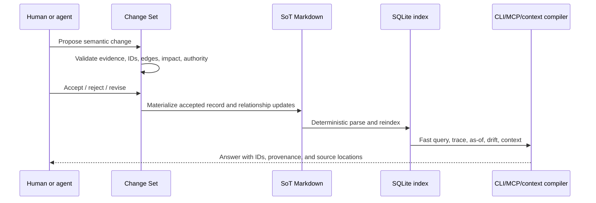

Direct SoT edits follow the same logical path: the system detects changed record hashes, creates a synthesized Change Set, and asks for adjudication when the change is material.

## 19.5 The first five minutes

```text
$ npx <framework> init

Scanning existing repository...

Found:
  12 SoT Markdown files
  146 typed IDs
  327 relational properties
  8 ADRs
  41 tests
  6 release notes

Graph integrity:
  4 dangling references
  2 duplicate IDs
  11 records unverified >90 days
  7 requirements with no implementation edge
  5 tests with no verifies edge
  3 possible conflicts

Generated:
  .product/index.sqlite
  .product/graph.json

Nothing inferred has been made authoritative.

Next:
  /product decide first conflict
```

The user resolves one conflict:

```text
Current SoT record:
BR-104 — Free Plan Member Limit
Status: Accepted

New evidence:
CFD-140 — Seven-member experiment improved activation
MON-018 — No retention or support-cost regression

Proposed change:
CHG-0142 — Supersede five-member limit with seven

Affected relationships:
  BR-104 conflicts-with CFD-140
  API-045 enforces BR-104
  TEST-301 verifies BR-104
  UJ-101 constrained-by BR-104

Affected implementation:
  entitlement API
  onboarding copy
  pricing page
  three tests
  dashboard metric

Decision:
[Accept] [Reject] [Revise]
```

After acceptance:

```text
BR-104  → Superseded
BR-142  → Accepted; supersedes BR-104
CHG-0142 → Archived with rationale and impact
SQLite and graph indexes rebuilt incrementally
```

The user can then ask:

```text
/product why BR-142
/product trace BR-142
/product as-of v0.6 BR-104
```

Each answer includes the current record, evidence, related decisions, superseded history, implementation, verification, freshness, and exact Markdown sources.

## 19.6 Migration from PRD-CE

### Preserve without semantic rewriting

- Existing SoT Markdown content
- Existing typed IDs as canonical addresses
- Existing relationship semantics
- Prefix registry
- Supersession history
- Valid-time fields
- Staleness and verification metadata
- Lessons learned
- Hooks and validation intent
- Code/test linkage
- Custom prose and comments

### Normalize or transform

- Root `SoT/` → supported legacy location or optional migration to `product/SoT/`
- Existing SoT entry syntax → canonical structured Markdown fields where safe
- EPICs → active Change Sets or EPIC compatibility view
- Temp files → work/evidence ingestion
- Skills → verbs or playbooks
- Named agents → hidden workers
- Readiness → goal-scoped fitness and graph-integrity findings
- `devgraph.json` → generated SQLite and graph JSON projections
- Authored HTML → generated views
- Lifecycle stage → optional journey or policy profile

### Baseline migration event

Create one migration Change Set:

```text
CHG-MIGRATION-001
Status: accepted after review
Source: PRD-CE repository at commit <hash>
Effect: establishes baseline V2 SoT and generated index
Typed IDs: preserved
Relationships: preserved and normalized
Optional UIDs: generated without changing IDs
Ambiguities: retained as proposed records or migration findings
```

No migration may silently declare inferred content authoritative. No migration may replace typed IDs merely to satisfy a new ontology.

## 19.7 Recommended implementation sequence

1. Freeze fixtures from the current PRD-CE repository.
2. Implement the typed ID registry and record boundary parser.
3. Parse and normalize relational properties.
4. Build blocking and non-blocking integrity validation.
5. Create the disposable SQLite schema and deterministic indexer.
6. Implement `query`, `trace`, `as-of`, and `doctor`.
7. Define Change Set files and semantic diff.
8. Implement accepted-change application into Markdown.
9. Implement `/product init`, `/product check`, and `/product decide`.
10. Add MCP resources and read tools over SQLite.
11. Compile the single skill into provider adapters.
12. Add behavior evals, migration tests, and tutorial fixtures.

## 19.8 Framework self-hosting

The V2 project should use its own SoT and Change Sets to manage:

- Product philosophy
- Schema decisions
- ID and relationship vocabulary
- Command changes
- Provider compatibility
- Registry governance
- Release decisions
- Behavioral eval results
- Community feedback

The repository’s pull requests become real adjudication events. This is both validation and demonstration.

## 19.9 Prototype experiments

1. **Legacy parse:** Can the current PRD-CE SoT parse with no lost IDs, edges, comments, or prose?
2. **Brownfield scan:** Can five unfamiliar repos produce useful findings?
3. **Relationship value:** Do reverse references and neighborhood retrieval improve agent output?
4. **Conflict UX:** Can users resolve semantic contradictions without ontology training?
5. **Context pack:** Does scoped retrieval improve implementation accuracy and token use?
6. **Temporal replay:** Can the model answer current, as-of-effective, and as-of-known queries correctly?
7. **Identity stability:** Can a record move files or change title/type without breaking `BR-104` references?
8. **Rebuild:** Does deleting `.product/` and reindexing reproduce the same logical graph?
9. **Round trip:** Can local Markdown sync to a hosted graph and back without information loss?
10. **Adjudication burden:** What percentage of changes can be safely automated or delegated?
11. **First tutorial:** Can a new user complete it reliably in under ten minutes?
12. **Provider parity:** Do Claude, Codex, Cursor, Gemini, and Copilot produce equivalent Change Sets?
13. **Post-release learning:** Can telemetry propose useful changes without polluting accepted SoT knowledge?

---

# 20. Final Vision

## Philosophy

**Product knowledge has a lifecycle.**

Capture evidence once. Turn decisions into durable, typed-ID-addressable SoT records. Connect them through explicit relational properties. Evolve them through reviewed Change Sets. Preserve what was rejected and superseded. Continuously compare intent, implementation, and reality. Give every human and agent only the relevant graph neighborhood for the current task.

## What developers say

> “I can ask the product why it works this way, and it answers with the exact SoT IDs, evidence, code, and tests.”

> “The agent knows what is current without rereading six months of Slack.”

> “When a decision changes, the old reasoning does not disappear.”

> “Our PRDs, code, tests, telemetry, and customer feedback finally describe the same product.”

## Concepts that disappear

- `PRD-final-v7.md`
- “Which document is current?”
- Re-litigating rejected options
- Unexplained code
- Stale architecture assumptions hidden in prose
- Full-repository context dumps
- Persona-heavy agent theater
- Hand-maintained dashboards that drift from the source
- Readiness scores without a specific goal
- Generated text silently becoming canonical

## Concepts that become universal

- Typed IDs as durable human- and agent-readable addresses
- Optional hidden UIDs for cross-repository synchronization
- Structured Markdown SoT as the canonical accepted product memory
- Relational properties as first-class graph edges
- Evidence distinct from decision
- Current state distinct from proposed change
- Accepted meaning changed only through adjudication
- Supersession instead of deletion
- Valid time and recorded time
- Intent, delivery, and reality as separate planes
- SQLite and graph views rebuilt from Markdown
- Context packs compiled from the relevant relational neighborhood
- Rejected alternatives as reusable memory
- Product health as explainable derived views

## What the first five minutes feel like

The framework inspects an existing product, shows something useful, and helps resolve one real ambiguity. No graph vocabulary is required. Nothing inferred is silently promoted. The user experiences the value before the method.

## What the hundredth project feels like

The command vocabulary is muscle memory. Playbooks and policies are reusable. Agents enter with precise context. Cross-product dependencies are visible. New evidence can challenge old decisions without erasing history. Onboarding begins with the current Product Model rather than archaeology.

## Why it becomes difficult to replace

Not because the file format is proprietary.

Not because the cloud traps the data.

Not because the command list is large.

It becomes difficult to replace because the organization has accumulated a high-quality, adjudicated reasoning history:

- what it learned,
- what it decided,
- what it rejected,
- what it built,
- what reality showed,
- and how each changed the next decision.

That history compounds into better product judgment.

## Final design statement

> **The Product Knowledge Graph is the durable asset. The SoT is its canonical Markdown projection. Typed IDs are its addresses. Relational properties are its edges. The Change Set is the unit of work. The SoT record or claim is the unit of knowledge. Adjudication is the differentiating capability. SQLite, graph JSON, and hosted graphs are read models. Context compilation is the agent interface. Everything else is a view, adapter, policy, or playbook.**

That is the smallest system that preserves what already works in PRD-CE, removes unnecessary surface area, and continuously compounds product knowledge without forcing users to operate graph infrastructure.

---

# Appendix A — Master Architecture

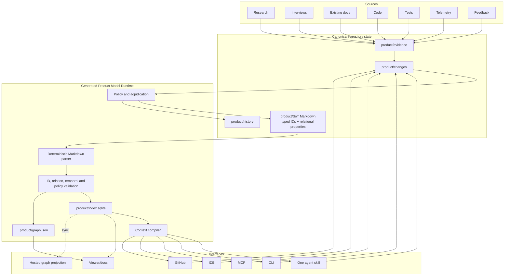

The arrows into `product/changes/` represent proposals. Only adjudicated changes materialize accepted SoT mutations. The generated runtime can always be rebuilt from canonical repository state.

# Appendix B — Decision Principles

1. One public noun: Product.
2. One canonical accepted representation: structured SoT Markdown.
3. Typed IDs are durable human-facing addresses.
4. Relational properties are first-class graph edges.
5. Optional hidden UIDs support cross-repo identity without replacing typed IDs.
6. One reviewable work unit: Change Set.
7. One MVP durable knowledge unit: SoT record or claim.
8. Evidence never silently becomes authority.
9. Accepted meaning is never silently overwritten.
10. Freshness is not lifecycle status.
11. Prefixes are durable affordances, not permission to duplicate or reuse identity.
12. Current state and proposed state are separate.
13. Intent, delivery, and reality are separate.
14. Views and databases are derived.
15. `.product/` can be deleted and rebuilt.
16. Context is compiled from relevant IDs and relationships, not dumped.
17. Local data is complete, readable, and exportable.
18. Cloud adds synchronization and governance.
19. Core is small; methods live in playbooks.
20. Source is authored once and compiled everywhere.
21. Deterministic validation surrounds probabilistic reasoning.
22. Rejected and superseded knowledge remain valuable.
23. Every feature must strengthen, validate, enrich, adjudicate, or consume the Product Model.
24. The first useful result precedes methodology.
25. The hundredth session must be smarter than the first.

# Appendix C — Coding Agent Implementation Contract

> **Preserved proposal — not an authorized coding handoff.** Use
> [`PRD_CE_V2_BUILD_PLAN.md`](PRD_CE_V2_BUILD_PLAN.md) and an accepted root `PRD.md` to determine
> whether any implementation work is authorized.

This appendix preserves the proposed coding-agent handoff from the original research. It is intentionally narrower and more prescriptive than the research sections, but it is not active on this branch.

## C.1 Mission

Build the V2 local kernel that proves the SoT-first Product Model Runtime:

```text
Markdown SoT + typed IDs + relational properties
    → deterministic parse and validation
    → disposable SQLite/graph indexes
    → query, trace, as-of, and check
    → Change Set adjudication
    → accepted Markdown materialization
```

Do not begin with a hosted service, graph canvas, marketplace, or agent squad.

## C.2 Required deliverables

### Core format

- Canonical record parser for V2 structured Markdown.
- Compatibility parser for current PRD-CE SoT files.
- Loss-preserving writer or patcher that does not delete unknown prose or comments.
- Machine-readable ID prefix registry.
- Machine-readable relationship registry with inverse aliases.
- Change Set schema.

### Validation

- Duplicate ID detection.
- Dangling relationship detection.
- Unknown prefix and predicate detection.
- Alias collision detection.
- Invalid status and temporal-window detection.
- Supersession consistency checks.
- Missing source location and provenance warnings.
- Accepted generated/inferred content policy violations.
- Relationship removal and direct SoT edit detection.

### Generated read model

- `.product/index.sqlite` with records, relationships, aliases, changes, evidence, artifacts, and findings.
- Full-text search over title, statement, rationale, and body.
- `.product/graph.json` node-link projection.
- Deterministic rebuild command.
- Incremental update path may follow after full rebuild is correct.

### CLI

Implement these commands first:

```text
product init
product index
product check
product query <text-or-id>
product trace <id>
product as-of <version-or-date> [id]
product doctor
product change create
product change diff <change-id>
product change accept <change-id>
product change reject <change-id>
```

The slash-command skill may route to these capabilities after the kernel works.

### MCP

Expose read-first resources and tools:

```text
resource: product://record/{id}
resource: product://change/{id}
resource: product://graph/neighborhood/{id}
resource: product://report/integrity

tool: product_query
  input: query, scope?, as_of?, max_results?

tool: product_trace
  input: id, direction?, predicates?, depth?

tool: product_check
  input: scope?, severity?

tool: product_propose_change
  input: title, rationale, mutations[], evidence_ids[]
```

MCP tools must not directly mutate accepted SoT without a Change Set and authority check.

## C.3 Recommended implementation shape

A TypeScript/Node implementation is recommended for npm distribution and agent-harness portability, while existing Python utilities can remain as compatibility references during migration.

Suggested modules:

```text
packages/
  schema/
  markdown/
  ids/
  relationships/
  validator/
  index-sqlite/
  temporal/
  changes/
  context/
  cli/
  mcp/
```

The implementation language is not constitutional. The file and behavior contracts are.

## C.4 Parser acceptance fixture

Given:

```markdown
## BR-104 | Free Plan Member Limit

- **Type:** Business Rule
- **Status:** Accepted
- **Verified:** 2026-08-07
- **Valid From:** v0.6
- **Valid To:** —
- **Introduced By:** `CHG-0142`

### Statement

A free workspace may contain no more than five active members.

### Relationships

- `informed-by → CFD-089`
- `enforced-by → API-045`
- `verified-by → TEST-301`
- `conflicts-with → CFD-140`
```

The parser must produce a record with ID `BR-104` and four relationships. It must normalize `enforced-by` and `verified-by` into their canonical directions or canonical predicate metadata without losing the authored form.

## C.5 Query behavior

`product query BR-104` must return:

- Record metadata and statement.
- Current lifecycle, authority, freshness, and temporal status.
- Outgoing and incoming relationships.
- Evidence and conflicts.
- Implementing and verifying artifacts.
- Superseded and superseding records.
- Source file and line range.

`product trace BR-104 --depth=2` must return a bounded neighborhood, not the entire repository.

`product as-of v0.6 BR-104` must distinguish:

- effective truth at v0.6,
- current truth now,
- and what the repository knew when the record was created when transaction-time data is available.

## C.6 Change application behavior

An accepted Change Set must be able to:

- Add a SoT record.
- Modify fields or prose of an existing record.
- Add or remove relationships.
- Supersede a record while retaining the old one.
- Add evidence links.
- Update temporal fields.
- Generate an adjudication receipt.
- Reindex the repository.

The system should patch only the affected record blocks and preserve unrelated formatting.

## C.7 Migration behavior

For the current PRD-CE repository:

- Discover root `SoT/` automatically.
- Preserve every typed ID.
- Parse the existing relationship vocabulary.
- Preserve `Valid From`, `Valid To`, `Invalidated By`, `Verified`, and `Status` fields.
- Report unsupported or ambiguous shapes without deleting them.
- Generate optional UIDs only as additive metadata.
- Produce a migration report containing counts, warnings, collisions, and unresolved edges.
- Permit migration to `product/SoT/`, but do not require it for initial indexing.

## C.8 Definition of done for the local kernel

The local kernel is complete when all of the following are true:

1. The current PRD-CE SoT corpus indexes without lost IDs or silently dropped relationships.
2. Every parsed record and edge retains a Markdown source location.
3. Deleting `.product/` and rebuilding produces the same logical records and edges.
4. Duplicate IDs and dangling edges produce deterministic findings.
5. `query`, `trace`, and `as-of` work from SQLite without loading all Markdown into an agent context.
6. An accepted Change Set can supersede one record and update dependent relationships without corrupting unrelated Markdown.
7. Inferred import candidates remain proposed.
8. Existing code and test references to typed IDs still resolve.
9. The test suite includes legacy fixtures, canonical fixtures, malformed fixtures, temporal fixtures, and round-trip fixtures.
10. A new user can run `init`, receive a useful graph-integrity finding, and inspect its provenance in under ten minutes.

## C.9 Explicit non-goals for the first coding pass

- Do not replace typed IDs with opaque UIDs.
- Do not make SQLite canonical.
- Do not require Neo4j, Postgres, or a hosted service.
- Do not rewrite all SoT prose into one-record-per-file unless empirical evidence requires it.
- Do not rebuild all 47 skills.
- Do not build a general-purpose graph canvas.
- Do not auto-accept LLM-generated product decisions.
- Do not encode a rigid ten-stage lifecycle into the kernel.
- Do not create new agent personas as primary navigation.

## C.10 Implementation decision checklist

Before merging any architectural change, answer:

- Does this preserve Markdown as canonical?
- Does this preserve typed IDs?
- Does this preserve and strengthen relational properties?
- Can `.product/` still be deleted and rebuilt?
- Does the change reduce or increase user-facing concepts?
- Is the new capability a core primitive, a derived view, or a playbook?
- Can every result cite its SoT provenance?
- Does generated content remain non-authoritative until adjudicated?

---

# Appendix D — Primary Sources

**Accessed August 7, 2026.**

- **[S1]** PRD-Led Context Engineering README — https://github.com/mattgierhart/PRD-driven-context-engineering/blob/main/README.md
- **[S2]** PRD-CE Unique ID System — https://github.com/mattgierhart/PRD-driven-context-engineering/blob/main/SoT/SoT.UNIQUE_ID_SYSTEM.md
- **[S3]** PRD-CE `asof.py` — https://github.com/mattgierhart/PRD-driven-context-engineering/blob/main/scripts/asof.py
- **[S4]** Impeccable README — https://github.com/pbakaus/impeccable/blob/main/README.md
- **[S5]** Impeccable repository guidelines and source/generated policy — https://github.com/pbakaus/impeccable/blob/main/AGENTS.md
- **[S6]** Impeccable build system — https://github.com/pbakaus/impeccable/blob/main/scripts/build.js
- **[S7]** Impeccable changelog — https://impeccable.style/changelog/
- **[S8]** Impeccable docs and main command — https://impeccable.style/docs/ and https://impeccable.style/docs/impeccable/
- **[S9]** OpenSpec — https://github.com/Fission-AI/OpenSpec
- **[S10]** GitHub Spec Kit — https://github.com/github/spec-kit and https://github.github.com/spec-kit/
- **[S11]** BMAD Method — https://github.com/bmad-code-org/BMAD-METHOD
- **[S12]** Graphiti temporal context graphs — https://github.com/getzep/graphiti
- **[S13]** Model Context Protocol architecture — https://modelcontextprotocol.io/docs/learn/architecture
- **[S14]** React, “Thinking in React” — https://react.dev/learn/thinking-in-react
- **[S15]** Pro Git, Git Objects — https://git-scm.com/book/en/v2/Git-Internals-Git-Objects.html
- **[S16]** Terraform language and state — https://developer.hashicorp.com/terraform/language and https://developer.hashicorp.com/terraform/language/state
- **[S17]** Docker concepts — https://docs.docker.com/get-started/docker-overview/
- **[S18]** Tailwind CSS core concepts — https://tailwindcss.com/docs/
- **[S19]** Next.js App Router — https://nextjs.org/docs/app
- **[S20]** Astro design principles — https://docs.astro.build/en/concepts/why-astro/
- **[S21]** OpenAI Agents SDK — https://openai.github.io/openai-agents-js/
- **[S22]** Diátaxis documentation framework — https://diataxis.fr/
- **[S23]** shadcn/ui Registry — https://ui.shadcn.com/docs/registry
- **[S24]** Michael Nygard, “Documenting Architecture Decisions” — https://cognitect.com/blog/2011/11/15/documenting-architecture-decisions
- **[S25]** Cursor Rules — https://docs.cursor.com/context/rules
