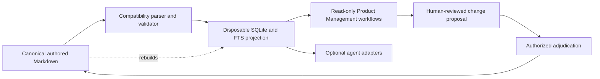

# PRD-CE V2 · Full Build Plan

## Related artifacts

- [`../PRD.md`](../PRD.md) — required product authority; currently an uninitialized downstream seed
  pending the Wave 0 split.
- [`MASTER_AI_NATIVE_PRODUCT_ENGINEERING_V2_IMPLEMENTATION_BLUEPRINT.md`](MASTER_AI_NATIVE_PRODUCT_ENGINEERING_V2_IMPLEMENTATION_BLUEPRINT.md)
  — preserved, non-authoritative research input.
- [`PRD_CE_V2_LIVE_PROJECT_EVALUATION_PROMPT.md`](PRD_CE_V2_LIVE_PROJECT_EVALUATION_PROMPT.md)
  — reusable, private-target-manifest evaluation protocol.
- [`GEARHEARTAI_PRD_CE_V2_SITE_BRIEF.md`](GEARHEARTAI_PRD_CE_V2_SITE_BRIEF.md) — Product Management
  website planning handoff.

## 1. Executive direction

PRD-CE V2 will mature on `codex/prd-ce-v2-product-model` as a focused methodology and product for
the **Product Management lifecycle**. It will not merge to `main` merely because the design is
coherent. The branch must first prove compatibility, useful read-only value, safe change handling,
clean packaging, and truthful release behavior.

The product promise is:

> Help product teams preserve what they learned, decided, delivered, and observed so each human or
> AI agent can act from current, attributable context without erasing history.

The first executable value is deliberately smaller:

> Inspect an existing PRD-CE repository in place and reveal trustworthy identity, relationship,
> provenance, lifecycle, temporal, and local repository-divergence problems without changing
> authored files.

This plan covers the full intended buildout, but it is **not an EPIC or an implementation
authorization**. V2 should begin at Progressive PRD gate v0.1, but the root PRD is not yet
initialized for V2 because the repository-authority/template-seed conflict in Section 3 must be
resolved first. Implementation EPICs begin only at v0.7.

## 2. Owner-confirmed boundaries

The following decisions govern this plan:

1. PRD-CE V2 serves the Product Management lifecycle.
2. This repository remains a reusable methodology and template repository. Tracked reusable
   artifacts must not contain named downstream products, client details, or machine-specific target
   paths.
3. GearHeartAI.org presents the Product Management path only for now.
4. Future methodologies become separately governed products and method packs. Their possible
   existence does not broaden V2 scope or justify speculative abstractions in the first product.
5. V2 stays on its branch until a release-candidate evidence package supports an explicit merge
   decision.
6. Markdown remains the canonical accepted and recovery model. Generated databases, views, and
   context packages are disposable projections.
7. Typed IDs, explicit relationships, provenance, temporal meaning, and process history are durable
   product memory and must survive V2.
8. Initial executable value is read-only and non-destructive.
9. Moving root `SoT/` is deferred until compatibility and round-trip preservation are demonstrated.
10. V2 runtime status is **Proposed** until executable behavior exists.
11. No implementation EPIC is created before PRD gate v0.7.

## 3. Status and authority

### Current observed state

| Item | Status |
|---|---|
| Current methodology on `main` | Existing V1 baseline |
| V2 research package | Committed design input |
| V2 build plan | Proposed |
| V2 parser, index, validator, or query runtime | Not implemented |
| V2 migration or accepted-state writer | Not implemented and on hold |
| V2 public availability | Proposed; not installable |
| V2 merge to `main` | Not authorized |

### Target authority order

1. `PRD.md` — methodology product strategy and lifecycle authorization.
2. Accepted SoT records and IDs — durable evidence, decisions, rules, and technical contracts.
3. This build plan — contingent sequencing and gates.
4. The master blueprint — research input, not an override.
5. Evaluation outputs — evidence candidates until sanitized, reproducible, and accepted.
6. EPICs — bounded execution records created only at v0.7 or later.

### Authority and packaging debt to close first

The root `PRD.md` is currently both the repository's required product-definition surface and the
generic PRD seed shipped to downstream repositories. Those responsibilities conflict: filling the
root PRD with PRD-CE's own V2 strategy would contaminate the reusable product template, while
leaving it blank keeps V2 outside the repository's documented authority chain.

The install manifest also treats the entire root `docs/` directory as framework content. Without a
distribution allowlist, repository-maintainer plans, research inputs, evaluation protocols, and the
GearHeart website handoff can travel into downstream product repositories even though they are not
part of the Product Management method.

**Recommended resolution:** before runtime implementation, separate the generic seed from the
repository's own product authority:

1. Move the generic downstream PRD source into an explicit template-source location.
2. Update the install manifest, packaging transform, and sync checks to seed that generic file.
3. Replace whole-directory `docs/` distribution with an explicit allowlist of consumer-facing
   Product Management method documentation. Keep maintainer plans, research, evaluations, and site
   handoffs repository-local.
4. Update root `PRD.md` in place to define PRD-CE itself, beginning at v0.1.
5. Register accepted V2 evidence and decisions with durable IDs without copying them into the
   downstream seed.
6. Add a clean-install fixture proving no methodology-development or GearHeart handoff content
   leaks into a new product.

Until that split is complete, this document remains proposed and no V2 runtime work is authorized.

## 4. Product scope

### In scope

- Product discovery evidence and uncertainty.
- Product decisions, assumptions, outcomes, and business rules.
- Personas, journeys, requirements, and experience intent.
- Delivery plans, architecture, code/test traceability, releases, and operational reality where
  they inform product decisions.
- Customer and operational learning that challenges current intent.
- Current, proposed, rejected, stale, deprecated, and superseded meaning.
- Task-scoped context for product work, always with exact provenance.
- Human-reviewed change proposals after the read-only foundation is proven.
- New-project initialization and brownfield adoption without destructive restructuring.

### Explicitly out of scope for V2

- Named downstream products or client material in the reusable repository.
- Adjacent business methodologies or domain-specific workflows.
- A universal enterprise knowledge platform or ontology.
- A hosted graph, cloud dependency, marketplace, portfolio dashboard, or generic node canvas as a
  requirement for local value.
- Automatic strategic decisions or silent promotion of inferred knowledge.
- Provider parity before one canonical implementation is stable.
- Root `SoT/` relocation during the read-only alpha.
- Public performance, recall, context-efficiency, adoption, or review-time claims without matched
  runtime and human evidence.

### Reuse boundary

V2 may expose a small internal kernel—canonical records, identity, relationships, provenance,
temporal state, deterministic projections, and controlled change. A future product may reuse only
those proven primitives through its own PRD, terminology, domain pack, release evidence, and public
experience. No future use case is allowed to make Product Management users learn extra concepts.

## 5. Sanitized review findings adopted as provisional planning inputs

These findings shape this proposed plan but are not yet accepted SoT evidence. They must be
registered with durable IDs after the authority/template split; the raw private evaluation remains
ignored and is not a canonical source.

### Strong findings that change the plan

- The branch contained design documents but no V2 executable behavior.
- V2 was outside the repository's own authority chain.
- Multiple proposed “first releases” contradicted one another and collectively described a
  platform-sized scope.
- The proposed migration contract did not cover the variety of legacy Markdown, IDs,
  relationships, tables, headings, filenames, placeholders, and directory layouts observed in
  existing repositories.
- Process records—lifecycle rows, work sessions, checkpoints, and changelogs—carry material truth
  and must be indexed rather than silently demoted.
- Local branch divergence can create two meaningful versions of product truth and belongs in
  repository-health checks.
- Accepted-state mutation lacked stale-base, concurrency, atomicity, recovery, idempotency,
  rollback, principal authority, privacy, and prompt-injection contracts.
- Public status must remain `Proposed` until runtime behavior exists.

### Promising but unproven hypotheses

- A smaller public vocabulary may lower concept load.
- Relationally compiled context may reduce irrelevant input.
- Change Sets may make product decisions safer and more reviewable.
- A task-first interface may surface useful findings before users learn the ontology.

These remain hypotheses. The prior comparison used incomplete arms and, in some cases, different
tasks or ground truth. It does not establish that V1 or V2 has better recall, speed, context
efficiency, or usability. Those claims require matched runtime tests described below.

## 6. Product architecture boundary

### Layer contracts

| Layer | Responsibility | Must not become |
|---|---|---|
| Canonical Markdown | Complete accepted state and recovery model | A generated dump or database cache |
| Compatibility parser | Preserve known structures and quarantine ambiguity | A silent normalizer |
| Validator | Deterministic structural, relational, provenance, temporal, and repository checks | A subjective product score |
| SQLite/FTS | Disposable search and traversal projection | A competing write authority |
| Product Management workflows | Task-first inspection, explanation, and lifecycle guidance | A public ontology lesson |
| Change proposal | One attributable semantic delta with evidence and impact | Direct accepted-state mutation |
| Adjudication | Explicit human-authorized accept/reject/revise/defer/supersede | An unguarded agent tool |
| Adapters | Thin access surfaces over canonical behavior | Provider-specific forks of semantics |
| GearHeartAI.org | Education, proof, and verified distribution | A second product database or simulated runtime |

## 7. Progressive PRD authorization matrix

The PRD lifecycle remains the single product-development gate system. The build waves in Section 8
are delivery sequencing, not alternate PRD versions.

| PRD gate | Required V2 outcome before advancing |
|---|---|
| v0.1 Spark | Problem, outcome, non-goals, owner scope decisions, evidence records, open questions, and authority/template split plan |
| v0.2 Market Definition | Primary Product Management users, adoption profiles, brownfield/new-project segments, and “not for” boundary |
| v0.3 Commercial Model | Category, naming, packaging, distribution, open-source, and support hypotheses; no fabricated pricing |
| v0.4 User Journeys | First-five-minutes inspection, new-project initialization, brownfield diagnosis, decision review, delivery trace, and learning loops |
| v0.5 Red Team | Migration, mutation, privacy, prompt injection, secrets, authority, branch divergence, and maintainer-surface threat model |
| v0.6 Architecture | Parser, ID, relationship, temporal, projection, fixture, authorization, packaging, and recovery contracts; disposable spikes only |
| v0.7 Build Execution | EPICs created for approved waves; read-only foundation built before mutation |
| v0.8 Release | Clean install, upgrade, rollback, uninstall, compatibility guidance, support runbooks, and release-candidate merge decision |
| v0.9 Go-to-Market | Truthful GearHeartAI launch, verified capability registry, onboarding, analytics, and feedback loop |
| v1.0 Adoption | Repeated-use, retention, owner-confirmed value, case evidence, and lifecycle refinement |

## 8. Provisional build waves

Before v0.1 initialization, only Wave 0A documentation is authorized by the current request. Wave
0B is a separately approved repository-governance bootstrap: it may change template and packaging
mechanics before v0.1, but it does not implement the V2 runtime and does not create a premature
EPIC. All product-runtime implementation waits for the required PRD gate and a v0.7+ EPIC.

### Wave 0 — Authority, scope, and clean packaging

**Lifecycle:** pre-v0.1 authority repair through v0.6 preparation.

#### Wave 0A — Current planning package

Deliver:

- This proposed build plan.
- A reusable, target-manifest-driven evaluation protocol.
- A scoped and truth-labeled GearHeartAI Product Management brief.
- A clear research-only status notice on the master blueprint.
- Ignore rules protecting local target manifests and raw evaluation output.

#### Wave 0B — Owner-approved governance bootstrap

After a separate owner approval, deliver:

- Separate repository product authority from downstream template seeds.
- Replace blanket `docs/` installation with an explicit consumer-document allowlist.
- Populate root `PRD.md` with PRD-CE's V2 product definition after the split.
- Register accepted V2 evidence and owner decisions with durable IDs.
- Mark the research blueprint proposed and reconcile its competing first-release definitions.
- Define one naming/version vocabulary for methodology generation, PRD gate, runtime release,
  template version, and provider package version.
- Add a clean-install fixture and leak check covering named products, maintainer plans, research,
  evaluation protocols, and GearHeart handoffs.

Exit:

- The authority chain resolves without exceptions.
- Downstream templates and installed docs remain generic and contain no PRD-CE development records,
  maintainer research, evaluation targets, or GearHeart handoffs.
- Runtime and public status are consistently `Proposed`.
- One alpha contract replaces all competing first-release definitions.

### Wave 1 — Corpus and compatibility contract

**Lifecycle:** v0.5 red team and v0.6 architecture; experiments only.

Deliver:

- A committed synthetic fixture corpus covering canonical and malformed structures.
- An ignored local target manifest for authorized private repositories, using opaque target IDs.
- A compatibility profile contract for discovery locations and legacy conventions.
- A loss inventory for IDs, explicit and implicit relationships, tables, headings, filenames,
  custom fields, comments, lifecycle rows, work sessions, checkpoints, and changelogs.
- Expected quarantine behavior for ambiguous structures.

Exit:

- Every observed structure has a preserve, normalize-with-evidence, quarantine, or reject policy.
- Private paths and product names are absent from tracked artifacts.
- Ground-truth fixtures can be reviewed without running a V2 runtime.

### Wave 2 — Read-only Compatibility Inspector

**Lifecycle:** first v0.7 implementation EPIC.

Deliver:

- One compatibility parser.
- One typed-ID and relationship registry.
- One deterministic validator.
- One disposable SQLite/FTS projection.
- Four initial commands: `index`, `check`, `query`, and `trace`.
- Exact file/line or record citations for every result.
- Local branch-divergence reporting without network dependency.
- Explicit unknown and ambiguity quarantine.

Do not include a writer, migration, file moves, Change Set apply, accepted-state adjudication, MCP,
graph JSON, viewer, hosted service, or provider parity.

Exit:

- Zero silently lost typed IDs or explicit relationships across the fixture corpus.
- Process records needed for product impact remain queryable.
- Repeated rebuilds from the same snapshot are logically identical and pass a defined byte-stability
  contract for generated artifacts.
- Authored files and Git state remain unchanged.
- Every finding is reproducible from cited source evidence.
- Deleting the projection loses no accepted meaning.

### Wave 3 — Product Management alpha

**Lifecycle:** v0.7 after Wave 2 passes.

Deliver:

- Task-first workflows for discovery, current decision, provenance, contradiction, impact,
  delivery trace, release reality, and learning.
- A first-five-minutes experience for new and brownfield repositories.
- Lifecycle, confidence, freshness, authority, and temporal state presented as separate dimensions.
- `as-of` queries only if temporal parsing has already passed compatibility tests.
- One thin agent skill or provider wrapper over the CLI after CLI behavior stabilizes.

Exit:

- Product Management users reach owner-confirmed useful findings without learning internal graph
  vocabulary first.
- Findings come from deterministic runtime behavior rather than evaluator interpretation.
- No named-product assumption appears in code, fixtures, copy, or docs.
- One provider wrapper adds no new semantics.

### Wave 4 — Matched and longitudinal validation

**Lifecycle:** v0.7 into v0.8.

Deliver:

- Predeclared matched control/treatment tasks with the same snapshot, question, selected change,
  evidence budget, time budget, and ground truth.
- At least three matched context tasks before any aggregate context-efficiency verdict.
- A parity audit and completion matrix that block incomparable or incomplete aggregate claims.
- Human comprehension and task-success sessions for the public vocabulary.
- A four-week dogfood protocol measuring repeat use and rediscovery avoided.
- Machine-readable results plus a self-contained visual report.

Exit:

- No critical false negatives on approved bounded impact tasks.
- Comparative claims are limited to completed, parity-passing runtime tests.
- Context-pack claims meet predeclared thresholds without losing required facts, or the feature is
  reduced/removed.
- Human evidence supports the selected public vocabulary and review burden.

### Wave 5 — Safe change-proposal beta

**Lifecycle:** v0.7 implementation after Wave 2 and v0.5 safety gates pass.

Deliver:

- Complete Change Set schema and semantic diff.
- Base-content hashes and stale-base rejection.
- Concurrent-change and collision behavior.
- Atomic multi-file apply with partial-failure recovery.
- Idempotent reapply, rollback, and auditable receipts.
- Human principal, role, repository, and action authorization.
- Direct-edit detection and reconciliation.
- Secret classification, evidence privacy, repository boundaries, and prompt-injection controls.
- Explicit accept, reject, revise, defer, deprecate, and supersede outcomes.

Exit:

- Generated or inferred content cannot silently become accepted.
- Accepted, proposed, rejected, stale, deprecated, and superseded states remain distinguishable.
- Adversarial, concurrency, crash-recovery, and rollback tests pass.
- A reviewer can understand current state, delta, evidence, impact, and authority without graph
  terminology.
- No agent-invocable interface can bypass human authorization.

### Wave 6 — Packaging and access surfaces

**Lifecycle:** v0.8 release preparation.

Deliver:

- One canonical implementation source and generated provider artifacts.
- Clean-room new-project and brownfield installation.
- Upgrade, rollback, uninstall, and recovery procedures.
- A generated capability/status registry used by documentation and GearHeartAI.org.
- Read-only MCP only after the CLI contract is stable and independently tested.
- Context compilation only after Wave 4 proves it useful.

Exit:

- Installation never overwrites existing product content.
- Upgrade detects local drift and fails safely.
- Uninstall removes framework-owned artifacts while leaving authored truth intact.
- Provider surfaces preserve canonical semantics and pass contract parity tests.
- Counts, compatibility lists, commands, and capability statuses are generated from one source.

### Wave 7 — Product Management release

**Lifecycle:** v0.8 and v0.9.

Deliver:

- Product Management method guidance across the Progressive PRD lifecycle.
- Tutorials, reference material, compatibility guidance, and support runbooks.
- A verified release artifact and installation path.
- GearHeartAI.org's Product Management experience and proof surface.
- A migration guide that begins with in-place inspection and never requires a blind file move.

Exit:

- All v0.8 release gates pass.
- Public claims map to executable tests, release artifacts, or clearly labeled illustrations.
- The V2 branch is a reviewed release candidate.
- The owner explicitly approves merge to `main` and public deployment separately.

### Wave 8 — Adoption and optional evolution

**Lifecycle:** v1.0 and later.

Measure repeated use, retention, decision quality, rediscovery avoided, maintenance burden, and
support cost. Add optional projections or collaboration layers only when observed demand and local
limits justify them. Future products begin from separate PRDs; they do not enter this release plan.

## 9. Compatibility fixture matrix

The tracked corpus must be synthetic or fully sanitized. Private repositories remain read-only and
are supplied through an ignored local manifest.

| Fixture class | Required behavior |
|---|---|
| Canonical root `SoT/` | Parse without relocation |
| Flat or alternate document layout | Discover through a profile; do not assume one folder |
| H2/H3 and mixed record headings | Preserve record boundaries and source locations |
| Typed IDs in tables, prose, filenames, README, PRD, and work records | Preserve identity and owner surface |
| Custom and compound prefixes | Preserve or explicitly reject by policy; never truncate |
| Predicate-less and section-labeled relationships | Retain observed edges with explicit ambiguity state |
| Template residue and placeholders | Distinguish scaffolding from accepted records |
| No SoT directory | Report the adoption shape; do not invent missing files |
| Lifecycle rows, sessions, checkpoints, and changelogs | Preserve process truth and temporal ordering |
| Conflicting status vocabularies | Map only through an approved profile; preserve original value |
| Superseded and partially known history | Return known/unknown honestly |
| Local branch divergence | Report semantic-bearing divergence without changing branches |
| Malformed and adversarial Markdown | Fail safely, retain source, and avoid instruction execution |

## 10. Validation protocol

### Evidence classes

- `OBSERVED` — deterministic source or runtime evidence.
- `PROXY` — a model-level simulation because runtime behavior is unavailable.
- `INFERRED` — a reasoned conclusion not directly demonstrated.
- `NOT TESTED` — unavailable, unsafe, incomplete, or incomparable.

Model prose never receives runtime credit. A simulated V2 arm is capped at design-level evidence and
cannot support automation, adoption, or performance claims.

### Required experiment controls

1. Freeze a task manifest before either arm runs: snapshot, exact question, selected change,
   evidence budget, time budget, scoring set, and hashes.
2. Use an independent curator or predeclared evidence set. Do not construct ground truth from an
   evaluator's answer.
3. Seal both arm outputs and run a parity audit before calculating a comparison.
4. Mark a dimension `NOT TESTED` when paired arms are incomplete or tasks differ.
5. Require all comparative targets to complete both arms before publishing an aggregate comparison.
6. Require at least three matched tasks before a context-efficiency verdict or kill criterion.
7. Use a shared concept taxonomy; broad V2 nouns cannot be compared with granular V1 mechanics.
8. Separate evaluator time-to-candidate, owner time-to-confirmed-value, and observed-user task
   completion.
9. Cap usability evidence at design level until humans complete representative tasks.
10. Predeclare resource ceilings for agents, retries, tokens, wall time, and target count.
11. Schema-validate finding IDs, hypothesis links, duplicates, weights, coverage, arithmetic, and
    cross-file hashes before scoring.
12. Call raw rows `evidence records`; cluster them before counting independent findings.

### Required machine-readable artifacts

- `TASK_MANIFEST.json`
- `COMPLETION_MATRIX.json`
- `PARITY_AUDIT.json`
- `HYPOTHESIS_RESULTS.json`
- `SCORECARD.json` and `SCORECARD.csv`
- `EVIDENCE.jsonl`
- `RESULT_VALIDATION.json`
- `run-manifest.json`
- A self-contained `report.html`

The local target manifest and raw confidential evidence must remain ignored or outside the
repository. Published reports use opaque target IDs and sanitized evidence.

## 11. Branch and merge governance

- Keep `main` as the stable current methodology until V2 is a release candidate.
- Reconcile material changes from `main` into the V2 branch at planned intervals; record semantic
  conflicts rather than accepting merges mechanically.
- Keep experiments disposable and outside canonical paths until their contract is approved.
- Do not merge planning documents alone as a V2 release.
- The current local branch has an ancestor containing named private evaluation targets. Do not push
  or publicly share this branch history as-is. Before first publication, obtain owner approval to
  create a sanitized release branch by squash/cherry-pick or to rewrite the unpublished branch.
  Preserve restricted raw evidence outside public Git. Never rewrite an already published branch
  without a separately approved migration plan.
- Treat a clean Git worktree as necessary but insufficient; validate semantic status and generated
  artifacts separately.

### Minimum merge bar

- Root authority and downstream template sources are separated and validated.
- PRD lifecycle has reached v0.8 release candidate.
- No critical data-loss, competing-authority, or silent-promotion risk remains.
- Compatibility passes representative synthetic fixtures and authorized private validation.
- Migration, if offered, is reversible and idempotent; in-place inspection remains available.
- Accepted-state mutation, if offered, passes authorization, concurrency, recovery, and rollback
  tests.
- Clean install, upgrade, rollback, and uninstall pass in clean-room fixtures.
- Longitudinal dogfood is complete and material findings are owner-confirmed.
- Tracked reusable artifacts contain no named downstream products, client facts, secrets, or local
  target paths.
- The complete reachable history intended for publication passes the same sensitive-reference
  scrub; an ancestor cannot re-expose removed target data.
- GearHeartAI.org capability claims match a generated, provenance-bearing status registry.
- Owner approves the merge and public release as separate decisions.

## 12. GearHeartAI.org synchronization

GearHeart AI is the publisher. The current site tells one product story: trustworthy Product
Management across discovery, decisions, delivery, release, and learning.

- Do not market, preview, name, or measure future methodology products on the current site.
- Present the existing methodology as available only after its exact adoption path is verified.
- Present V2 runtime behavior as `Proposed` until an executable release exists.
- Use a deterministic, visibly illustrative proof instead of fake terminal output or a simulated
  backend.
- Prefer the read-only Compatibility Inspector as the first runtime-backed proof.
- Source capability status, commands, versions, and URLs from one validated registry.
- Keep the site modular internally, but do not expose speculative platform architecture.
- Require separate owner approvals for product naming, visual direction, high-fidelity composition,
  new public claims, and production deployment.

The coding-agent handoff is [`GEARHEARTAI_PRD_CE_V2_SITE_BRIEF.md`](GEARHEARTAI_PRD_CE_V2_SITE_BRIEF.md).

## 13. Principal risks and hold criteria

| Risk | Hold condition | Required response |
|---|---|---|
| Authority drift | Root PRD and template seed remain the same unresolved file | Hold runtime implementation; complete Wave 0 |
| Scope creep | Alpha requires hosted, marketplace, multi-provider, or future-method layers | Remove those dependencies |
| Parser overfitting | Unseen valid structures are silently lost or normalized | Expand fixtures; quarantine uncertainty |
| Destructive migration | Adoption requires a file move before useful inspection | Hold migration; keep in-place read-only path |
| Silent acceptance | Generated/inferred content can become accepted without authority | Hold mutation; close safety contract |
| Process-truth loss | Sessions, checkpoints, lifecycle rows, or changelogs disappear from impact analysis | Hold alpha release; fix indexing model |
| Private-data leakage | Target names, paths, client facts, or raw evidence enter tracked/public artifacts | Stop release; remove and rotate exposed secrets if applicable |
| Template/distribution leakage | Maintainer plans, research, evaluations, or GearHeart handoffs install into downstream products | Hold packaging; enforce an allowlist and clean-install leak test |
| Public-history leakage | A reachable ancestor exposes removed private target names or paths | Do not push; publish only an owner-approved sanitized history |
| Branch divergence | V2 cannot account for material changes on `main` | Reconcile and adjudicate conflicts |
| Claim drift | Website copy outruns runtime or provenance | Fail content validation and remove the claim |
| Maintainer overload | Optional surfaces exceed the tested local kernel | Cut scope before adding maintainers or services |

## 14. Open owner decisions

These decisions should be resolved at their PRD gate, not guessed by an implementation agent:

1. Confirm the repository-authority/template-seed and consumer-document allowlist split described in
   Section 3.
2. Approve the public product name; **The Product Model** remains a working label only.
3. Confirm whether the public lifecycle verb remains **Build** or becomes **Deliver**.
4. Approve the exact v0.2 primary user and “not for” boundary after research.
5. Confirm whether the first website proof remains illustrative until Wave 2 or waits for the
   runtime-backed Compatibility Inspector.
6. Approve how the unpublished branch history will be sanitized before any push or public review.
7. Approve the release and merge independently after v0.8 evidence exists.

## 15. Immediate next actions

1. Commit this plan, the generic evaluation protocol, blueprint status notice, and revised
   GearHeartAI brief as one reviewable planning package.
2. Keep the commit local; review and approve a sanitized-history publication strategy before any
   push or remote handoff.
3. Review and separately approve the Wave 0B governance bootstrap.
4. Execute Wave 0B as a reviewed repository-maintenance change: split the PRD seed, allowlist
   consumer docs, prove a clean install, then update root `PRD.md` to v0.1 and register accepted
   evidence/decisions.
5. Complete v0.2 user and adoption-profile research with Product Management practitioners.
6. Build the synthetic compatibility inventory during v0.5/v0.6 planning; keep private validation
   targets in an ignored local manifest.
7. At v0.6, write the parser, projection, safety, and packaging contracts and run only disposable
   technical spikes.
8. At v0.7, create the first implementation EPIC for the read-only Compatibility Inspector.

## 16. Definition of full V2

V2 is complete when a new or existing product repository can adopt the Product Management
lifecycle; inspect its accepted truth without mutation; trace every result to source; preserve
identity, relationships, process history, and temporal meaning; safely propose and adjudicate a
change under explicit human authority; retrieve task-scoped context without losing required facts;
and install, upgrade, roll back, or remove the methodology reproducibly.

Cloud services, marketplaces, portfolio views, generic graph canvases, and future methodology
products are not required for that definition.
