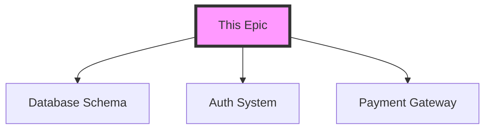

# EPIC-{NUMBER}: {Feature Name} v{0.1}

> **📊 STATUS EMOJI GUIDE** (Product Owner maintains filename prefix)
> - ✅ **COMPLETED**: 100% done, deployed, validated
> - 🟡 **READY**: Unblocked, requirements clear, can start
> - 🔴 **EMERGENCY**: P0 blocking priority, critical
> - 🚧 **IN PROGRESS**: Active development underway
> - 🚫 **BLOCKED**: Cannot proceed, waiting on dependency
> - 📋 **PLANNING**: Requirements being gathered
>
> **FILENAME FORMAT**: `{emoji} EPIC-XX-NAME.md` (e.g., `🟡 EPIC-01-FOUNDATION.md`)
>
> **PRODUCT OWNER RESPONSIBILITY**: Update filename emoji when status changes and update all references to prevent broken links.

## 🎯 Epic Dashboard

### Quick Status
```
[▓▓▓▓░░░░░░] 40% Complete
⏱️ Time Elapsed: 2 days | Est. Remaining: 3 days
🚦 Status: IN PROGRESS
🤖 Current Model: Sonnet
```

### Interactive Checklist
<!-- Click checkboxes to update progress -->
- [ ] 📋 Planning Complete
- [ ] 🎨 Design Approved  
- [ ] 🏗️ Architecture Reviewed
- [ ] ✅ Tests Written
- [ ] 💻 Implementation Complete
- [ ] 📱 Mobile Validation Complete (iOS Simulator)
- [ ] 🧪 Tests Passing
- [ ] 📊 Performance Validated
- [ ] 🚀 Deployed to Staging
- [ ] ✓ User Acceptance
- [ ] 🎉 Deployed to Production

## 📊 Epic Meta Information

| Field | Value | Auto-Updated |
|-------|-------|--------------|
| **Current Version** | v0.1 | ✅ |
| **Planning Version** | v0.1-0.3 (Opus) | |
| **Execution Version** | v0.4+ (Sonnet) | |
| **Last Updated** | 2025-07-20 10:00 | ✅ |
| **Last Editor** | Claude Code | ✅ |
| **Status** | Planning Phase | ✅ |
| **Completion** | 0% | ✅ |
| **Blocked Items** | 0 | ✅ |
| **Test Coverage** | 0% | ✅ |
| **Story Points** | [Total] | ✅ |
| **Context Windows** | [Estimated] | ✅ |
| **Risk Score Impact** | [±X] | Link to Command Center |

## 📑 Version History
| Version | Date | Editor | Changes | Impact |
|---------|------|--------|---------|--------|
| v0.1 | 2025-07-20 | Claude Code | Initial epic structure | 🟢 Low |

## ⚠️ EPIC-00 Foundation Setup Template

**Use this section for EPIC-00 (Pre-Development Foundation Setup) only. Delete this section for all other EPICs.**

### Foundation Setup Checklist (EPIC-00 Only)
- [ ] 🔍 Product Requirements Validated (PRD v0.5+)
- [ ] 🏗️ Environment Configuration (.env.example + .env)
- [ ] 🔐 Security Foundation (.gitignore + secrets strategy)
- [ ] 📋 Production Secrets Guide Created
- [ ] 🧪 Quality Framework Setup (golden datasets if AI)
- [ ] 📚 Developer Documentation (README.md)
- [ ] 🔑 Service Accounts Provisioned & Tested
- [ ] 📁 Repository Foundation (initial commit)
- [ ] ✅ Gate EPIC-00 Validation Complete
- [ ] 🚀 Phase 1.1 Agent Setup Ready

### Foundation Setup Context
- **Trigger**: PRD v0.5+ approved and Gate 1 passed
- **Purpose**: Essential infrastructure setup that enables rapid, secure development
- **Critical**: Must be completed before Phase 2 (Technical Feasibility)
- **Services to Configure**: Authentication, Database, Storage, Monitoring, CI/CD, Secrets Management

### Production Secrets Strategy (EPIC-00)
- [ ] Create `.env.example` with all required variables
- [ ] Document secret provisioning process
- [ ] Set up secure secret storage (1Password/similar)
- [ ] Configure development vs production environments
- [ ] Test service account authentication
- [ ] Document emergency secret rotation procedures

---

## 🧭 Quick Navigation
- [📋 EPIC Overview](#epic-overview)
- [🎯 Strategic Context](#strategic-context)
- [🎨 Design Integration](#design-integration)
- [🏗️ Technical Approach](#technical-approach)
- [📁 File Operations Manifest](#file-operations-manifest)
- [🚦 Operational Phases (A-E)](#operational-phases)
- [📝 Content Tasks (1-N)](#content-tasks)
- [🧪 Testing Strategy](#testing-strategy)
- [📈 Progress Tracking](#progress-tracking)
- [🤝 Handoff Notes](#handoff-notes)

---

## 📋 EPIC Overview {#epic-overview}

### Quick Summary
- **Purpose**: [1-2 sentence summary]
- **Size**: [Small (<300 lines) | Medium (300-800) | Large (>800 - consider A/B split)]
- **Complexity**: [Low | Medium | High]
- **Risk Impact**: [±X points on Command Center risk score]

### EPIC Size Management
**Warning Thresholds**:
- 500 lines: Review for potential optimization
- 800 lines: Consider A/B splitting
- 1000+ lines: MUST split into EPIC-XXA and EPIC-XXB

### Subagent Delegation Plan
| Task Type | Recommended Agent | Reason |
|-----------|------------------|--------|
| {task category} | @agent-{name} or "Claude directly" | {why this agent} |

---

## 🎯 Strategic Context {#strategic-context}

### Business Value
- **Market Need**: [What problem does this solve?]
- **User Story**: As a [user type], I want [goal] so that [benefit]
- **Success Metrics**: 
  - [ ] Metric 1: [Target value]
  - [ ] Metric 2: [Target value]
- **Priority**: 🔴 Critical | 🟡 High | 🟢 Medium | ⚪ Low
- **Revenue Impact**: $[estimated impact]/month

### Dependencies & Risks


---

## 🎨 Design Integration {#design-integration}

### Design Status Tracker
- [ ] User Journey Mapped
- [ ] Wireframes Created
- [ ] Design System Aligned
- [ ] Mockups Approved
- [ ] Assets Exported
- [ ] Implementation Guide Ready

### Design Resources
| Resource | Status | Link/Location |
|----------|--------|---------------|
| Design Brief | ✅ Complete | [Link] |
| Figma/UXPilot | 🔄 In Progress | [Link] |
| Component Library | ✅ Ready | [Link] |
| Design Tokens | ⏳ Pending | [Link] |

### Key Design Decisions
1. **Decision**: [Description]
   - **Rationale**: [Why this approach]
   - **Impact**: [What changes]

---

## 🏗️ Technical Approach {#technical-approach}

### Architecture Decision Record (ADR)
<!-- Model: opus-required for architecture decisions -->

**Decision**: [Technical approach chosen]

**Status**: Proposed | Accepted | Deprecated | Superseded

**Context**: 
[What is the issue that we're seeing that is motivating this decision?]

**Options Considered**:
1. **Option A**: [Description]
   - ✅ Pros: [List]
   - ❌ Cons: [List]
2. **Option B**: [Description]
   - ✅ Pros: [List]
   - ❌ Cons: [List]

**Decision**: 
[Which option was chosen and why]

**Consequences**:
- 🟢 Positive: [What becomes easier]
- 🔴 Negative: [What becomes harder]

### Technical Checklist
- [ ] TypeScript Quality Hooks configured
- [ ] Database schema designed
- [ ] API endpoints defined
- [ ] Security review completed
- [ ] Performance benchmarks set
- [ ] Monitoring plan ready
- [ ] Rollback strategy defined

---

##  codebase Context {#codebase-context}
<!-- Model: sonnet-required for codebase analysis -->

### Codebase Analysis
- **Relevant repositories**: [List of repositories]
- **Primary Language/Framework**: [e.g., TypeScript, React, Node.js]
- **Key Directories/Files**: 
    - `src/components/`: [Brief description]
    - `src/services/`: [Brief description]
    - `utils/`: [Brief description]
- **Architectural Style**: [e.g., Monorepo, Microservices, Modular Monolith]
- **State Management**: [e.g., Redux, Zustand, Context API]
- **Styling**: [e.g., Tailwind CSS, CSS-in-JS, SASS Modules]

### Code Quality & Tooling
- **Linter**: [e.g., ESLint, Ruff]
- **Formatter**: [e.g., Prettier]
- **Testing Framework**: [e.g., Jest, Vitest, Pytest]
- **CI/CD**: [e.g., GitHub Actions, Jenkins]
- **Build Tool**: [e.g., Webpack, Vite, Turborepo]

### Validation Checklist
- [ ] Codebase structure reviewed and understood.
- [ ] Key files and modules for this epic have been identified.
- [ ] Existing test coverage has been assessed.
- [ ] Local development environment is set up and running.
- [ ] Dependencies are understood and potential conflicts are noted.

---

## 📁 File Operations Manifest {#file-operations-manifest}
<!-- Track all file operations to prevent scope creep and maintain architectural clarity -->

### Planned Impact Summary
| Operation | Count | Risk | Notes |
|-----------|-------|------|-------|
| **Files to Create** | 0 | Low | [Primary purpose] |
| **Files to Modify** | 0 | Low | [Scope of changes] |  
| **Files to Delete** | 0 | Low | [Cleanup/refactor] |
| **Critical Dependencies** | 0 | Low | [External systems] |
| **Test Files Required** | 0 | Low | [Coverage target] |

### Architecture Overview
```
project/
├── src/
│   ├── components/    # [Changes planned]
│   ├── api/          # [Changes planned]
│   └── utils/        # [Changes planned]
├── tests/            # [Test coverage]
└── docs/             # [Documentation updates]
```

### Phase File Operations Tracker
<!-- Status: ⏳ Planned | ✅ Completed | ⚠️ Modified | ❌ Skipped | 🆕 Unplanned -->

| Phase | File Path | Operation | Purpose | Status | Actual | Deviation Notes |
|-------|-----------|-----------|---------|--------|--------|-----------------|
| **Phase 1** ||||||| 
| 1 | `src/example.js` | CREATE | Example file | ⏳ | - | - |
| **Phase 2** ||||||| 
| 2 | `tests/example.test.js` | CREATE | Test coverage | ⏳ | - | - |

### Deviation Log
<!-- Track only significant deviations that impact architecture or scope -->
| Phase | Type | Description | Impact | Risk |
|-------|------|-------------|---------|------|
| - | - | No deviations yet | - | - |

### File Complexity Assessment
- **Estimated Complexity**: Low/Medium/High
- **Cross-Component Impact**: Minimal/Moderate/Significant  
- **Breaking Changes**: None/Backwards Compatible/Breaking
- **Migration Required**: No/Yes (describe if yes)

---

## 🚦 Operational Phases (A-E) {#operational-phases}
**Standard phases that apply to all EPICs - DO NOT RENAME**

### 📌 Anchor Policy for Required Reading
**CRITICAL**: All "Required Reading" references must use stable heading anchors, not line numbers.
- ✅ CORRECT: `COMMAND_CENTER.md#technical-architecture-truth`
- ❌ WRONG: `COMMAND_CENTER.md:line-47`
- **Reason**: Line numbers change; anchors are stable
- **Format**: `{filename}#{heading-id}` where heading ID is lowercase, hyphenated

### Phase A: Planning & Architecture
- **Status**: [ ] Not Started | [ ] In Progress | [ ] Complete
- **Objective**: Define approach, review architecture, plan implementation
- **Required Reading** (use anchors only):
  - `COMMAND_CENTER.md#technical-architecture-truth`
  - `PRD.md#requirements`
  - `WORKFLOW-GATES.md#gate-2-technical-validation`
- **Standard Activities**:
  - [ ] Review requirements with Product Owner
  - [ ] Verify against Command Center metrics
  - [ ] Architecture decision record
  - [ ] Risk assessment
  - [ ] Subagent delegation planning

### Phase B: Core Implementation 
- **Status**: [ ] Not Started | [ ] In Progress | [ ] Complete
- **Objective**: Build primary functionality
- **Required Reading** (use anchors only):
  - `TECHNICAL-ARCHITECTURE.md#detailed-stack-components` (if exists)
  - `API_CONTRACTS.md#endpoints` (if exists)
  - Current EPIC tasks section
- **Delegate to**: {agent or "Claude directly"}
- **Context Strategy**: {fresh/orchestrated/accumulated}

### Phase C: Integration & Testing
- **Status**: [ ] Not Started | [ ] In Progress | [ ] Complete  
- **Objective**: Connect components, write tests
- **Required Reading** (use anchors only):
  - `testing-playbook.md#coverage-requirements`
  - `COMMAND_CENTER.md#single-source-of-truth-table` (test metrics)
- **Coverage Target**: {X}% based on risk score

### Phase D: Polish & Optimization
- **Status**: [ ] Not Started | [ ] In Progress | [ ] Complete
- **Objective**: Performance, UX refinement, edge cases
- **Required Reading** (use anchors only):
  - `STANDARDS.md#performance-targets`
  - `WORKFLOW-GATES.md#gate-4-quality-validation`

### Phase E: Documentation & Handoff  
- **Status**: [ ] Not Started | [ ] In Progress | [ ] Complete
- **Objective**: Update Three-File docs, extract learnings
- **Required Reading** (use anchors only):
  - `COMMAND_CENTER.md#epic-learning-repository`
  - `COMMAND_CENTER.md#reusable-patterns-bank`
- **Mandatory Updates**:
  - [ ] COMMAND_CENTER.md learnings
  - [ ] PRD.md assumptions
  - [ ] This EPIC's post-completion

---

## 📝 Content Tasks (1-N) {#content-tasks}
**Flexible task list that varies by EPIC - RENAME AS NEEDED**

### Task 1: {Specific Task Name}
- **Phase**: [A-E]
- **Status**: `📋 To Do` | `🔄 In Progress` | `✅ Done` | `🚫 Blocked`
- **Assigned to**: @agent-{name} or "Claude"
- **Context Load**: [files to include]
- **Acceptance Criteria**:
  - [ ] {specific criterion}
  - [ ] {specific criterion}

<details>
<summary>Implementation Notes</summary>

```typescript
// Key code snippets or approach
```

**Test Command**: `npm run test:{specific}`
</details>

### Task 2: {Specific Task Name}
- **Phase**: [A-E]
- **Status**: `📋 To Do`
- **Dependencies**: Task 1
- **Assigned to**: @agent-{name}

### Task N: {Add more as needed}
- **Phase**: [A-E]
- **Status**: `📋 To Do`

### Phase E: Documentation Update & Learning Extraction
- **Objective**: Update all relevant documentation and extract learnings for future EPICs using Three-File Discipline.

⚠️ **IMPORTANT**: Consult product owner agent to verify if additional documents need updating beyond this list.

- **Core Documentation Updates** (MANDATORY):
    - [ ] Update `/COMMAND_CENTER.md`:
        - Update Single Source of Truth table with new metrics
        - Add EPIC completion to Learning Repository
        - Document any new patterns in Patterns Bank
        - Record any anti-patterns discovered
        - Update Agent Effectiveness Matrix
        - Add File Complexity Score and Planned vs Actual Alignment %
    - [ ] Update `/PRD.md`:
        - Add validated/invalidated assumptions to Assumptions Log
        - Update any requirement changes discovered
    - [ ] Update current EPIC file:
        - Add Post-Completion Analysis section
        - Document actual vs planned metrics
        - Record context bridge for next EPICs
        - Note what would be done differently

- **Additional Updates** (as applicable):
    - [ ] Update `deployment-playbook.md` if deployment procedures changed
    - [ ] Update `testing-playbook.md` with new test strategies discovered
    - [ ] Update product-specific `claude.md` with agent delegation learnings
    - [ ] Archive any deprecated documentation to `/archive/`

- **Learning Extraction Tasks**:
    - [ ] Identify reusable patterns from this EPIC
    - [ ] Document anti-patterns to avoid
    - [ ] Calculate actual vs planned velocity
    - [ ] Complete File Operations Manifest reconciliation:
        - Update all "Actual" columns with final status
        - Document deviations with clear justifications
        - Calculate Planned vs Actual Alignment percentage
        - Identify unplanned files for technical debt tracking
- **Documentation Consolidation Checklist** (3+3 Pattern):
    - [ ] Check COMMAND_CENTER.md file size (warn if >800 lines)
    - [ ] Review for duplicate documentation across files
    - [ ] Identify files not referenced in 30+ days
    - [ ] Consolidate related technical documents:
        - Testing files → Single TESTING.md or COMMAND_CENTER Technical Guidelines
        - Security files → SECURITY.md or COMMAND_CENTER Technical Guidelines
        - Quality files → COMMAND_CENTER Technical Guidelines
    - [ ] Archive obsolete documentation to `/archive/`
    - [ ] Verify 3+3 Pattern compliance:
        - 3 Primary: COMMAND_CENTER, PRD, Current EPIC
        - 3 Technical (if needed): API_CONTRACTS, BUSINESS_RULES, DEVELOPMENT_SEQUENCE
    - [ ] Flag any files for consolidation in next session
    - [ ] Assess agent effectiveness for different tasks
    - [ ] Record validated/invalidated assumptions
    - [ ] Create context bridge for dependent EPICs

- **Quality Assurance**:
    - [ ] All metrics in Truth Table are current
    - [ ] No conflicting information across documents
    - [ ] Patterns are documented with clear reuse instructions
    - [ ] Agent effectiveness data is quantified
    - [ ] Product Owner notified of completion

- **Product Owner Consultation**:
    - [ ] Ask product owner: "Are there any other documents that should be updated that aren't on this list?"
    - [ ] Verify all stakeholder-facing documents are current

---

## 🧪 Testing Strategy {#testing-strategy}

### Test Planning Dashboard
```
Unit Tests:        [░░░░░░░░░░] 0% (0/50)
Integration Tests: [░░░░░░░░░░] 0% (0/20)
E2E Tests:         [░░░░░░░░░░] 0% (0/10)
Overall Coverage:  [░░░░░░░░░░] 0%
```

### Interactive Test Checklist

#### Prerequisites
- [ ] Testing framework configured
- [ ] Test database setup
- [ ] Mock data prepared
- [ ] CI/CD pipeline ready

#### Test Categories
<details>
<summary>📦 Unit Tests (Click to expand)</summary>

- [ ] Component: `UserAuthentication`
  - [ ] Test: Valid login credentials
  - [ ] Test: Invalid credentials
  - [ ] Test: Token expiration
  - [ ] Test: Rate limiting
  
- [ ] Component: `PaymentProcessor`
  - [ ] Test: Successful payment
  - [ ] Test: Failed payment
  - [ ] Test: Refund processing
  - [ ] Test: Currency conversion
</details>

<details>
<summary>🔗 Integration Tests</summary>

- [ ] Flow: User Registration → Email Verification
- [ ] Flow: Add to Cart → Checkout → Payment
- [ ] Flow: API → Database → Cache
</details>

<details>
<summary>🌐 E2E Tests</summary>

- [ ] Journey: New user signup to first purchase
- [ ] Journey: Returning user quick checkout
- [ ] Journey: Admin dashboard operations
</details>

<details>
<summary>📱 Mobile Testing</summary>

**See [Testing Playbook Template](testing-playbook-template.md#mobile-testing) for comprehensive mobile testing checklist**

Quick mobile validation checkpoints:
- [ ] `npm run ios` - App launches in iOS Simulator
- [ ] Touch interactions work correctly
- [ ] Mobile-responsive design validated
- [ ] Cross-platform functionality confirmed

</details>

### Test Execution Log
| Date | Type | Passed | Failed | Coverage | Notes |
|------|------|--------|--------|----------|-------|
| 2025-07-20 | Unit | 0 | 0 | 0% | Initial |
| 2025-07-20 | Mobile | 0 | 0 | 0% | See testing-playbook-template.md |

---

## 💻 [DEPRECATED - Use Content Tasks Section] {#implementation-tasks}

### Task Progress Tracker
```
Total Tasks: 10
✅ Completed: 0
🔄 In Progress: 0
📋 To Do: 10
🚫 Blocked: 0
```

### Interactive Task List

#### 🔵 Task 1: Database Schema Setup
- **Status**: `📋 To Do` | `🔄 In Progress` | `✅ Done` | `🚫 Blocked`
- **Model**: `🤖 Sonnet Ready`
- **Estimate**: [X] story points / [Y] context windows
- **Assignee**: @claude-code

<details>
<summary>📝 Task Details (Click to expand)</summary>

**Context**: 
Setting up the database schema for user management and authentication.

**Acceptance Criteria**:
- [ ] Users table created with proper constraints
- [ ] Indexes added for performance
- [ ] RLS policies implemented
- [ ] Migration script tested

**Implementation Notes**:
```sql
-- Example schema
CREATE TABLE users (
  id UUID PRIMARY KEY DEFAULT gen_random_uuid(),
  email TEXT UNIQUE NOT NULL,
  created_at TIMESTAMPTZ DEFAULT NOW()
);
```

**Test Command**:
```bash
npm run test:db:schema
```
</details>

#### 🔵 Task 2: API Endpoint Implementation
- **Status**: `📋 To Do`
- **Model**: `🤖 Sonnet Ready`
- **Estimate**: [X] story points / [Y] context windows
- **Dependencies**: Task 1

<details>
<summary>📝 Task Details</summary>

**Endpoints to Implement**:
- [ ] POST /api/users/register
- [ ] POST /api/users/login
- [ ] GET /api/users/profile
- [ ] PUT /api/users/profile

**Validation Requirements**:
- Email format validation
- Password strength requirements
- Rate limiting per IP
</details>

#### 🔴 Task 3: Complex Architecture Decision
- **Status**: `📋 To Do`
- **Model**: `🧠 Opus Required`
- **Estimate**: 1 context window
- **Blocker**: Needs performance analysis

<details>
<summary>📝 Task Details</summary>

**Decision Needed**:
Choose between WebSocket vs Server-Sent Events for real-time updates

**Research Required**:
- Performance benchmarks
- Scalability analysis
- Cost comparison
</details>

### Blocked Tasks Monitor
<!-- Auto-updated when tasks are marked as blocked -->
```
⚠️ Currently Blocked: 0 tasks
🧠 Awaiting Opus: 0 tasks
👤 Awaiting User: 0 tasks
```

---

## 📈 Progress Tracking {#progress-tracking}

### Daily Progress Log

<details>
<summary>📅 2025-07-20 (Day 1)</summary>

**🎯 Goals for Today**:
- [x] Epic creation and planning
- [ ] Database schema design
- [ ] Initial test setup

**✅ Completed**:
- Epic structure created
- Requirements gathered

**🚧 In Progress**:
- Database schema design (50%)

**🚫 Blockers**:
- None

**📝 Notes**:
Starting with database-first approach as recommended in standards.

**📊 Effort Tracking**:
- Planning: [X] story points
- Implementation: [Y] story points
- Testing: [Z] story points
- Context Windows Used: [N]
- **Total Points**: [Sum]
</details>

### Velocity Metrics
```
Average Daily Progress: N/A (Day 1)
Estimated Completion: TBD
Confidence Level: 🟡 Medium
```

---

## 🤝 Handoff Notes {#handoff-notes}

### Model Handoff Checklist
When switching between Opus and Sonnet:

#### From Sonnet → Opus
- [ ] Document all attempted solutions
- [ ] Export error logs and stack traces
- [ ] Summarize architectural questions
- [ ] Note any design decisions needed
- [ ] Update task status to `blocked-for-opus`

#### From Opus → Sonnet
- [ ] Architectural decisions documented
- [ ] Implementation plan detailed
- [ ] Edge cases identified
- [ ] Test scenarios defined
- [ ] Complex logic explained

### Current Handoff Status
```
Last Handoff: N/A
Direction: N/A
Pending Items: 0
```

---

## 🔧 Utilities & Commands

### Quick Commands
```bash
# Run tests for this epic
npm run test:epic:XX

# Check epic status
npm run epic:status XX

# Generate progress report
npm run epic:report XX

# Update completion percentage
npm run epic:update-progress XX
```

### Status Badges


---

## 📚 References & Resources

### Related Documents
- [WORKFLOW-MASTER.md](../workflows/WORKFLOW-MASTER.md) - Overall workflow
- [TECH-STACK](../tech-stack/) - Technical standards
- [Design Brief]() - Feature design details
- [PRD v1.0]() - Product requirements

### External Resources
- [API Documentation]()
- [Design System]()
- [Component Library]()

---

## 🎉 Completion Criteria

### Definition of Done
- [ ] All tasks completed
- [ ] All tests passing (>80% coverage)
- [ ] Performance benchmarks met
- [ ] Security review passed
- [ ] Documentation updated
- [ ] Deployed to staging
- [ ] User acceptance received
- [ ] Deployed to production
- [ ] Monitoring configured
- [ ] Retrospective completed

### Sign-off
| Role | Name | Date | Signature |
|------|------|------|-----------|
| Technical Lead | | | |
| Product Owner | | | |
| QA Lead | | | |
| DevOps | | | |

---

*This document follows the APOLLO progressive documentation philosophy. Update in place rather than creating new versions.*
