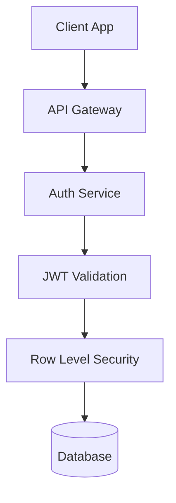
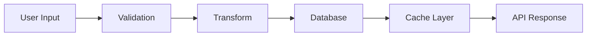
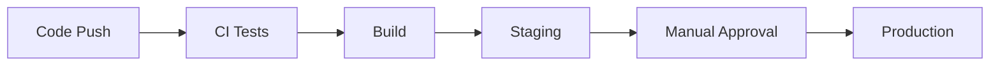

# 🏗️ {PRODUCT_NAME} TECHNICAL ARCHITECTURE

> **Extraction Date**: {DATE}  
> **Extracted From**: COMMAND_CENTER.md (section exceeded 200 lines)  
> **Authority**: COMMAND_CENTER remains source of truth for summary  
> **Purpose**: Detailed technical specifications and architecture documentation

---

## 📊 Architecture Summary
**This section remains in COMMAND_CENTER.md as the authoritative summary**

Link back: [COMMAND_CENTER Technical Architecture](../COMMAND_CENTER.md#technical-architecture-truth)

---

## 🔧 Detailed Stack Components

### Frontend Architecture
```
frontend/
├── src/
│   ├── components/       # UI components
│   │   ├── common/      # Shared components
│   │   ├── features/    # Feature-specific
│   │   └── layouts/     # Page layouts
│   ├── hooks/           # Custom React hooks
│   ├── services/        # API clients
│   ├── state/           # State management
│   ├── styles/          # Global styles
│   └── utils/           # Utilities
```

**Technology Stack**:
- **Framework**: {React 18.2/Next.js 14/etc} 
- **State Management**: {Redux/Zustand/Context}
- **Styling**: {Tailwind/CSS-in-JS/SASS}
- **Build Tool**: {Vite/Webpack/Turbopack}
- **Type Safety**: TypeScript {version}

**Key Decisions**:
| Decision | Rationale | Trade-offs |
|----------|-----------|------------|
| {decision} | {why} | {pros/cons} |

### Backend Architecture
```
backend/
├── src/
│   ├── api/             # Route handlers
│   │   ├── auth/        # Authentication
│   │   ├── users/       # User management
│   │   └── {feature}/   # Feature endpoints
│   ├── middleware/      # Express middleware
│   ├── services/        # Business logic
│   ├── models/          # Data models
│   ├── utils/           # Utilities
│   └── config/          # Configuration
```

**Technology Stack**:
- **Runtime**: {Node.js/Deno/Bun} {version}
- **Framework**: {Express/Fastify/Hono}
- **Database**: {PostgreSQL/MongoDB/SQLite}
- **ORM/Query**: {Prisma/Drizzle/TypeORM}
- **Validation**: {Zod/Joi/Yup}

### Mobile Architecture (if applicable)
```
mobile/
├── src/
│   ├── screens/         # Screen components
│   ├── navigation/      # Navigation config
│   ├── components/      # Shared components
│   ├── services/        # API & native
│   └── utils/           # Utilities
```

**Technology Stack**:
- **Framework**: {React Native/Flutter/Native}
- **Navigation**: {React Navigation/Native}
- **State**: {Redux/MobX/Context}
- **Testing**: {Jest/Detox}

---

## 🔐 Security Architecture

### Authentication & Authorization


### Security Layers
| Layer | Implementation | Testing | Monitoring |
|-------|---------------|---------|------------|
| **Network** | {HTTPS/WSS} | {tools} | {metrics} |
| **Application** | {CORS/CSP/Headers} | {tools} | {metrics} |
| **Data** | {Encryption/Hashing} | {tools} | {metrics} |
| **Infrastructure** | {Firewall/WAF} | {tools} | {metrics} |

### Compliance Requirements
- [ ] GDPR (if EU users)
- [ ] CCPA (if California users)
- [ ] HIPAA (if health data)
- [ ] PCI DSS (if payments)
- [ ] SOC 2 (if enterprise)

---

## 🗄️ Data Architecture

### Database Schema
```sql
-- Core tables structure
CREATE TABLE users (
    id UUID PRIMARY KEY DEFAULT uuid_generate_v4(),
    email TEXT UNIQUE NOT NULL,
    created_at TIMESTAMPTZ DEFAULT NOW()
);

-- Add more tables as needed
```

### Data Flow


### Caching Strategy
| Data Type | TTL | Invalidation | Storage |
|-----------|-----|--------------|---------|
| User profiles | 5min | On update | Redis |
| Static content | 1hr | Deploy hook | CDN |
| API responses | 30s | On write | Memory |

---

## 🚀 Deployment Architecture

### Infrastructure Overview
```
Production Environment:
├── CDN (CloudFlare/Fastly)
├── Load Balancer
├── App Servers (Auto-scaling)
├── Database (Primary + Read Replicas)
├── Cache Layer (Redis)
├── Object Storage (S3)
└── Monitoring Stack
```

### Deployment Pipeline


### Environment Configuration
| Environment | URL | Database | Features |
|------------|-----|----------|----------|
| Development | localhost | Local | All |
| Staging | staging.{domain} | Staging DB | All |
| Production | {domain} | Prod DB | Stable |

---

## 📡 API Architecture

### API Design Principles
- **REST**: Resource-oriented design
- **GraphQL**: Query flexibility (if used)
- **Versioning**: URL path (v1, v2)
- **Rate Limiting**: Per user/IP
- **Documentation**: OpenAPI/Swagger

### Endpoint Structure
```
/api/v1/
├── /auth
│   ├── POST /login
│   ├── POST /logout
│   └── POST /refresh
├── /users
│   ├── GET /profile
│   ├── PUT /profile
│   └── DELETE /account
└── /{resource}
    ├── GET /
    ├── POST /
    ├── GET /:id
    ├── PUT /:id
    └── DELETE /:id
```

### API Response Format
```typescript
interface ApiResponse<T> {
  success: boolean;
  data?: T;
  error?: {
    code: string;
    message: string;
    details?: any;
  };
  meta?: {
    pagination?: PaginationMeta;
    timestamp: number;
  };
}
```

---

## 🔄 Integration Architecture

### External Services
| Service | Purpose | Integration | Fallback |
|---------|---------|-------------|----------|
| {Service} | {purpose} | {REST/SDK/Webhook} | {strategy} |

### Event System
```typescript
// Event-driven architecture
interface EventBus {
  emit(event: string, data: any): void;
  on(event: string, handler: Function): void;
  off(event: string, handler: Function): void;
}
```

### Message Queue (if applicable)
- **Technology**: {RabbitMQ/Kafka/SQS}
- **Patterns**: {Pub/Sub/Queue}
- **Retry Strategy**: {exponential backoff}
- **Dead Letter Queue**: {handling}

---

## ⚡ Performance Architecture

### Performance Budgets
| Metric | Target | Current | Status |
|--------|--------|---------|--------|
| LCP | <2.5s | {value} | 🟢🟡🔴 |
| FID | <100ms | {value} | 🟢🟡🔴 |
| CLS | <0.1 | {value} | 🟢🟡🔴 |
| TTI | <3.5s | {value} | 🟢🟡🔴 |

### Optimization Strategies
- **Code Splitting**: Route-based splitting
- **Lazy Loading**: Component-level loading
- **Image Optimization**: WebP/AVIF formats
- **Bundle Size**: Tree shaking, minification
- **Database**: Indexes, query optimization

---

## 🔍 Monitoring & Observability

### Monitoring Stack
```
Application Monitoring:
├── APM (NewRelic/DataDog)
├── Error Tracking (Sentry)
├── Logging (LogTail/CloudWatch)
├── Analytics (PostHog/Mixpanel)
└── Uptime (BetterUptime)
```

### Key Metrics
| Metric | Target | Alert Threshold |
|--------|--------|-----------------|
| Uptime | 99.9% | <99.5% |
| Response Time | <200ms p95 | >500ms |
| Error Rate | <0.1% | >1% |
| CPU Usage | <70% | >85% |

### Logging Strategy
```typescript
// Structured logging
logger.info('user.action', {
  userId: user.id,
  action: 'login',
  timestamp: Date.now(),
  metadata: { ... }
});
```

---

## 🔄 Migration & Upgrade Paths

### Database Migrations
```bash
# Migration commands
npm run db:migrate:create {name}
npm run db:migrate:up
npm run db:migrate:down
npm run db:migrate:status
```

### API Versioning Strategy
- **Deprecation Notice**: 3 months
- **Sunset Period**: 6 months
- **Migration Guides**: Per version
- **Backward Compatibility**: 2 versions

### Technology Upgrade Path
| Component | Current | Target | Timeline |
|-----------|---------|--------|----------|
| {tech} | {version} | {version} | {date} |

---

## 📋 Architecture Decision Records (ADRs)

### ADR Template
```markdown
## ADR-{number}: {Title}
**Date**: {date}
**Status**: {Proposed|Accepted|Deprecated}

### Context
{What is the issue that we're seeing that is motivating this decision?}

### Decision
{What is the change that we're proposing and/or doing?}

### Consequences
{What becomes easier or more difficult to do because of this change?}
```

### Recent Decisions
| ADR | Title | Date | Status |
|-----|-------|------|--------|
| ADR-001 | {title} | {date} | {status} |
| ADR-002 | {title} | {date} | {status} |

---

## 🔗 Links & References

### Internal Documentation
- [COMMAND_CENTER.md](../COMMAND_CENTER.md) - Source of truth
- [API_CONTRACTS.md](../API_CONTRACTS.md) - API specifications
- [BUSINESS_RULES.md](../BUSINESS_RULES.md) - Business logic

### External Resources
- [{Technology} Documentation]({url})
- [Architecture Diagrams]({url})
- [Performance Reports]({url})

---

*This document is extracted from COMMAND_CENTER.md when the Technical Architecture section exceeds 200 lines. The COMMAND_CENTER summary remains the authoritative source.*