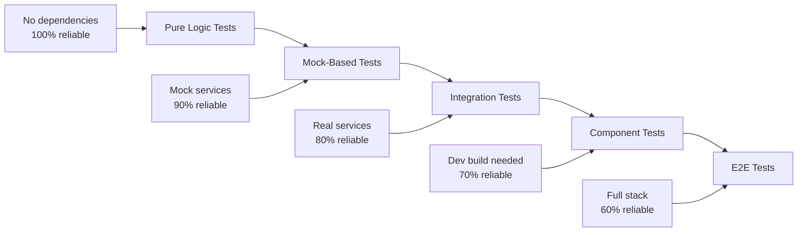

# 🧪 Unified Testing Strategy & Execution: {Product Name}

## 🚨 CRITICAL: Test Timing & Dependencies

### The Golden Rule of Test Timing
> **"Test what you can with what you have, but know what you're missing"**
> **"If you can't show the file path and run the test, it doesn't exist"**

### Testing Truth Authority
> **ALWAYS consult `@agent-{product-name}-testing-truth` for current metrics**
> **NEVER claim test coverage without running `verify-test-claims.sh`**
> **Source of Truth: `tests/TEST_MANIFEST.md`**

### Test Dependency Layers (Test These In Order!)
1. **Zero-Dependency Tests** ✅ Write immediately
   - Pure logic functions
   - Validation utilities
   - Business rule calculations
   - No external services or frameworks

2. **Framework-Dependency Tests** 🟡 After test environment setup
   - State management (Redux/Zustand)
   - React component logic
   - Requires: Jest configuration, test framework

3. **Environment-Dependency Tests** 🟡 After development build
   - React Native components
   - Navigation flows
   - Native module integration
   - Requires: Development build, simulators

4. **Browser-Dependency Tests** 🟡 After Puppeteer setup
   - End-to-end user journeys
   - Cross-browser compatibility
   - Visual regression testing
   - Mobile responsive validation
   - Requires: Puppeteer configuration, test server running

5. **External-Dependency Tests** 🔴 After service configuration
   - OAuth flows (Google, Apple)
   - Payment processing (Stripe, IAP)
   - Third-party APIs
   - Requires: API keys, OAuth setup, service accounts

## 📊 Two-Tier Testing Metrics Framework

### Why Two Tiers?
Prevents misleading metrics when only 20% of features are built but showing "80% test coverage"

| Metric | Definition | Example | Interpretation |
|--------|-----------|---------|----------------|
| **Feature Test Coverage** | Tests for BUILT features only | 67% | "Of features we've built, 67% have tests" |
| **Overall Test Coverage** | Tests vs entire product scope | 5% | "Of all planned features, 5% have tests" |

### Testing Philosophy
```
Approach:     [TDD/BDD/Hybrid]
Feature Coverage Target: 100% (built features)
Overall Coverage Target: 80% (by launch)
Automation:   [Full/Partial/Manual]
CI/CD Integration: [Yes/No]
Environment Strategy: Progressive (Local → Dev Build → CI)
```

### Testing Pyramid (Enhanced with Browser Automation)
```
           /\
          /E2E\      (5-10% - Critical user journeys via Puppeteer)
         /------\
        /Browser\    (10-15% - Cross-browser, Visual regression, Mobile emulation)
       /----------\
      / Mobile   \   (10-15% - iOS/Android + Mobile web validation)
     /------------\
    /  API       \   (20-30% - Service integration)
   /--------------\
  /Integration    \  (25-35% - Component interaction)
 /------------------\
/     Unit          \ (35-45% - Individual functions)
/__________________\
```

### Browser Automation Layer Details
- **E2E Testing (Puppeteer)**: Complete user journey automation
- **Cross-Browser Testing**: Chrome, Firefox, Safari compatibility validation
- **Visual Regression Testing**: Screenshot-based UI consistency verification
- **Mobile Web Testing**: Responsive design validation with device emulation
- **Performance Testing**: Core Web Vitals measurement through real browser metrics
- **Accessibility Testing**: Automated a11y validation through browser automation

### Key Testing Metrics & Gates
- **Coverage Target**: >80% overall (Required for deployment)
- **Mobile Testing**: iOS Simulator validation required for all features
- **Test Execution Time**: <5 minutes (CI), <10 minutes (with mobile)
- **Flaky Test Tolerance**: <2%
- **Bug Escape Rate**: <5%
- **Performance Baseline**: Must maintain within 10% of golden dataset

---

## 🎯 Test Dashboard

### Overall Health
```
🟢 Passing  🟡 Flaky  🔴 Failing  ⚫ Skipped

Unit:        🟢🟢🟢🟢🟢🟡🔴⚫⚫⚫ (50% coverage)
Integration: 🟢🟢🟢🟡🔴🔴⚫⚫⚫⚫ (30% coverage)
E2E:         🟢🟡🔴⚫⚫⚫⚫⚫⚫⚫ (10% coverage)
Performance: ⚫⚫⚫⚫⚫⚫⚫⚫⚫⚫ (0% coverage)

Overall:     [▓▓▓▓░░░░░░] 40% Complete
```

### Quick Stats
| Metric | Current | Target | Status |
|--------|---------|--------|--------|
| Total Tests | 45 | 100 | 🟡 |
| Passing | 35 | 95+ | 🔴 |
| Coverage | 40% | 80% | 🔴 |
| Avg Runtime | 2.5s | <3s | 🟢 |
| Flaky Tests | 3 | 0 | 🟡 |

## 🚦 Pre-Flight Checklist

### Phase 0: Test Framework Setup (Before ANY Tests)
- [ ] Testing frameworks installed and configured
  - [ ] Jest for unit/integration
  - [ ] React Native Testing Library (if mobile)
  - [ ] Playwright/Cypress for E2E
- [ ] Development build created (if React Native)
- [ ] Test environment variables configured
- [ ] CI/CD pipeline with test gates
- [ ] Golden datasets prepared

### Phase 1: Infrastructure Tests (Before Feature Tests)
- [ ] Database connection tests passing
- [ ] API endpoint tests passing
- [ ] Migration/rollback tests passing
- [ ] Basic CRUD operations tested
- [ ] Error handling verified
- [ ] Performance baselines established

### Phase 2+: Feature Tests (After Infrastructure)
- [ ] Pure logic tests written first
- [ ] Component tests after dev build ready
- [ ] Integration tests after services connected
- [ ] E2E tests after features complete

### Environment Verification
```bash
# Run this to verify setup
npm run test:verify-setup

✅ Jest: v29.5.0
✅ Development Build: Available (if React Native)
✅ Coverage: Istanbul configured
✅ Database: Test DB connected
✅ Mocks: Configured
✅ OAuth: [Configure if needed]
```

## 📋 Test Categories

### 🔷 Unit Tests

<details>
<summary><strong>Authentication Module</strong> - Coverage: 85% ✅</summary>

#### Test Status
- [x] `hashPassword()` - Generates secure hash
- [x] `verifyPassword()` - Validates credentials
- [x] `generateToken()` - Creates JWT tokens
- [x] `validateToken()` - Verifies JWT validity
- [ ] `refreshToken()` - Token refresh logic
- [ ] `revokeToken()` - Token blacklisting

#### Code Example
```typescript
describe('Authentication', () => {
  test('should hash password securely', async () => {
    const password = 'SecurePass123!';
    const hash = await hashPassword(password);
    
    expect(hash).not.toBe(password);
    expect(hash.length).toBeGreaterThan(50);
    expect(await verifyPassword(password, hash)).toBe(true);
  });
});
```

#### Coverage Report
```
File               | % Stmts | % Branch | % Funcs | % Lines |
-------------------|---------|----------|---------|---------|
auth/index.ts      |   85.5  |    78.3  |   90.0  |   85.5  |
auth/tokens.ts     |   73.2  |    65.0  |   80.0  |   73.2  |
```
</details>

<details>
<summary><strong>Payment Processing</strong> - Coverage: 45% 🟡</summary>

#### Test Status
- [x] `processPayment()` - Basic flow
- [x] `validateCard()` - Card validation
- [ ] `handleDecline()` - Decline scenarios
- [ ] `processRefund()` - Refund logic
- [ ] `handleWebhooks()` - Stripe webhooks
- [ ] `currencyConversion()` - Multi-currency

#### Required Mocks
```typescript
// Mock Stripe responses
const stripeMock = {
  charges: {
    create: jest.fn().mockResolvedValue({
      id: 'ch_test_123',
      status: 'succeeded'
    })
  }
};
```
</details>

### 🔗 Integration Tests

<details>
<summary><strong>API → Database Flow</strong> - Status: 🟡 3/5 Passing</summary>

#### Test Scenarios
- [x] **User Registration Flow**
  - API receives POST /register
  - Validates input
  - Creates database record
  - Sends confirmation email
  - Returns success response

- [x] **Data Retrieval with Caching**
  - Check cache first
  - Query database if miss
  - Update cache
  - Return data

- [ ] **Transaction Rollback**
  - Start transaction
  - Simulate failure
  - Verify rollback
  - Check data integrity

#### Current Issues
```
❌ Test: Transaction Rollback
   Error: Timeout waiting for rollback
   File: integration/db-transactions.test.ts:45
   
   Attempting to fix with:
   - Increase timeout to 10s
   - Add explicit rollback trigger
```
</details>

### 🌐 End-to-End Tests

<details>
<summary><strong>Critical User Journeys</strong> - Status: 🔴 1/4 Passing</summary>

#### Journey 1: New User Onboarding ✅
```typescript
test('New user can sign up and access dashboard', async ({ page }) => {
  // 1. Navigate to signup
  await page.goto('/signup');
  
  // 2. Fill form
  await page.fill('[name="email"]', 'test@example.com');
  await page.fill('[name="password"]', 'SecurePass123!');
  
  // 3. Submit and verify
  await page.click('[type="submit"]');
  await expect(page).toHaveURL('/dashboard');
  await expect(page.locator('h1')).toContainText('Welcome');
});
```

#### Journey 2: Purchase Flow 🔴
- Issue: Payment form not loading
- Debug: Check Stripe integration
- ETA: 2 hours

#### Journey 3: Admin Operations ⏸️
- Status: Blocked by auth implementation

#### Journey 4: Mobile Responsive ⏸️
- Status: Awaiting design approval
</details>

### 🌐 Browser Automation Tests (Puppeteer)

<details>
<summary><strong>End-to-End User Journeys</strong> - Status: 🟡 3/5 Implemented</summary>

#### Critical User Journey 1: User Onboarding ✅
```javascript
// tests/e2e/user-onboarding.test.js
const puppeteer = require('puppeteer');

describe('User Onboarding Journey', () => {
  let browser, page;

  beforeAll(async () => {
    browser = await puppeteer.launch({ headless: false });
    page = await browser.newPage();
  });

  test('New user can complete full onboarding flow', async () => {
    // Navigate to landing page
    await page.goto('http://localhost:3000');
    
    // Sign up flow
    await page.click('[data-testid="signup-button"]');
    await page.fill('[name="email"]', 'test@example.com');
    await page.fill('[name="password"]', 'SecurePass123!');
    await page.click('[type="submit"]');
    
    // Email verification simulation
    await page.waitForNavigation();
    expect(page.url()).toContain('/verify-email');
    
    // Complete profile
    await page.click('[data-testid="skip-verification"]'); // For testing
    await page.fill('[name="firstName"]', 'John');
    await page.fill('[name="lastName"]', 'Doe');
    await page.click('[data-testid="complete-profile"]');
    
    // Verify dashboard access
    await page.waitForSelector('[data-testid="dashboard"]');
    expect(await page.textContent('h1')).toContain('Welcome, John');
  });

  afterAll(async () => {
    await browser.close();
  });
});
```

#### Critical User Journey 2: Purchase Flow 🟡
```javascript
// tests/e2e/purchase-flow.test.js
test('User can complete payment transaction', async () => {
  await page.goto('http://localhost:3000/products');
  
  // Select product
  await page.click('[data-testid="product-card-1"]');
  await page.click('[data-testid="add-to-cart"]');
  
  // Go to checkout
  await page.click('[data-testid="cart-icon"]');
  await page.click('[data-testid="checkout-button"]');
  
  // Fill payment details (using test data)
  await page.fill('[data-testid="card-number"]', '4242424242424242');
  await page.fill('[data-testid="expiry"]', '12/25');
  await page.fill('[data-testid="cvc"]', '123');
  
  // Complete purchase
  await page.click('[data-testid="pay-button"]');
  await page.waitForSelector('[data-testid="success-message"]');
  
  expect(await page.textContent('[data-testid="success-message"]'))
    .toContain('Payment successful');
});
```

#### Mobile Responsive Testing 🆕
```javascript
// tests/e2e/mobile-responsive.test.js
test('App works correctly on mobile devices', async () => {
  // Test iPhone 13 viewport
  await page.setViewport({ width: 375, height: 812 });
  await page.goto('http://localhost:3000');
  
  // Test mobile navigation
  await page.click('[data-testid="mobile-menu-toggle"]');
  await page.waitForSelector('[data-testid="mobile-nav-menu"]');
  
  // Test responsive layout
  const isMobileLayout = await page.$('[data-testid="mobile-layout"]');
  expect(isMobileLayout).toBeTruthy();
  
  // Test touch interactions
  await page.tap('[data-testid="feature-card"]');
  await page.waitForSelector('[data-testid="feature-details"]');
});
```
</details>

<details>
<summary><strong>Visual Regression Testing</strong> - Status: 🆕 New Capability</summary>

#### Screenshot-Based Testing
```javascript
// tests/e2e/visual-regression.test.js
test('Homepage maintains visual consistency', async () => {
  await page.goto('http://localhost:3000');
  
  // Take full page screenshot
  const screenshot = await page.screenshot({ fullPage: true });
  
  // Compare with baseline (first run creates baseline)
  expect(screenshot).toMatchImageSnapshot({
    threshold: 0.2,
    customDiffConfig: {
      threshold: 0.1,
    },
  });
});

test('Component library visual consistency', async () => {
  const components = ['button', 'card', 'modal', 'form'];
  
  for (const component of components) {
    await page.goto(`http://localhost:6006/?path=/story/${component}`);
    await page.waitForSelector('[data-testid="storybook-component"]');
    
    const screenshot = await page.screenshot({
      clip: await page.$eval('[data-testid="storybook-component"]', 
        el => ({
          x: el.offsetLeft,
          y: el.offsetTop,
          width: el.offsetWidth,
          height: el.offsetHeight
        })
      )
    });
    
    expect(screenshot).toMatchImageSnapshot({
      customSnapshotIdentifier: `${component}-component`
    });
  }
});
```
</details>

<details>
<summary><strong>Cross-Browser Testing</strong> - Status: 🆕 New Capability</summary>

#### Multi-Browser Validation
```javascript
// tests/e2e/cross-browser.test.js
const browsers = [
  { name: 'Chrome', product: 'chrome' },
  { name: 'Firefox', product: 'firefox' },
  { name: 'Safari', product: 'webkit' }
];

describe.each(browsers)('$name Browser Testing', ({ name, product }) => {
  let browser, page;
  
  beforeAll(async () => {
    browser = await puppeteer.launch({ 
      product,
      headless: true 
    });
    page = await browser.newPage();
  });

  test(`Critical features work in ${name}`, async () => {
    await page.goto('http://localhost:3000');
    
    // Test core functionality
    await page.click('[data-testid="main-cta"]');
    await page.waitForNavigation();
    
    // Verify functionality works
    const isWorking = await page.$('[data-testid="success-indicator"]');
    expect(isWorking).toBeTruthy();
  });
});
```
</details>

### ⚡ Performance Tests (Enhanced with Browser Metrics)

<details>
<summary><strong>Core Web Vitals Testing</strong> - Status: 🆕 Browser-Based Performance</summary>

#### Real Browser Performance Testing
```javascript
// tests/e2e/performance.test.js
test('Page meets Core Web Vitals standards', async () => {
  await page.goto('http://localhost:3000');
  
  // Measure Core Web Vitals
  const metrics = await page.evaluate(() => {
    return new Promise((resolve) => {
      new PerformanceObserver((list) => {
        const entries = list.getEntries();
        const vitals = {};
        
        entries.forEach((entry) => {
          if (entry.name === 'first-contentful-paint') {
            vitals.fcp = entry.startTime;
          }
          if (entry.name === 'largest-contentful-paint') {
            vitals.lcp = entry.startTime;
          }
        });
        
        // Get CLS
        vitals.cls = entries
          .filter(entry => entry.entryType === 'layout-shift')
          .reduce((sum, entry) => sum + entry.value, 0);
          
        resolve(vitals);
      }).observe({ entryTypes: ['paint', 'layout-shift', 'largest-contentful-paint'] });
      
      // Timeout after 5 seconds
      setTimeout(() => resolve({}), 5000);
    });
  });
  
  // Assert Core Web Vitals thresholds
  expect(metrics.fcp).toBeLessThan(1800); // FCP < 1.8s
  expect(metrics.lcp).toBeLessThan(2500); // LCP < 2.5s
  expect(metrics.cls).toBeLessThan(0.1);  // CLS < 0.1
});
```

#### Load Testing Scenarios
- [ ] **Baseline Load** (100 users/min)
  - Target: <500ms response time
  - Current: Not tested
  
- [ ] **Peak Load** (1000 users/min)
  - Target: <2s response time
  - Current: Not tested

- [ ] **Stress Test** (5000 users/min)
  - Target: Graceful degradation
  - Current: Not tested

#### k6 Test Script
```javascript
import http from 'k6/http';
import { check, sleep } from 'k6';

export const options = {
  stages: [
    { duration: '2m', target: 100 },
    { duration: '5m', target: 100 },
    { duration: '2m', target: 0 },
  ],
};

export default function () {
  const res = http.get('https://api.example.com/');
  check(res, {
    'status is 200': (r) => r.status === 200,
    'response time < 500ms': (r) => r.timings.duration < 500,
  });
  sleep(1);
}
```
</details>

## 🐛 Issue Tracking

### Active Issues

| ID | Type | Test | Status | Priority | Assigned |
|----|------|------|--------|----------|----------|
| BUG-001 | 🔴 Failing | Payment webhook | In Progress | P1 | @dev |
| BUG-002 | 🟡 Flaky | User session timeout | Investigating | P2 | @qa |
| BUG-003 | 🔴 Failing | Mobile menu | Blocked | P1 | - |

### Flaky Test Monitor
```
auth.test.ts > "should timeout expired sessions"
Failure Rate: 30% (3/10 runs)
Last Failed: 2025-07-20 10:30
Pattern: Fails on CI, passes locally
Action: Add retry mechanism
```

## 📊 Progressive Test Runs

### Run #1 - 2025-07-20 10:00
<details>
<summary>View Results</summary>

**Environment**: Local Development
**Duration**: 2m 34s

**Results Summary**:
```
Test Suites: 5 passed, 3 failed, 8 total
Tests:       35 passed, 10 failed, 45 total
Snapshots:   2 passed, 2 total
Coverage:    40.5% (target: 80%)
```

**Failed Tests**:
1. `payment.test.ts` - Stripe mock not configured
2. `e2e/checkout.test.ts` - Element not found
3. `integration/email.test.ts` - SMTP timeout

**Action Items**:
- [ ] Fix Stripe mock configuration
- [ ] Update E2E selectors
- [ ] Increase email timeout
</details>

### Run #2 - 2025-07-20 14:00
<details>
<summary>View Results</summary>

**Environment**: CI Pipeline
**Duration**: 3m 45s

**Improvements**:
- Fixed Stripe mocks ✅
- Email timeout increased ✅
- Added 5 new unit tests ✅

**Remaining Issues**:
- E2E checkout still failing
- New flaky test detected
</details>

## 🔍 Testing Truth Verification

### Before ANY Testing Claims
```bash
# MANDATORY: Run verification script
./scripts/verify-test-claims.sh

# Check manifest for current state
cat tests/TEST_MANIFEST.md

# Invoke testing truth agent for metrics
@agent-{product-name}-testing-truth
```

### Updating Test Metrics
1. **Create/modify test files**
2. **Run `verify-test-claims.sh`**
3. **Update `TEST_MANIFEST.md` with results**
4. **Include file paths and evidence**
5. **Never claim metrics without verification**

## 🚀 Test Commands

### Quick Test Commands
```bash
# ALWAYS verify claims first
./scripts/verify-test-claims.sh

# Run all tests
npm test

# Run with coverage
npm run test:coverage

# Run specific suite
npm run test:unit
npm run test:integration
npm run test:e2e

# Puppeteer-specific commands
npm run test:e2e:headless      # Run E2E tests in headless mode
npm run test:e2e:headed        # Run E2E tests with browser visible
npm run test:visual            # Run visual regression tests
npm run test:mobile            # Run mobile responsive tests
npm run test:cross-browser     # Run tests across multiple browsers
npm run test:performance       # Run Core Web Vitals testing

# Watch mode
npm run test:watch

# Debug mode
npm run test:debug
npm run test:e2e:debug         # Debug E2E tests with DevTools

# Run failed tests only
npm run test:failed

# Generate coverage report
npm run test:report

# Update visual baselines (after UI changes)
npm run test:visual:update
```

### CI/CD Integration
```yaml
# .github/workflows/test.yml
- name: Run Tests
  run: |
    npm run test:ci
    npm run test:coverage
    
- name: Upload Coverage
  uses: codecov/codecov-action@v3
  with:
    file: ./coverage/lcov.info
```

## 📈 Trend Analysis

### Coverage Trend (Last 7 Days)
```
Day 1: ████░░░░░░ 40%
Day 2: █████░░░░░ 45%
Day 3: █████░░░░░ 48%
Day 4: ██████░░░░ 52%
Day 5: ██████░░░░ 55%
Day 6: ███████░░░ 58%
Day 7: ███████░░░ 62%

Target: ████████░░ 80%
```

### Test Execution Time
```
Unit:        ██ 0.5s (✅ Fast)
Integration: ████████ 2.0s (✅ Acceptable)
E2E:         ████████████████ 4.0s (🟡 Monitor)
Total:       ██████████████████ 6.5s
```

## 🔄 Phase-Aligned Test Progression

### What to Test When (Critical for 100% AI Development)

| Development Phase | Tests to Write | Required Coverage | Gate Criteria |
|------------------|----------------|-------------------|---------------|
| **Phase 0: Foundation** | Environment tests, Config validation | 40% | Framework operational |
| **Phase 1: Infrastructure** | DB, API, CRUD, Migrations | 60% | All endpoints working |
| **Phase 2: Authentication** | Auth logic, Session, Entitlements | 75% | 100% auth paths |
| **Phase 3: Core Feature** | Business logic, Integration | 80% | Feature complete |
| **Phase 4+: Advanced** | E2E, Performance, Edge cases | 85%+ | Production ready |

### Test Writing Order (Per Phase)


### Common Blocking Issues & Solutions

| Issue | Impact | Solution | Prevention |
|-------|--------|----------|------------|
| No dev build | Component tests fail | Create build in Phase 0 | Include in foundation |
| No OAuth config | Social auth blocked | Configure in Phase 1 | Document external deps |
| Missing mocks | Tests fail randomly | Create comprehensive mocks | Mock-first approach |
| Wrong test order | Cascading failures | Follow phase gates | Respect dependencies |

## 🎯 Next Steps

### Priority Queue
1. 🔴 **Fix failing E2E tests** (2 hours)
   - Update selectors
   - Add wait conditions
   
2. 🟡 **Resolve flaky tests** (1 hour)
   - Add retry logic
   - Improve timing

3. 🟢 **Increase coverage** (4 hours)
   - Add payment module tests
   - Complete auth tests
   - Add error scenarios

### Weekly Goals
- [ ] Achieve 70% coverage
- [ ] Zero failing tests
- [ ] Reduce flaky tests to <2
- [ ] Add performance baseline
- [ ] Complete E2E suite

## 🔧 Testing Best Practices

### Quick Reference
1. **Test Naming**: `should [expected behavior] when [condition]`
2. **AAA Pattern**: Arrange → Act → Assert
3. **One Assertion**: One logical assertion per test
4. **Mock External**: Mock all external dependencies
5. **Test Data**: Use factories, not hardcoded values

### Common Patterns
```typescript
// Good: Descriptive and isolated
test('should return user data when valid ID provided', async () => {
  // Arrange
  const userId = 'test-123';
  const mockUser = createMockUser({ id: userId });
  
  // Act
  const result = await getUserById(userId);
  
  // Assert
  expect(result).toEqual(mockUser);
});

// Bad: Multiple concerns, unclear naming
test('user test', async () => {
  const user = await getUser('123');
  expect(user.name).toBe('John');
  expect(user.email).toBe('john@example.com');
  const updated = await updateUser(user);
  expect(updated.name).toBe('John Doe');
});
```

---

*This document is continuously updated. Each test run adds to the progressive log. Use interactive elements to track real-time progress.*